# Especificação Técnica — Aplicação PDV Mobile

**Versão:** 1.0  
**Autor:** Manus AI  
**Idioma:** Português (Moçambique)  
**Status:** Documento-base para análise, desenvolvimento e validação com as partes interessadas

> **Objetivo:** definir, de forma detalhada e implementável, uma aplicação móvel de Ponto de Venda — PDV — para registar vendas, controlar produtos e stock, receber pagamentos, operar com conectividade limitada, emitir documentos fiscais quando aplicável e disponibilizar relatórios de gestão.

---

## 1. Resumo executivo

O sistema proposto será um **PDV mobile offline-first**, executado em smartphones ou tablets Android e, opcionalmente, iOS. A aplicação permitirá que operadores registem vendas rapidamente, selecionem produtos, apliquem descontos autorizados, recebam pagamentos, imprimam ou compartilhem comprovantes e consultem o histórico de operações.

A solução será composta por uma aplicação móvel, uma API de negócio, uma base de dados central, uma base de dados local no dispositivo e integrações externas, como gateway de pagamentos, serviço de emissão fiscal, impressoras térmicas, leitor de código de barras e serviço de notificações.

A recomendação inicial é começar com um **monólito modular no backend**, em vez de microserviços. Essa escolha reduz a complexidade operacional inicial, facilita transações consistentes entre venda, pagamento e stock e mantém uma trajetória de evolução para serviços separados quando houver necessidade comprovada de escala, isolamento ou autonomia de equipas.

A proteção de dados deve ser planeada desde o início. A legislação de proteção de dados pessoais aplicável em Moçambique aplica-se ao tratamento de dados pessoais realizado em meios digitais e assenta em princípios como finalidade, necessidade, transparência, segurança e responsabilização [1]. Para a camada móvel, o OWASP MASVS organiza controles de segurança em áreas como armazenamento, criptografia, autenticação, rede, plataforma, código, resiliência e privacidade [2]. Os diagramas deste documento utilizam a notação UML como linguagem de visualização, especificação, construção e documentação de sistemas [3].

---

## 2. Premissas e decisões de escopo

Como o negócio não foi especificado, este documento adota premissas explícitas. Elas devem ser confirmadas antes da implementação definitiva.

| Tema | Premissa adotada | Impacto caso seja diferente |
|---|---|---|
| País de operação | Moçambique | A emissão fiscal, meios de pagamento e regras tributárias devem ser adaptados para outro país. |
| Tipo de negócio | Loja, quiosque, pequeno comércio de retalho ou serviço com catálogo de produtos | Restaurantes, delivery, farmácias e grossistas exigem extensões específicas. |
| Dispositivo | Smartphone ou tablet com Android; iOS como opção futura | Integrações com impressoras, NFC, câmera e periféricos podem variar por plataforma. |
| Conectividade | O PDV precisa continuar vendendo durante indisponibilidade temporária da internet | Será necessário sincronismo, resolução de conflitos e política de retenção local. |
| Fiscal | Emissão fiscal será uma integração configurável, não uma regra embutida de forma rígida | O tipo de documento fiscal eletrónico depende da província, do regime tributário e da operação, conforme homologado pela Autoridade Tributária de Moçambique (AT). |
| Pagamentos | Numerário, carteira móvel (M-Pesa, e-Mola, mKesh), cartão e pagamento misto | Integrações com adquirentes, TPA ou POS dependem do fornecedor escolhido. |
| Multiempresa | O sistema deverá suportar empresa, filial, loja, terminal e operador | Um produto poderá ter preços e stocks diferentes por loja. |
| Utilizadores | Não há tipos fixos de utilizador nem entidade de agrupamento (role); o acesso é definido exclusivamente por permissões atómicas concedidas diretamente a cada utilizador | A autorização é sempre avaliada por permissão, escopo e política — nunca por um rótulo de perfil ou função. |
| Identidade do produto | SKU interno e código de barras opcional | Produtos sem código de barras devem continuar podendo ser pesquisados por nome ou SKU. |
| Escopo do sistema | Registo, venda, pagamento, stock, caixa, comprovante e relatórios | Compras, fidelidade, delivery e marketplace não fazem parte deste sistema. |

### 2.1. Fora do escopo do sistema

Não fazem parte deste sistema: contabilidade completa, folha de pagamento, gestão avançada de compras, roteirização de entrega, marketplace, programa de fidelidade complexo, produção industrial, integração com todos os adquirentes do mercado, emissão de todos os modelos fiscais e previsão de demanda baseada em inteligência artificial.

Caso venham a ser necessários no futuro, esses itens devem ser tratados como produtos ou módulos separados, sem alterar o núcleo da venda, desde que sejam preservadas as fronteiras de domínio descritas na arquitetura.

### 2.2. Objetivos de negócio

| Objetivo | Indicador sugerido |
|---|---|
| Reduzir o tempo de checkout | Tempo mediano entre inclusão do primeiro item e conclusão da venda. |
| Evitar vendas inconsistentes | Percentual de vendas sem divergência de total, pagamento ou stock. |
| Operar durante falhas de internet | Percentual de vendas que podem ser registadas em modo offline. |
| Melhorar o controle de caixa | Diferença entre valor esperado e valor contado no fechamento. |
| Aumentar a rastreabilidade | Percentual de alterações sensíveis associadas a utilizador, data, dispositivo e motivo. |
| Reduzir perdas de stock | Diferença entre stock sistêmico e inventário físico. |

---

## 3. Atores e modelo de acesso

O sistema não reconhece "tipos de perfil" como mecanismo de autorização. Cada ator — humano ou serviço — atua sobre o sistema através de **permissões atómicas concedidas individualmente**, dentro de um escopo (organização, loja, terminal, caixa) e sujeitas às políticas de limite e aprovação descritas em 4.1.1. Ocultar um botão na aplicação não é suficiente para proteger uma operação: toda ação deve ser validada na API pela permissão efetiva do utilizador, nunca por um rótulo de função.

O sistema não possui nenhuma entidade de agrupamento de permissões (nada equivalente a `role`). Cada permissão é concedida ou negada **diretamente a um utilizador**, em um escopo específico, com validade e condições próprias. Dois utilizadores podem ter exatamente as mesmas permissões efetivas sem que isso derive de nenhuma estrutura em comum além das concessões individuais que cada um recebeu.

A tabela abaixo descreve exemplos de atores e das permissões atómicas tipicamente concedidas a eles — não perfis fixos nem grupos, apenas ilustrações de combinações comuns de concessões individuais que podem ser reconfiguradas a qualquer momento sem alterar o sistema.

| Ator (exemplo) | Permissões atómicas tipicamente concedidas | Observação |
|---|---|---|
| Administração | `user.manage`, `user.permission.assign`, `store.manage`, `integration.manage`, `tax.config.manage` | Combinação de conveniência; cada permissão é concedida isoladamente ao utilizador. |
| Supervisão de loja | `sale.cancel`, `sale.item.discount` (limite alto), `cash.close.approve`, `report.sales.view` | Não implica acesso a configuração global. |
| Frente de caixa | `sale.create`, `sale.item.discount` (limite baixo), `cash.open`, `cash.close`, `cash.withdrawal.create`, `cash.supply.create` | Escopo normalmente restrito a um terminal/caixa. |
| Stock | `inventory.adjust`, `inventory.transfer`, `inventory.count` | Pode ou não ter acesso a vendas. |
| Consulta/auditoria | `report.sales.view`, `audit.log.view` | Nenhuma permissão de escrita. |
| Serviço fiscal (sistema) | Não usa permissões de utilizador; comunica-se via integração autenticada por credencial de serviço | Devolve autorização, rejeição ou contingência conforme o documento fiscal. |
| Gateway de pagamento (sistema) | Não usa permissões de utilizador; autenticado por credencial de serviço/API key | Autoriza, captura, cancela ou estorna transações externas. |
| Dispositivo PDV (sistema) | Recebe permissões efetivas sincronizadas com escopo e validade | Deve possuir identidade própria, versão e estado de sincronização; toda operação é revalidada pelo backend. |

---

## 4. Requisitos funcionais

Os requisitos estão identificados para facilitar rastreabilidade entre produto, desenvolvimento, testes e aceite. Todos os requisitos abaixo são obrigatórios para o sistema.

### 4.1. Autenticação, utilizadores e permissões

| ID | Requisito | Critério de aceite |
|---|---|---|
| RF-001 | O sistema deve permitir autenticação por e-mail/utilizador e senha ou método equivalente configurado pela empresa. | Utilizador válido acede apenas a organização autorizada. |
| RF-002 | O sistema deve permitir encerrar a sessão e bloquear o terminal por inatividade. | Após o tempo configurado, o operador precisa autenticar-se novamente. |
| RF-003 | O sistema deve permitir registar, ativar, inativar e redefinir credenciais de utilizadores conforme a permissão. | Utilizador inativado não consegue iniciar nova sessão. |
| RF-004 | O sistema deve aplicar autorização baseada exclusivamente em permissões atómicas concedidas diretamente ao utilizador, com escopo, condições e políticas de aprovação; não deve existir entidade de agrupamento de permissões. | Operações não autorizadas retornam erro de autorização e não alteram dados. |
| RF-005 | O sistema deve registar tentativas de autenticação e operações administrativas relevantes. | Cada evento possui ator, data, dispositivo, ação e resultado. |
| RF-006 | O sistema pode suportar PIN curto ou biometria local para troca rápida de operador. | O PIN não substitui a autenticação completa quando houver risco elevado ou expiração de sessão. |

#### 4.1.1. Modelo de autorização granular

A autorização deve ser avaliada como a interseção entre **identidade**, **permissão**, **escopo**, **contexto** e **política de aprovação**. Não existe nenhuma entidade intermediária de agrupamento: cada permissão é concedida ou negada diretamente a um utilizador, em um escopo específico — a decisão de autorização é sempre feita pela permissão atómica associada ao recurso e pela abrangência autorizada, nunca por uma categoria de utilizador.

Uma permissão deve seguir o padrão `recurso.ação`, podendo incluir um terceiro segmento para uma variante operacional. Exemplos: `sale.create`, `sale.item.discount`, `sale.cancel`, `cash.open`, `cash.close`, `cash.withdrawal.create`, `payment.refund`, `inventory.adjust`, `product.price.update`, `report.sales.export`, `user.permission.assign` e `audit.log.view`.

| Elemento | Função | Exemplo |
|---|---|---|
| Permissão | Define a ação atómica que pode ser executada. | `sale.cancel` |
| Concessão | Atribui uma permissão diretamente a um utilizador, em um escopo. | Utilizador recebe `report.sales.export` na loja A. |
| Negação explícita | Bloqueia uma permissão para o utilizador nesse escopo, mesmo que exista concessão em um escopo mais amplo. | Operador não pode `cash.close.approve` no terminal 03. |
| Escopo | Define onde a permissão vale. | Loja A, terminal 03 e caixa atual. |
| Condição | Define limites contextuais. | Desconto máximo de 10% ou valor até 500 MT. |
| Aprovação | Exige segundo utilizador ou credencial elevada. | Cancelamento de venda já fiscalizada. |
| Auditoria | Regista a decisão e o contexto. | Utilizador, ação, entidade, motivo e resultado. |

A regra recomendada é **negação por padrão**. O backend deve calcular as permissões efetivas do utilizador a partir de suas concessões diretas, resolver conflitos conforme a política definida — por exemplo, uma negação explícita em um escopo mais específico prevalece sobre uma concessão em escopo mais amplo — e rejeitar a solicitação quando o escopo, o limite ou a aprovação não forem satisfeitos.

### 4.2. Empresas, lojas e terminais

| ID | Requisito | Critério de aceite |
|---|---|---|
| RF-010 | O administrador deve registar empresa, filial/loja, endereço e parâmetros operacionais. | A loja aparece disponível para utilizadores autorizados. |
| RF-011 | O sistema deve registar cada dispositivo como terminal identificado. | Uma venda informa terminal, versão do app e loja de origem. |
| RF-012 | O administrador deve configurar sequência de documentos, política de descontos, horário e parâmetros fiscais. | Alterações ficam auditadas e versionadas. |
| RF-013 | Cada concessão de permissão a um utilizador deve especificar um escopo de organização, loja, terminal ou caixa, com vigência opcional. | O operador não acede vendas de lojas sem autorização. |

### 4.3. Catálogo e preços

| ID | Requisito | Critério de aceite |
|---|---|---|
| RF-020 | O utilizador autorizado deve registar, editar, inativar e consultar produtos. | Produto inativo não pode ser vendido em nova venda. |
| RF-021 | O produto deve suportar nome, descrição, SKU, código de barras, unidade, categoria, preço, custo e situação. | Campos obrigatórios são validados antes da gravação. |
| RF-022 | O operador deve localizar produtos por código de barras, SKU, nome e categoria. | A busca retorna resultados em tempo aceitável e permite seleção sem ambiguidade. |
| RF-023 | O sistema deve permitir preços por loja ou tabela de preço. | O preço usado na venda deve ser congelado no item da venda. |
| RF-024 | O sistema deve permitir produtos com quantidade fracionada quando a unidade de medida permitir. | A precisão e o arredondamento são configuráveis por produto. |
| RF-025 | O sistema deve permitir importar e exportar catálogo por ficheiro estruturado. | Registos inválidos são rejeitados com relatório de erros. |

### 4.4. Venda e checkout

| ID | Requisito | Critério de aceite |
|---|---|---|
| RF-030 | O operador deve iniciar uma venda e adicionar um ou mais itens. | O total é atualizado a cada inclusão ou alteração. |
| RF-031 | O operador deve alterar quantidade, remover item e limpar o carrinho antes da conclusão. | Nenhuma alteração é permitida após o fechamento sem fluxo de cancelamento/estorno. |
| RF-032 | O sistema deve calcular subtotal, desconto, acréscimo, frete quando aplicável, tributos informativos e total. | Os valores respeitam regras de arredondamento e não produzem total negativo. |
| RF-033 | O sistema deve permitir desconto por item ou na venda somente com a permissão atómica correspondente e respeitando limites contextuais. | Acima do limite, o sistema exige aprovação de um utilizador com a permissão de aprovação no escopo compatível. |
| RF-034 | O operador deve identificar cliente opcionalmente, conforme finalidade e necessidade. | A venda pode ser concluída sem NUIT ou registo de cliente, salvo exigência da operação fiscal. |
| RF-035 | O sistema deve suspender uma venda em andamento e recuperá-la no mesmo terminal ou loja conforme política. | Venda suspensa não pode ser confundida com venda concluída. |
| RF-036 | O sistema deve concluir a venda somente após validação de itens, totais, caixa, pagamento, permissão efetiva e estado do terminal. | Falha em qualquer validação impede fechamento parcial. |
| RF-037 | O sistema deve permitir cancelamento de item antes do fechamento. | O motivo e o operador são registados quando a política exigir. |
| RF-038 | O sistema deve permitir consultar vendas concluídas por número, período, operador, terminal e status. | O resultado respeita escopo de acesso. |

### 4.5. Pagamentos

| ID | Requisito | Critério de aceite |
|---|---|---|
| RF-040 | O sistema deve registar pagamento em dinheiro. | O troco é calculado e validado contra o valor recebido. |
| RF-041 | O sistema deve registar carteira móvel (M-Pesa, e-Mola, mKesh), cartão de débito, cartão de crédito e outros meios configurados. | Cada transação possui método, valor, status e referência. |
| RF-042 | O sistema deve suportar pagamento dividido entre múltiplos meios quando habilitado. | A soma dos pagamentos aprovados cobre o total da venda. |
| RF-043 | O sistema deve impedir fechamento com valor pago inferior ao total, exceto quando houver regra explícita de crédito. | A venda permanece pendente até completar o pagamento. |
| RF-044 | O sistema deve tratar estados pendente, autorizado, capturado, recusado, cancelado, estornado e expirado. | A transição de estado é validada e auditada. |
| RF-045 | O sistema deve permitir estorno ou cancelamento de pagamento conforme a política do adquirente/gateway. | A venda e o caixa refletem o resultado da operação externa. |
| RF-046 | O sistema deve usar idempotência em chamadas financeiras. | Repetição da mesma solicitação não gera cobrança duplicada. |

### 4.6. Caixa

| ID | Requisito | Critério de aceite |
|---|---|---|
| RF-050 | O operador deve abrir um turno de caixa informando o saldo inicial. | Não é possível vender em terminal sem caixa aberto, salvo configuração específica. |
| RF-051 | O sistema deve registar vendas e pagamentos vinculados ao caixa aberto. | Cada movimento possui caixa, terminal, operador e horário. |
| RF-052 | O sistema deve permitir suprimento e sangria somente com as permissões atómicas correspondentes, motivo e limites configurados. | O saldo esperado é recalculado após cada movimento. |
| RF-053 | O operador deve solicitar fechamento informando valores contados por meio de pagamento. | O sistema calcula diferença entre esperado e contado. |
| RF-054 | O sistema deve permitir aprovar ou rejeitar fechamento com divergência apenas a utilizador que possua `cash.close.approve` no escopo do caixa. | A decisão fica registada no histórico de auditoria. |
| RF-055 | O sistema deve gerar relatório de fechamento por caixa, terminal, operador e período. | O relatório contém totais por meio de pagamento e diferenças. |

### 4.7. Stock

| ID | Requisito | Critério de aceite |
|---|---|---|
| RF-060 | O sistema deve manter saldo de stock por produto e loja. | O saldo pode ser consultado por produto, loja e data de atualização. |
| RF-061 | A conclusão da venda deve gerar movimentação de saída conforme a política de stock. | A movimentação referencia a venda e o item correspondente. |
| RF-062 | O sistema deve permitir entrada, ajuste, perda, devolução e transferência de stock. | Toda movimentação possui tipo, quantidade, motivo e utilizador. |
| RF-063 | O sistema deve impedir stock negativo ou exigir a permissão/aprovação configurada quando a política permitir venda sem stock. | A regra é aplicada no servidor e no modo offline conforme a política de risco. |
| RF-064 | O sistema deve alertar stock abaixo do mínimo. | O alerta informa produto, loja, saldo e limite configurado. |
| RF-065 | O sistema deve permitir inventário físico. | A diferença gera movimentação auditável, sem sobrescrever o histórico. |

### 4.8. Comprovante, fiscal e integrações

| ID | Requisito | Critério de aceite |
|---|---|---|
| RF-070 | O sistema deve gerar comprovante digital da venda. | O comprovante contém número, data, itens, totais, pagamentos e identificação da loja. |
| RF-071 | O sistema deve compartilhar comprovante por impressão, PDF, e-mail ou aplicação compatível, conforme dispositivo. | Falha no compartilhamento não desfaz a venda. |
| RF-072 | O sistema deve integrar-se a serviço fiscal configurável quando exigido. | A venda mantém status fiscal separado do status comercial. |
| RF-073 | O sistema deve tratar autorização, rejeição, contingência, cancelamento e consulta fiscal. | Cada retorno externo é armazenado com código e mensagem técnica. |
| RF-074 | O sistema deve integrar leitor de código de barras e impressora térmica compatíveis. | O dispositivo pode funcionar sem periférico, usando câmera ou comprovante digital. |
| RF-075 | O sistema deve expor webhooks ou rotina de consulta para atualizar pagamentos e documentos fiscais pendentes. | Eventos repetidos são processados de maneira idempotente. |

### 4.9. Relatórios e administração

| ID | Requisito | Critério de aceite |
|---|---|---|
| RF-080 | O utilizador deve consultar vendas por período, loja, operador, produto e meio de pagamento somente com `report.sales.view` e dentro do escopo efetivo. | Filtros produzem totais coerentes com o detalhe. |
| RF-081 | O sistema deve apresentar produtos mais vendidos, faturamento, ticket médio e cancelamentos. | Indicadores possuem definição documentada. |
| RF-082 | O sistema deve permitir exportar relatórios em CSV ou formato equivalente somente com `report.sales.export`. | A exportação respeita permissões e filtros aplicados. |
| RF-083 | O sistema deve disponibilizar registo de auditoria para concessão, revogação, negação, aprovação e uso de permissões, além de alterações críticas. | O log não pode ser alterado por utilizadores operacionais. |

### 4.10. Sincronização offline

| ID | Requisito | Critério de aceite |
|---|---|---|
| RF-090 | A aplicação deve armazenar localmente catálogo mínimo, permissões efetivas limitadas ao dispositivo, escopos e parâmetros necessários à operação. | O operador consegue iniciar uma venda sem internet após sincronização válida. |
| RF-091 | A aplicação deve enfileirar operações offline com identificador único, permissão utilizada, escopo de execução e estado de sincronização. | Cada operação pode ser reenviada sem duplicação. |
| RF-092 | O sistema deve sincronizar dados assim que a conectividade retornar. | O estado da fila fica visível a qualquer utilizador com permissão de consulta de sincronização no escopo do terminal. |
| RF-093 | O sistema deve tratar conflitos de stock, preço, cancelamento e registo. | A política de resolução é determinística e regista intervenção quando necessário. |
| RF-094 | O sistema deve informar limitações do modo offline. | O operador sabe se uma venda está pendente de autorização fiscal ou financeira. |

---

## 5. Requisitos não funcionais

Os requisitos abaixo devem ser convertidos em testes ou métricas observáveis. Quando um requisito não puder ser medido, ele ainda está incompleto.

| ID | Categoria | Requisito mensurável |
|---|---|---|
| RNF-001 | Desempenho | Em condições normais, o ecrã de checkout deve responder à inclusão de um item em até 300 ms no dispositivo de referência. |
| RNF-002 | Desempenho | Consultas locais de catálogo por código de barras devem retornar em até 500 ms para uma base de 50 mil produtos, sujeito à capacidade do dispositivo. |
| RNF-003 | Disponibilidade | A API deve atingir disponibilidade mensal definida em contrato; recomenda-se meta de 99,5%, excluindo janelas programadas. |
| RNF-004 | Offline | A venda local deve ser possível sem internet durante o período configurado, com indicação clara das operações pendentes. |
| RNF-005 | Consistência | A conclusão comercial deve ser transacional: venda, itens, pagamentos e movimentos de stock não podem ficar parcialmente persistidos no backend. |
| RNF-006 | Segurança | Todo tráfego externo deve usar TLS; tokens e dados sensíveis devem ser protegidos no dispositivo e no servidor. |
| RNF-007 | Segurança | O backend deve validar autenticação, permissão atómica, efeito de concessão/negação, escopo hierárquico, vigência, limites, aprovação, integridade, idempotência e regras de negócio. |
| RNF-008 | Privacidade | O sistema deve recolher apenas dados pessoais necessários, documentar finalidade, retenção, acesso e eliminação conforme aplicável [1]. |
| RNF-009 | Auditoria | Operações críticas e decisões de autorização devem ser imutáveis do ponto de vista operacional e conter ator, horário, origem, entidade, ação, permissão, escopo, política aplicada e resultado. |
| RNF-010 | Escalabilidade | A API deve ser stateless para permitir múltiplas instâncias atrás de balanceador quando necessário. |
| RNF-011 | Compatibilidade | A aplicação deve ter matriz de dispositivos e versões mínimas suportadas, validada antes da publicação. |
| RNF-012 | Usabilidade | O fluxo de venda deve ser executável com poucos toques, suporte a teclado numérico, estados de erro compreensíveis e contraste adequado. |
| RNF-013 | Acessibilidade | Componentes devem possuir área de toque suficiente, rótulos para leitor de ecrã, foco previsível e feedback não dependente apenas de cor. |
| RNF-014 | Observabilidade | Logs estruturados, métricas, rastreamento de erros e correlação por request devem existir no app e no backend. |
| RNF-015 | Recuperação | Deve existir backup automatizado, teste de restauração e plano de recuperação com RPO/RTO definidos pelo negócio. |
| RNF-016 | Manutenibilidade | Código deve ser organizado por módulos de negócio, com testes automatizados, lint, formatação, revisão e documentação de API. |
| RNF-017 | Integridade financeira | Valores monetários devem usar unidade inteira — centavos — ou tipo decimal exato, nunca ponto flutuante para persistência financeira. |
| RNF-018 | Idempotência | Endpoints de criação de venda, pagamento, fiscal e sincronização devem aceitar chave idempotente. |
| RNF-019 | Atualização | A aplicação deve possuir estratégia de migração de base de dados local e suporte a atualização sem perda de fila pendente. |
| RNF-020 | Conformidade | A implantação fiscal deve ser homologada com contador, fornecedor fiscal e regras da jurisdição antes de produção. |

### 5.1. Segurança e privacidade

A aplicação deve adotar, no mínimo, armazenamento seguro de tokens, proteção contra captura indevida de dados, validação de certificado pelo sistema operacional, ausência de dados sensíveis em logs, rotação de credenciais, expiração de sessão, negação por padrão e autorização granular por menor privilégio. Permissões sincronizadas para o dispositivo devem ter escopo e validade; a API deve revalidar cada comando e impedir que um utilizador aprove a própria operação. A seleção final de controles deve ser validada contra o OWASP MASVS [2].

Dados de clientes devem ser opcionais quando a operação não exigir identificação. NUIT, telefone, e-mail e endereço não devem ser recolhidos por conveniência sem finalidade definida. O sistema deve possuir política de retenção, exportação e correção de dados, além de processo para atender solicitações do titular quando aplicável.

> A definição de base legal, prazos de retenção, papéis de controlador e operador e atendimento a solicitações do titular deve ser validada com assessoria jurídica ou encarregado de dados da organização. Este documento não substitui orientação jurídica.

---

## 6. Regras de negócio

| ID | Regra |
|---|---|
| RN-001 | Uma venda deve pertencer a uma única empresa, loja, caixa, terminal e operador no momento da conclusão, e o operador deve possuir `sale.create` no escopo correspondente. |
| RN-002 | O preço e a descrição do item devem ser copiados para `sale_items` no fechamento, preservando o histórico mesmo que o registo do produto mude depois. |
| RN-003 | O total da venda deve ser calculado no servidor. A aplicação pode exibir uma prévia, mas não é a autoridade final. |
| RN-004 | O total deve ser igual à soma dos itens, acréscimos, descontos e outros encargos após arredondamento definido. |
| RN-005 | Desconto acima do limite da permissão ou da política contextual exige aprovação registada de utilizador que possua a permissão de aprovação em escopo compatível; o solicitante não pode aprovar a própria operação. |
| RN-006 | Uma venda só pode assumir estado `COMPLETED` quando os pagamentos obrigatórios tiverem sido aprovados ou aceitos conforme a política. |
| RN-007 | Cada pagamento deve possuir uma chave idempotente. Reenvios não podem criar um segundo lançamento. |
| RN-008 | O cancelamento não deve apagar venda nem item; deve criar uma transação de reversão e manter o histórico. |
| RN-009 | O stock deve ser alterado por movimentações. O saldo materializado pode ser atualizado dentro da mesma transação. |
| RN-010 | Venda offline deve possuir identificador global criado no dispositivo e ser conciliada no servidor. |
| RN-011 | Em caso de conflito de preço, o sistema deve aplicar a política configurada: preservar preço já exibido, exigir atualização ou bloquear conclusão. |
| RN-012 | Em caso de conflito de stock, o sistema deve rejeitar, ajustar para o saldo permitido ou encaminhar para autorização, conforme configuração. |
| RN-013 | O fechamento de caixa deve bloquear novas vendas naquele caixa após o estado `CLOSED`. |
| RN-014 | Sangria e suprimento exigem `cash.withdrawal.create` ou `cash.supply.create`, motivo e, acima do limite, aprovação de utilizador com `cash.withdrawal.approve` ou `cash.supply.approve`. |
| RN-015 | Documento fiscal é uma entidade relacionada, mas separada da venda comercial, pois pode estar pendente, rejeitado, autorizado ou cancelado. |
| RN-016 | O sistema deve considerar fuso horário oficial da loja para relatórios e fechamento, mantendo timestamps em UTC no backend. |
| RN-017 | Exclusão física deve ser evitada para entidades transacionais; utilizar inativação ou cancelamento com auditoria. |
| RN-018 | O registo de produto pode ser alterado, mas não deve reescrever valores históricos de vendas concluídas. |

---

## 7. Casos de uso prioritários

### UC-01 — Realizar venda

**Ator principal:** operador.  
**Pré-condições:** utilizador autenticado, terminal registado e caixa aberto, salvo configuração de venda sem caixa.  
**Fluxo principal:** o operador inicia uma venda, identifica produtos por leitura ou busca, altera quantidades, aplica desconto permitido, seleciona cliente opcional, escolhe meio de pagamento, confirma o total, conclui a venda e gera o comprovante.  
**Exceções:** produto inativo, stock insuficiente, desconto sem autorização, pagamento recusado, perda de conectividade ou falha fiscal.  
**Pós-condições:** venda e itens persistidos, pagamentos registados, stock movimentado conforme política e comprovante disponível.

### UC-02 — Abrir caixa

O operador seleciona o terminal, informa o saldo inicial por meio de pagamento e confirma. O backend verifica se não existe outro caixa aberto para o mesmo terminal ou aplica a regra de concorrência configurada. O sistema cria o turno, regista o evento e permite o checkout.

### UC-03 — Fechar caixa

O operador solicita o fechamento, informa os valores contados e envia a conferência. O sistema calcula o valor esperado, apresenta diferenças e solicita aprovação quando exigido. Ao concluir, o caixa fica fechado e não aceita novos lançamentos.

### UC-04 — Cancelar ou estornar venda

O utilizador autorizado localiza a venda, informa o motivo e confirma. O sistema valida prazo, estado fiscal e estado de pagamento, solicita cancelamento/estorno externo quando necessário, cria reversões e mantém a venda original para auditoria.

### UC-05 — Sincronizar operação offline

A aplicação deteta conectividade, autentica o dispositivo, envia operações pendentes em ordem de dependência e recebe confirmações. O servidor processa cada operação com idempotência. Conflitos são armazenados para resolução automática ou manual, conforme o tipo.

---

## 8. Modelagem de base de dados

### 8.1. Estratégia de persistência

A solução deve utilizar **PostgreSQL** como base de dados central pela sua robustez transacional, suporte a índices, integridade referencial e capacidade de consulta. No dispositivo móvel, recomenda-se **SQLite** por meio de uma camada de persistência local. A base de dados local não deve ser tratada como fonte definitiva: ela é uma réplica operacional e uma fila segura de sincronização.

Todas as tabelas transacionais devem possuir `id` global, preferencialmente UUID, `created_at`, `updated_at` quando aplicável e versão ou estado de sincronização. Valores financeiros devem ser armazenados como inteiros em centavos ou decimal exato. Datas de persistência devem ser UTC; a apresentação utiliza o fuso da loja.

### 8.2. Entidades principais

| Entidade | Finalidade | Tipo de dado |
|---|---|---|
| `organizations` | Empresa ou grupo económico | Mestre |
| `stores` | Loja, filial ou ponto de venda | Mestre |
| `users` | Identidade de acesso | Segurança |
| `permission_definitions` | Catálogo de permissões atómicas | Segurança |
| `access_scopes` | Escopos hierárquicos de organização, loja, terminal e caixa | Segurança |
| `user_permissions` | Concessões e negações de permissão atribuídas diretamente a cada utilizador, com escopo e condições | Segurança |
| `permission_policies` | Limites, condições e exigência de aprovação | Segurança |
| `approval_requests` | Solicitações de segundo fator ou aprovação de gestão | Segurança |
| `devices` | Terminais móveis autorizados | Operacional |
| `categories` | Organização de produtos | Mestre |
| `products` | Catálogo comercial | Mestre |
| `price_lists` / `product_prices` | Preço por contexto | Mestre |
| `inventory_balances` | Saldo materializado por loja/produto | Operacional |
| `inventory_movements` | Livro de entradas e saídas | Transacional |
| `cash_registers` | Caixa físico/lógico | Operacional |
| `cash_sessions` | Turno de abertura e fechamento | Transacional |
| `cash_movements` | Suprimentos, sangrias e ajustes | Transacional |
| `customers` | Cliente opcional | Pessoal |
| `sales` | Cabeçalho da venda | Transacional |
| `sale_items` | Itens vendidos | Transacional |
| `payments` | Meios e estados de pagamento | Financeiro |
| `fiscal_documents` | Documento fiscal relacionado | Fiscal |
| `sync_operations` | Fila e idempotência offline | Integração |
| `audit_logs` | Registo de auditoria | Segurança |
| `integration_events` | Eventos externos e webhooks | Integração |

### 8.3. Tabelas de autorização granular

#### `permission_definitions`

| Coluna | Tipo | Regras |
|---|---|---|
| `id` | UUID | PK |
| `code` | VARCHAR(100) | Único, por exemplo `sale.cancel` |
| `resource` | VARCHAR(50) | Recurso protegido |
| `action` | VARCHAR(50) | Ação atómica |
| `risk_level` | VARCHAR(20) | `LOW`, `MEDIUM`, `HIGH`, `CRITICAL` |
| `description` | VARCHAR(300) | Obrigatório |
| `status` | VARCHAR(20) | `ACTIVE`, `INACTIVE` |
| `created_at` | TIMESTAMPTZ | Obrigatório |

#### `access_scopes` e `user_permissions`

Não existe nenhuma tabela de função/grupo. Toda concessão de acesso é uma linha em `user_permissions`, ligando um utilizador a uma permissão dentro de um escopo específico.

| Tabela | Coluna | Tipo | Regras |
|---|---|---|---|
| `access_scopes` | `id` | UUID | PK |
| `access_scopes` | `organization_id` | UUID | FK |
| `access_scopes` | `store_id` | UUID | FK opcional |
| `access_scopes` | `device_id` | UUID | FK opcional |
| `access_scopes` | `cash_register_id` | UUID | FK opcional |
| `access_scopes` | `scope_type` | VARCHAR(30) | `ORGANIZATION`, `STORE`, `DEVICE`, `CASH_REGISTER` |
| `user_permissions` | `id` | UUID | PK |
| `user_permissions` | `user_id` | UUID | FK |
| `user_permissions` | `permission_id` | UUID | FK |
| `user_permissions` | `scope_id` | UUID | FK; define onde a concessão vale |
| `user_permissions` | `effect` | VARCHAR(10) | `ALLOW` ou `DENY` |
| `user_permissions` | `conditions_json` | JSONB | Limites e condições opcionais, ex.: valor ou percentual máximo |
| `user_permissions` | `valid_from` | TIMESTAMPTZ | Vigência opcional |
| `user_permissions` | `valid_until` | TIMESTAMPTZ | Deve ser posterior a `valid_from` |
| `user_permissions` | `granted_by` | UUID | Utilizador que concedeu ou negou |
| `user_permissions` | `created_at` | TIMESTAMPTZ | Obrigatório |

#### `permission_policies` e `approval_requests`

| Tabela | Coluna | Tipo | Regras |
|---|---|---|---|
| `permission_policies` | `id` | UUID | PK |
| `permission_policies` | `permission_id` | UUID | FK |
| `permission_policies` | `scope_id` | UUID | FK opcional |
| `permission_policies` | `max_amount_cents` | BIGINT | Limite monetário opcional |
| `permission_policies` | `max_percentage` | NUMERIC(8,4) | Limite percentual opcional |
| `permission_policies` | `requires_approval` | BOOLEAN | Exige segundo aprovador |
| `permission_policies` | `approver_permission_id` | UUID | Permissão necessária para aprovar |
| `approval_requests` | `id` | UUID | PK |
| `approval_requests` | `requested_by` | UUID | Utilizador solicitante |
| `approval_requests` | `approved_by` | UUID | Utilizador aprovador, nulo até decisão |
| `approval_requests` | `permission_code` | VARCHAR(100) | Ação solicitada |
| `approval_requests` | `resource_type` | VARCHAR(50) | Entidade afetada |
| `approval_requests` | `resource_id` | UUID | Entidade afetada |
| `approval_requests` | `requested_amount_cents` | BIGINT | Valor submetido, quando aplicável |
| `approval_requests` | `status` | VARCHAR(20) | `PENDING`, `APPROVED`, `REJECTED`, `EXPIRED` |
| `approval_requests` | `reason` | VARCHAR(300) | Motivo obrigatório em ações críticas |
| `approval_requests` | `created_at` | TIMESTAMPTZ | Obrigatório |
| `approval_requests` | `decided_at` | TIMESTAMPTZ | Obrigatório após decisão |

O cálculo de autorização deve considerar apenas atribuições vigentes e escopos compatíveis com o recurso. A consulta deve impedir escalada por associação indireta: o utilizador que solicita uma permissão não pode aprovar a própria operação quando a política exigir um aprovador distinto.

### 8.4. Modelo relacional lógico

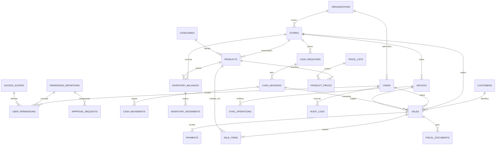

### 8.4. Definição de tabelas essenciais

#### `organizations`

| Coluna | Tipo | Regras |
|---|---|---|
| `id` | UUID | PK |
| `legal_name` | VARCHAR(200) | Obrigatório |
| `trade_name` | VARCHAR(200) | Opcional |
| `tax_id` | VARCHAR(30) | Único por organização, formato validado |
| `status` | VARCHAR(20) | `ACTIVE`, `INACTIVE` |
| `timezone` | VARCHAR(60) | Obrigatório |
| `created_at` | TIMESTAMPTZ | Obrigatório |
| `updated_at` | TIMESTAMPTZ | Obrigatório |

#### `stores`

| Coluna | Tipo | Regras |
|---|---|---|
| `id` | UUID | PK |
| `organization_id` | UUID | FK para `organizations` |
| `code` | VARCHAR(30) | Único dentro da organização |
| `name` | VARCHAR(150) | Obrigatório |
| `tax_id` | VARCHAR(30) | Opcional ou obrigatório conforme modelo fiscal |
| `address_json` | JSONB | Validado por contrato |
| `status` | VARCHAR(20) | `ACTIVE`, `INACTIVE` |
| `created_at` | TIMESTAMPTZ | Obrigatório |
| `updated_at` | TIMESTAMPTZ | Obrigatório |

#### `products`

| Coluna | Tipo | Regras |
|---|---|---|
| `id` | UUID | PK |
| `organization_id` | UUID | FK |
| `category_id` | UUID | FK opcional |
| `sku` | VARCHAR(60) | Único por organização |
| `barcode` | VARCHAR(80) | Índice; pode ser nulo |
| `name` | VARCHAR(200) | Obrigatório |
| `unit` | VARCHAR(10) | `UN`, `KG`, `L`, etc. |
| `allows_fraction` | BOOLEAN | Define quantidade fracionada |
| `cost_cents` | BIGINT | Não negativo |
| `tax_profile_id` | UUID | FK para configuração fiscal, se aplicável |
| `min_stock` | NUMERIC(14,3) | Não negativo |
| `status` | VARCHAR(20) | `ACTIVE`, `INACTIVE` |
| `created_at` | TIMESTAMPTZ | Obrigatório |
| `updated_at` | TIMESTAMPTZ | Obrigatório |

#### `sales`

| Coluna | Tipo | Regras |
|---|---|---|
| `id` | UUID | PK global |
| `organization_id` | UUID | FK |
| `store_id` | UUID | FK |
| `cash_session_id` | UUID | FK opcional conforme política |
| `device_id` | UUID | FK |
| `operator_user_id` | UUID | FK |
| `customer_id` | UUID | FK opcional |
| `local_number` | VARCHAR(40) | Número exibido no terminal |
| `status` | VARCHAR(30) | `DRAFT`, `PENDING_SYNC`, `COMPLETED`, `CANCELLED`, `REFUNDED` |
| `source` | VARCHAR(20) | `ONLINE`, `OFFLINE` |
| `subtotal_cents` | BIGINT | Não negativo |
| `discount_cents` | BIGINT | Não negativo |
| `surcharge_cents` | BIGINT | Não negativo |
| `total_cents` | BIGINT | Não negativo |
| `idempotency_key` | VARCHAR(120) | Único por organização |
| `completed_at` | TIMESTAMPTZ | Nulo até conclusão |
| `created_at` | TIMESTAMPTZ | Obrigatório |
| `updated_at` | TIMESTAMPTZ | Obrigatório |

#### `sale_items`

| Coluna | Tipo | Regras |
|---|---|---|
| `id` | UUID | PK |
| `sale_id` | UUID | FK |
| `product_id` | UUID | FK |
| `product_name_snapshot` | VARCHAR(200) | Histórico |
| `sku_snapshot` | VARCHAR(60) | Histórico |
| `unit_snapshot` | VARCHAR(10) | Histórico |
| `quantity` | NUMERIC(14,3) | Maior que zero |
| `unit_price_cents` | BIGINT | Não negativo |
| `discount_cents` | BIGINT | Não negativo |
| `total_cents` | BIGINT | Calculado e validado |
| `created_at` | TIMESTAMPTZ | Obrigatório |

#### `payments`

| Coluna | Tipo | Regras |
|---|---|---|
| `id` | UUID | PK |
| `sale_id` | UUID | FK |
| `method` | VARCHAR(30) | `CASH`, `MOBILE_MONEY`, `DEBIT`, `CREDIT`, etc. |
| `status` | VARCHAR(30) | Estado controlado |
| `amount_cents` | BIGINT | Maior que zero |
| `received_cents` | BIGINT | Aplicável a dinheiro |
| `change_cents` | BIGINT | Aplicável a dinheiro |
| `provider` | VARCHAR(60) | Opcional |
| `provider_transaction_id` | VARCHAR(150) | Índice único quando presente |
| `idempotency_key` | VARCHAR(120) | Único |
| `metadata_json` | JSONB | Nunca armazenar dados proibidos ou desnecessários |
| `authorized_at` | TIMESTAMPTZ | Opcional |
| `created_at` | TIMESTAMPTZ | Obrigatório |

#### `inventory_movements`

| Coluna | Tipo | Regras |
|---|---|---|
| `id` | UUID | PK |
| `store_id` | UUID | FK |
| `product_id` | UUID | FK |
| `movement_type` | VARCHAR(30) | `SALE`, `PURCHASE`, `ADJUSTMENT`, `LOSS`, `RETURN`, `TRANSFER_IN`, `TRANSFER_OUT` |
| `quantity` | NUMERIC(14,3) | Positiva; sinal semântico vem do tipo |
| `reference_type` | VARCHAR(40) | `SALE`, `INVENTORY`, etc. |
| `reference_id` | UUID | Identificador da origem |
| `reason` | VARCHAR(300) | Obrigatório para ajuste, perda e estorno |
| `created_by` | UUID | FK para utilizador ou serviço |
| `created_at` | TIMESTAMPTZ | Obrigatório |

#### `fiscal_documents`

| Coluna | Tipo | Regras |
|---|---|---|
| `id` | UUID | PK |
| `sale_id` | UUID | FK |
| `document_type` | VARCHAR(30) | Configurável conforme jurisdição |
| `status` | VARCHAR(30) | `PENDING`, `AUTHORIZED`, `REJECTED`, `CONTINGENCY`, `CANCELLED` |
| `document_number` | VARCHAR(50) | Opcional até autorização |
| `access_key` | VARCHAR(100) | Opcional |
| `provider` | VARCHAR(80) | Obrigatório quando integrado |
| `provider_reference` | VARCHAR(150) | Opcional |
| `request_hash` | VARCHAR(128) | Integridade/idempotência |
| `response_json` | JSONB | Retorno técnico sanitizado |
| `issued_at` | TIMESTAMPTZ | Opcional |
| `created_at` | TIMESTAMPTZ | Obrigatório |

#### `sync_operations`

| Coluna | Tipo | Regras |
|---|---|---|
| `id` | UUID | PK da operação |
| `device_id` | UUID | FK |
| `entity_type` | VARCHAR(50) | Tipo de entidade |
| `entity_id` | UUID | Identidade da entidade |
| `operation_type` | VARCHAR(20) | `CREATE`, `UPDATE`, `CANCEL`, `PAY`, etc. |
| `sequence_number` | BIGINT | Ordenação por dispositivo |
| `payload_json` | JSONB | Criptografado quando necessário |
| `status` | VARCHAR(20) | `PENDING`, `PROCESSING`, `APPLIED`, `CONFLICT`, `FAILED` |
| `attempt_count` | INTEGER | Não negativo |
| `last_error` | TEXT | Não deve conter segredo |
| `created_at` | TIMESTAMPTZ | Obrigatório |
| `processed_at` | TIMESTAMPTZ | Opcional |

### 8.5. Índices recomendados

| Índice | Objetivo |
|---|---|
| `products(organization_id, sku)` | Busca por SKU e unicidade empresarial |
| `products(organization_id, barcode)` | Leitura rápida por código de barras |
| `products(organization_id, normalized_name)` | Busca textual do catálogo |
| `sales(store_id, created_at)` | Relatórios por loja e período |
| `sales(operator_user_id, created_at)` | Relatórios por operador |
| `sales(status, created_at)` | Filas de pendência e auditoria |
| `payments(provider_transaction_id)` | Conciliação e idempotência |
| `inventory_movements(store_id, product_id, created_at)` | Extrato de stock |
| `sync_operations(device_id, status, sequence_number)` | Processamento da fila |
| `audit_logs(organization_id, created_at)` | Investigação e conformidade |

### 8.6. Exemplo de transação de fechamento de venda

A operação de fechamento deve seguir a sequência lógica abaixo dentro de uma transação no servidor:

1. Validar identidade, permissões atómicas efetivas, escopo, políticas de aprovação, loja, terminal, caixa e chave idempotente.
2. Recalcular itens, preços, descontos e total a partir dos dados recebidos e das regras vigentes.
3. Verificar stock, ou aplicar a política de venda sem stock.
4. Criar ou recuperar a venda pela chave idempotente.
5. Persistir os itens com snapshots de nome, SKU, unidade e preço.
6. Registar pagamentos e validar a soma dos valores aprovados.
7. Atualizar saldo ou inserir movimentos de stock.
8. Criar evento para emissão fiscal, se aplicável.
9. Registar auditoria.
10. Confirmar a transação e retornar o estado final à aplicação.

Se qualquer etapa falhar, a transação deve ser revertida, exceto chamadas externas já realizadas. Por isso, pagamentos e fiscal devem usar estados intermediários, idempotência e reconciliação assíncrona.

---

## 9. Arquitetura do sistema

### 9.1. Visão geral

A arquitetura recomendada é **offline-first, orientada a domínio e baseada em API**, com a aplicação móvel executando operações locais e sincronizando com o backend. O backend deve ser um monólito modular inicialmente, com módulos internos bem separados. Todas as rotas de comando devem passar por um middleware/serviço de autorização que recebe o código da permissão, o recurso, o escopo e o contexto da operação.

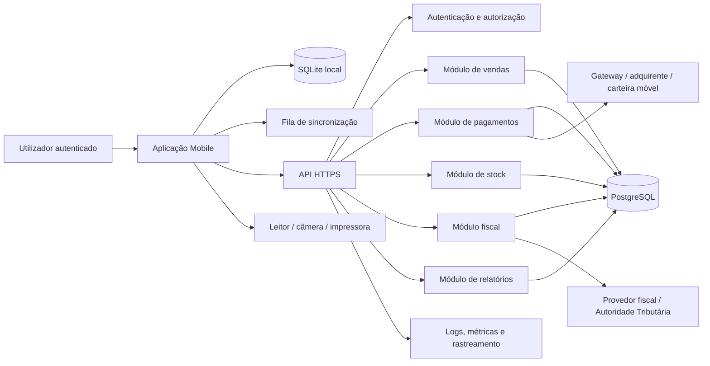

### 9.2. Camada móvel

A aplicação móvel deve ser dividida em apresentação, casos de uso, domínio e infraestrutura. Uma implementação possível usa **React Native com Expo e TypeScript**, ou outra tecnologia multiplataforma equivalente.

| Camada | Responsabilidade |
|---|---|
| Apresentação | Ecrãs, navegação, componentes, validação visual e estados de carregamento. |
| Aplicação | Casos de uso como abrir caixa, adicionar item, finalizar venda e sincronizar. |
| Domínio | Entidades, regras de cálculo, estados e contratos independentes de UI. |
| Persistência local | SQLite, migrações, índices, cache e fila offline. |
| Integrações nativas | Câmera, leitor, impressora, Bluetooth, biometria e armazenamento seguro. |
| Sincronização | Outbox, retry, ordenação, idempotência, conflitos e observabilidade. |

A UI não deve aceder diretamente tabelas locais ou endpoints. Ela deve chamar casos de uso. Isso reduz o acoplamento e torna possível testar a regra de venda sem renderizar o ecrã. As permissões efetivas podem ser sincronizadas para habilitar ou ocultar capacidades, mas a decisão autoritativa permanece no backend e deve ser revalidada a cada comando.

### 9.3. Backend modular

| Módulo | Responsabilidade | Principais entidades |
|---|---|---|
| Identity | Utilizadores, sessões, permissões atómicas, escopos e avaliação de políticas | `users`, `permission_definitions`, `user_permissions`, `access_scopes` |
| Organization | Empresas, lojas e dispositivos | `organizations`, `stores`, `devices` |
| Catalog | Produtos, categorias e preços | `products`, `categories`, `product_prices` |
| Sales | Carrinho persistido, venda, cancelamento e devolução | `sales`, `sale_items` |
| Payments | Estados de pagamento, conciliação e estorno | `payments`, `integration_events` |
| Cash | Abertura, movimentos e fechamento | `cash_sessions`, `cash_movements` |
| Inventory | Saldos, movimentos e inventário | `inventory_balances`, `inventory_movements` |
| Fiscal | Documentos, contingência e consulta | `fiscal_documents` |
| Sync | Operações offline, conflitos e idempotência | `sync_operations` |
| Reporting | Consultas e exportações | Views, consultas e jobs |
| Audit | Histórico de ações críticas | `audit_logs` |

### 9.4. Infraestrutura

A infraestrutura pode ser composta por uma API, PostgreSQL, armazenamento de objetos para comprovantes/ficheiros, fila opcional para tarefas assíncronas e plataforma de observabilidade. Um cache como Redis só deve ser introduzido quando houver necessidade mensurada de cache, lock distribuído ou fila de baixa latência.

A implantação deve separar ambientes de desenvolvimento, homologação e produção. Segredos não devem ser enviados ao repositório. Migrações de base de dados devem ser versionadas e executadas por pipeline controlado.

### 9.5. Comunicação e contratos

A API deve expor contratos versionados, preferencialmente documentados em OpenAPI. Os endpoints devem possuir correlação, paginação, filtros, limites de payload, respostas de erro consistentes e chave idempotente nos comandos. A resposta `403` deve diferenciar, quando for seguro fazê-lo, ausência de permissão, escopo incompatível, condição excedida e aprovação pendente, sem revelar dados de outros escopos.

Exemplos de recursos:

| Método | Endpoint | Finalidade |
|---|---|---|
| `POST` | `/v1/auth/login` | Autenticar utilizador |
| `GET` | `/v1/me/permissions` | Consultar permissões efetivas do utilizador no dispositivo/loja |
| `GET` | `/v1/permission-definitions` | Consultar catálogo de permissões |
| `POST` | `/v1/users/{id}/permissions` | Conceder ou negar uma permissão ao utilizador, com escopo e condições |
| `DELETE` | `/v1/users/{id}/permissions/{permissionGrantId}` | Revogar uma concessão ou negação |
| `GET` | `/v1/users/{id}/permissions` | Consultar concessões e negações do utilizador |
| `POST` | `/v1/approval-requests/{id}/approve` | Aprovar solicitação com permissão compatível |
| `GET` | `/v1/catalog/products` | Consultar produtos |
| `POST` | `/v1/cash-sessions` | Abrir caixa |
| `POST` | `/v1/sales` | Criar ou concluir venda |
| `POST` | `/v1/sales/{id}/cancel` | Cancelar venda |
| `POST` | `/v1/payments/{id}/refund` | Estornar pagamento |
| `GET` | `/v1/sales/{id}/receipt` | Obter comprovante |
| `POST` | `/v1/sync/batch` | Enviar operações offline |
| `GET` | `/v1/sync/changes?cursor=...` | Baixar alterações |
| `GET` | `/v1/reports/sales` | Consultar vendas agregadas |

Exemplo de erro padronizado:

```json
{
  "error": {
    "code": "STOCK_INSUFFICIENT",
    "message": "Stock insuficiente para um ou mais produtos.",
    "details": {
      "product_id": "uuid",
      "available_quantity": 2,
      "requested_quantity": 5
    },
    "correlation_id": "uuid"
  }
}
```

### 9.6. Estratégia offline-first

O modo offline deve ser projetado como uma capacidade explícita, não como uma tentativa de ignorar erros de rede. O dispositivo recebe somente as permissões e escopos necessários ao seu terminal, com prazo de validade e versão de política. Ao sincronizar, o servidor revalida a autorização; revogações posteriores invalidam operações ainda não aplicadas quando a política de risco assim exigir. A aplicação mantém uma base local mínima, regista comandos em uma outbox e apresenta o estado de cada operação.

| Situação | Comportamento recomendado |
|---|---|
| Catálogo atualizado e sem internet | Permitir venda segundo a política local. |
| Produto desconhecido offline | Bloquear ou permitir apenas busca posterior, conforme risco. |
| Pagamento com gateway indisponível | Permitir numerário; para cartão/carteira móvel, exigir integração disponível ou marcar pendência controlada. |
| Documento fiscal indisponível | Entrar em contingência apenas se a operação e a legislação autorizarem. |
| Conflito de preço | Exibir divergência e seguir política configurada. |
| Conflito de stock | Rejeitar, ajustar ou solicitar aprovação; nunca ocultar a divergência. |
| Reenvio da mesma operação | Retornar o resultado original pela chave idempotente. |

O sincronismo deve respeitar dependências: registo e preço antes da venda, venda antes do pagamento relacionado, pagamento antes do fechamento definitivo quando aplicável. A fila deve possuir retry com backoff, limite de tentativas, registo de erro e ecrã de diagnóstico para utilizadores autorizados.

---

## 10. Diagramas UML

Os diagramas seguintes utilizam Mermaid, que pode ser convertido para imagem em ferramentas compatíveis. A UML é uma linguagem gráfica formal de modelação; os diagramas devem ser mantidos sincronizados com os requisitos e o código [3].

### 10.1. Diagrama de casos de uso

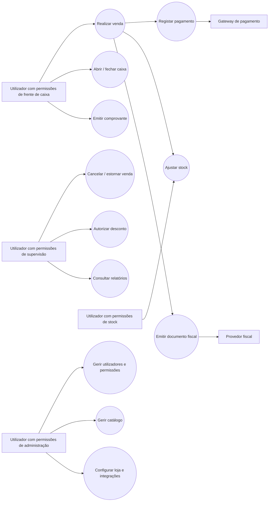

Os atores humanos do diagrama representam combinações ilustrativas de permissões atómicas (ver secção 3), não papéis fixos: um mesmo utilizador pode acumular qualquer subconjunto dessas permissões.

### 10.2. Diagrama de sequência — venda online

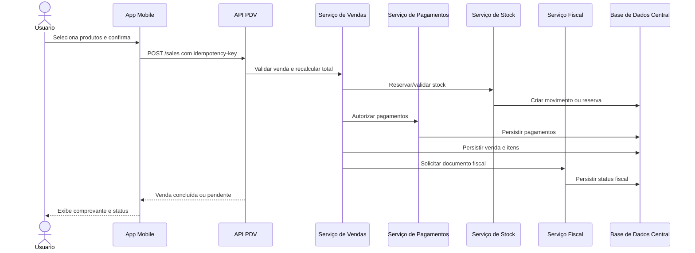

### 10.3. Diagrama de sequência — venda offline e sincronismo

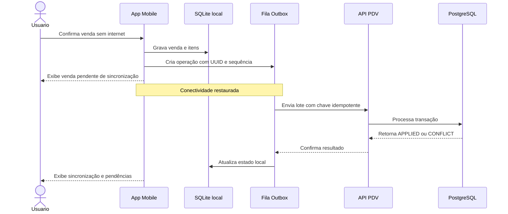

### 10.4. Diagrama de estados da venda

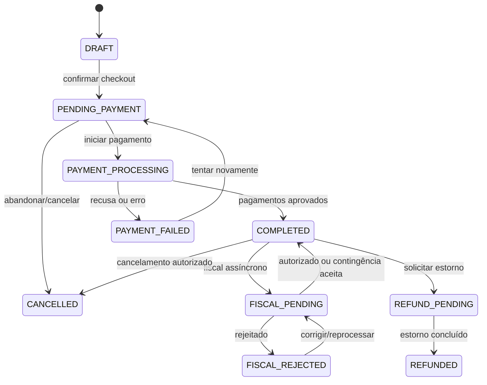

### 10.5. Diagrama de classes de domínio

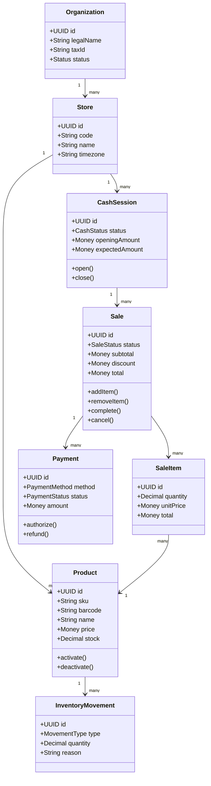

### 10.6. Diagrama de componentes

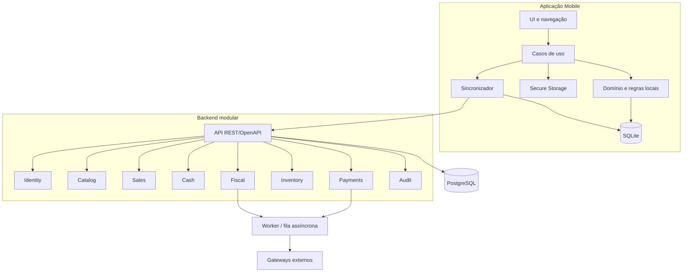

### 10.7. Diagrama de sequência — avaliação de permissão e aprovação

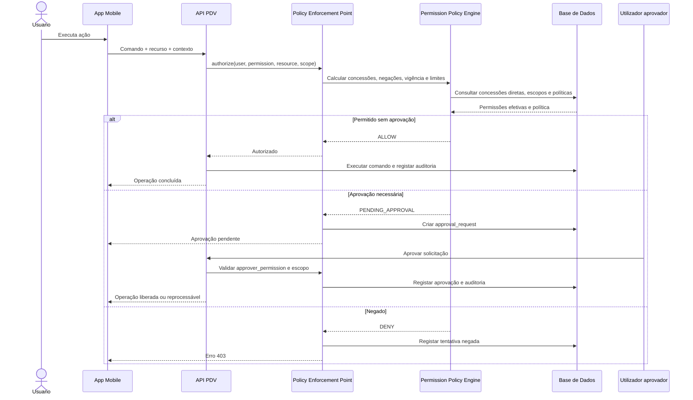

### 10.8. Diagrama de atividades — sincronização offline

Este diagrama representa o fluxo operacional completo de sincronização. O dispositivo deve atualizar revogações e políticas antes de enviar operações pendentes, pois uma permissão válida no momento da criação pode ter sido revogada antes da sincronização.

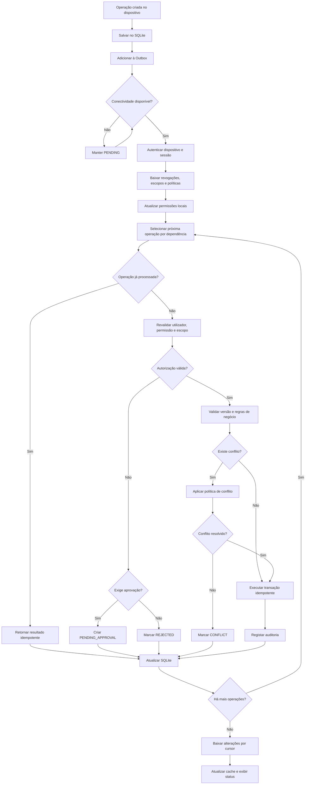

### 10.9. Diagrama de estados — operação de sincronização

Cada item da fila deve possuir um ciclo de vida explícito. O estado não deve ser inferido apenas pela existência ou ausência de erro.

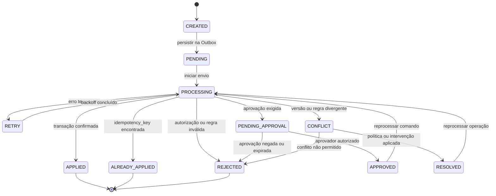

### 10.10. Diagrama de estados — permissão e aprovação

Este diagrama separa a existência da permissão, sua atribuição e a aprovação pontual de uma operação. Uma aprovação não cria uma permissão permanente.

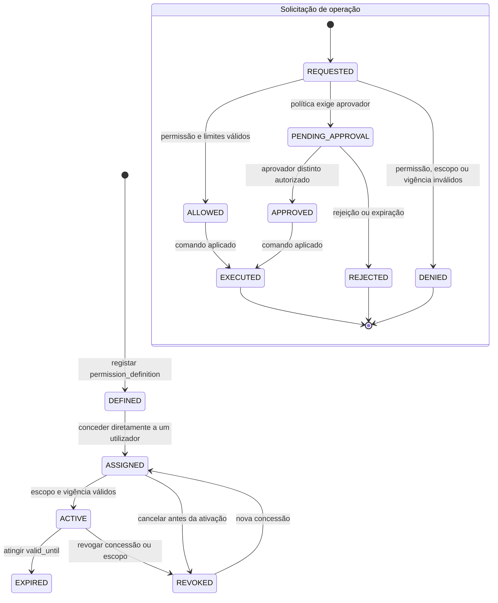

### 10.11. Diagrama de sequência — resolução de conflitos

O servidor deve ser a autoridade para conflitos de stock, preço, caixa, pagamento e permissões. O cliente não deve resolver silenciosamente conflitos financeiros ou de autorização.

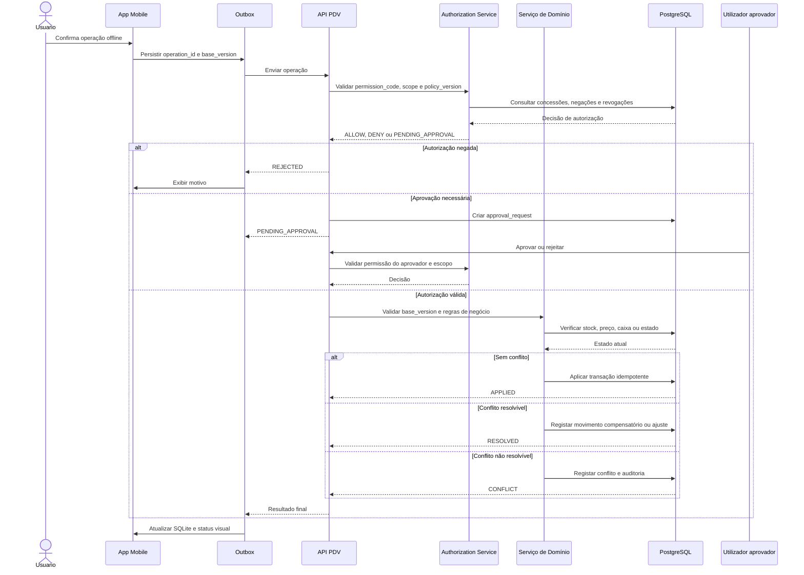

### 10.12. Diagrama de classes — autorização granular e sincronização

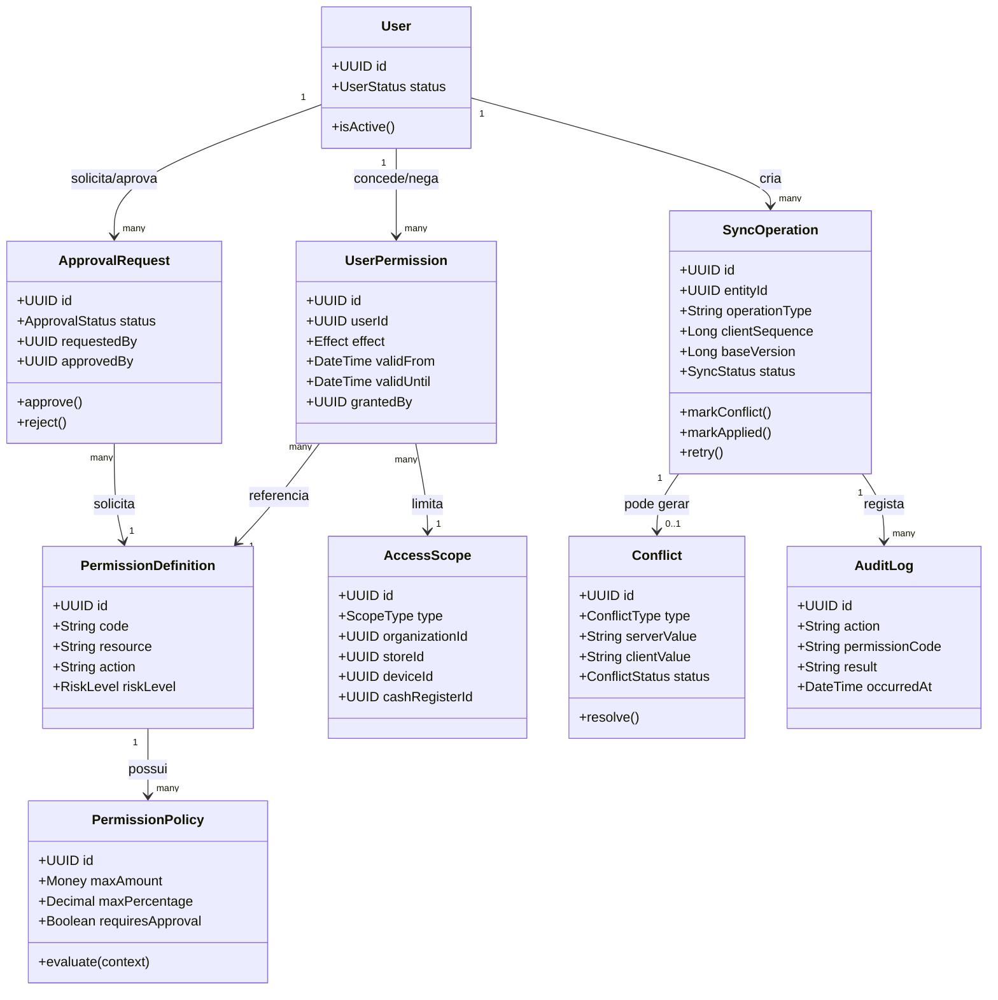

### 10.13. Diagrama de componentes — sincronização e autorização

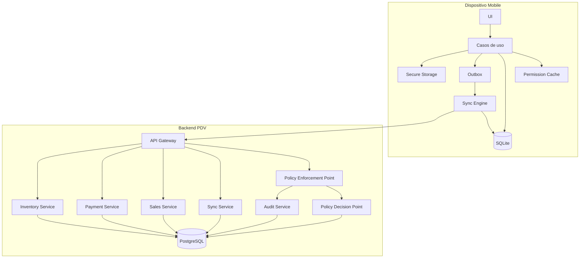

### 10.14. Diagrama de implantação

```mermaid
deploymentDiagram
    node "Smartphone ou Tablet" as Device {
        artifact "App PDV Mobile" as App
        artifact "SQLite + Outbox" as LocalDB
        artifact "Secure Storage" as SecureStore
    }
    node "Internet / Rede" as Network
    node "Servidor de Aplicação" as AppServer {
        artifact "API PDV" as API
        artifact "Authorization Service" as Auth
        artifact "Sync Worker" as Worker
    }
    node "Base de Dados Central" as Database {
        artifact "PostgreSQL" as PG
    }
    node "Serviços Externos" as External {
        artifact "Gateway de Pagamento" as PaymentGateway
        artifact "Provedor Fiscal" as FiscalProvider
    }

    App --> Network
    LocalDB --> App
    SecureStore --> App
    Network --> API
    API --> Auth
    API --> Worker
    API --> PG
    Worker --> PG
    Worker --> PaymentGateway
    Worker --> FiscalProvider
```

> Caso o renderizador Mermaid utilizado não suporte `deploymentDiagram`, o diagrama de implantação pode ser convertido para `flowchart`, mantendo os mesmos nós e relações.

### 10.15. Matriz de diagramas necessários

| Ordem | Diagrama | Tipo | Finalidade | Obrigatoriedade |
|---:|---|---|---|---|
| 1 | Casos de uso | UML | Identificar atores, funcionalidades e fronteiras do sistema. | Obrigatório |
| 2 | Atividades da sincronização | UML comportamental | Descrever o fluxo offline, revalidação e tratamento de resultados. | Obrigatório |
| 3 | Sequência da venda offline | UML comportamental | Mostrar mensagens entre app, fila, API, domínio e base de dados. | Obrigatório |
| 4 | Sequência de autorização | UML comportamental | Mostrar permissões, escopos, políticas e aprovação. | Obrigatório |
| 5 | Sequência de resolução de conflitos | UML comportamental | Mostrar a decisão do servidor para conflitos transacionais. | Obrigatório |
| 6 | Estados da operação de sincronização | UML comportamental | Definir o ciclo de vida da fila e seus retries. | Obrigatório |
| 7 | Estados de permissão e aprovação | UML comportamental | Diferenciar concessão, revogação, expiração e aprovação pontual. | Obrigatório |
| 8 | Classes de domínio | UML estrutural | Relacionar utilizadores, permissões, operações, conflitos e auditoria. | Obrigatório |
| 9 | Entidade-relacionamento | Complementar | Definir persistência, chaves e relacionamentos da base de dados. | Obrigatório |
| 10 | Componentes | UML estrutural | Distribuir responsabilidades entre app, API, autorização e serviços. | Obrigatório |
| 11 | Implantação | UML estrutural | Mostrar dispositivos, servidores, base de dados e integrações externas. | Recomendado |

### 10.16. Ordem recomendada de construção

A documentação deve ser produzida nesta ordem: casos de uso; atividades da sincronização; estados da operação; sequência da venda offline; sequência de autorização; sequência de conflitos; estados de permissão; classes de domínio; modelo de dados; componentes; e implantação.

Essa ordem começa pelo comportamento esperado, detalha as interações e somente depois consolida estrutura, persistência e infraestrutura. Os diagramas devem ser revisados sempre que houver alteração em requisitos, regras de negócio, permissões, estados da fila ou contratos de API.

---

## 11. Fluxos operacionais detalhados

### 11.1. Fluxo de abertura de caixa

1. O operador autentica-se e seleciona loja e terminal.
2. A aplicação consulta se há caixa aberto para o terminal.
3. Se não houver, apresenta o formulário de saldo inicial.
4. O operador informa os valores por meio de pagamento, se a política exigir detalhamento.
5. O backend valida permissões, concorrência e estado do terminal.
6. O backend cria `cash_session` e os movimentos iniciais.
7. A aplicação sincroniza o estado e habilita o botão de nova venda.

### 11.2. Fluxo de venda

1. O operador inicia o carrinho.
2. O produto é inserido por código de barras, SKU ou busca textual.
3. A aplicação valida quantidade, unidade e permissões.
4. O motor de preço aplica a tabela vigente e regista a origem do preço.
5. O operador solicita desconto, se necessário.
6. A aplicação exibe subtotal, descontos e total.
7. O operador escolhe um ou mais meios de pagamento.
8. O sistema autoriza ou regista cada pagamento.
9. O servidor recalcula e valida tudo.
10. A venda é persistida, o stock é movimentado e o fiscal é acionado conforme a política.
11. O comprovante é disponibilizado e o carrinho é limpo.

### 11.3. Fluxo de cancelamento

O cancelamento deve ser um novo comando, não uma exclusão. O sistema verifica o estado da venda, pagamentos, documento fiscal, prazo e permissão. Em seguida, regista o motivo, solicita cancelamento/estorno externo quando necessário, gera movimentos reversos de stock e atualiza o estado da venda. Se um provedor externo estiver indisponível, a operação assume `PENDING` e fica sujeita a reconciliação.

---

## 12. Organização do código

Uma estrutura possível para a aplicação é:

```text
mobile/
  src/
    app/                  # navegação e composição
    modules/
      auth/
      catalog/
      sales/
      payments/
      cash/
      inventory/
      sync/
      reports/
    shared/
      components/
      design-system/
      errors/
      money/
      permissions/
      storage/
    infrastructure/
      api/
      database/
      secure-storage/
      peripherals/
  migrations/
  tests/

backend/
  src/
    modules/
      identity/
      organization/
      catalog/
      sales/
      payments/
      cash/
      inventory/
      fiscal/
      sync/
      reporting/
      audit/
    shared/
      database/
      auth/
      events/
      errors/
      observability/
  migrations/
  openapi/
  tests/
```

A tecnologia específica pode variar. O essencial é manter separação de responsabilidades, contratos claros, testes do domínio e ausência de regras críticas escondidas apenas na interface.

---

## 13. Plano de implementação passo a passo

### Fase 0 — Descoberta e validação do negócio

Realizar entrevistas com proprietários, caixas, gerentes, contador e responsável por pagamentos. Mapear o processo atual, identificar documentos fiscais, meios de recebimento, regras de desconto, necessidades de stock, periféricos e situações de falta de internet.

**Entregáveis:** mapa de processos, glossário, matriz de atores e permissões, lista de integrações, riscos, critérios de sucesso e backlog priorizado.

### Fase 1 — Definição do escopo e protótipo

Construir protótipos dos ecrãs de login, abertura de caixa, catálogo, carrinho, pagamento, comprovante, fechamento e sincronização. Validar com operadores reais, especialmente o fluxo de leitura de código de barras e o tratamento de erros.

**Critério de saída:** utilizadores conseguem simular uma venda completa sem ambiguidade e os principais estados offline estão desenhados.

### Fase 2 — Fundação técnica

Criar repositório, estratégia de branches, pipeline de qualidade, ambientes, configuração de segredos, base de dados, migrações, observabilidade e contratos de API. Implementar autenticação, autorização, organização, loja e dispositivo.

**Critério de saída:** um utilizador autorizado consegue autenticar-se, selecionar uma loja e operar em um ambiente de homologação.

### Fase 3 — Catálogo e preços

Implementar categorias, produtos, códigos de barras, unidades, preços, ativação/inativação e sincronização de catálogo. Criar índices e importação inicial. Preparar cache local para consulta rápida.

**Critério de saída:** o operador encontra um produto por código, SKU ou nome e visualiza o preço correto da loja.

### Fase 4 — Caixa e venda local

Implementar abertura de caixa, carrinho, itens, cálculo monetário, descontos, cancelamento de item, persistência local e comprovante básico. Cobrir o domínio com testes unitários.

**Critério de saída:** é possível abrir caixa e montar uma venda completa em ambiente sem integração externa.

### Fase 5 — Pagamentos

Implementar numerário primeiro. Depois adicionar carteira móvel e cartão com o provedor escolhido. Modelar estados, callbacks, idempotência, timeout, cancelamento, estorno e conciliação.

**Critério de saída:** não ocorre cobrança duplicada em repetição de requisição e o caixa reflete pagamentos aprovados.

### Fase 6 — Stock

Implementar saldo por loja, movimentos de venda, entrada, ajuste, perda e devolução. Adicionar bloqueio de stock negativo ou autorização explícita.

**Critério de saída:** uma venda aprovada cria o movimento correto e o saldo é consistente após reprocessamento.

### Fase 7 — Fiscal e comprovantes

Selecionar fornecedor fiscal, mapear campos, homologar certificados e cenários, implementar estados de autorização/rejeição/contingência/cancelamento e criar comprovante digital. O desenho fiscal deve ser validado com especialista responsável pela empresa.

**Critério de saída:** cenários homologados de emissão e tratamento de falha passam sem intervenção técnica manual indevida.

### Fase 8 — Offline e sincronização

Implementar base de dados local, migrações, outbox, sequência por dispositivo, retry, idempotência, download incremental, resolução de conflitos e ecrã de pendências. Testar perda de conexão em cada etapa do checkout.

**Critério de saída:** vendas offline são sincronizadas uma vez, sem duplicação, e conflitos são compreensíveis para utilizadores com permissão de supervisão.

### Fase 9 — Relatórios e auditoria

Criar relatórios de vendas, produtos, pagamentos, caixa, cancelamentos e stock. Implementar auditoria de alterações críticas e exportação controlada.

**Critério de saída:** os totais do relatório conferem com as transações de origem e há rastreabilidade para operações sensíveis.

### Fase 10 — Segurança, desempenho e acessibilidade

Executar revisão baseada no OWASP MASVS [2], testes de autorização, análise de logs, proteção de dados, teste de carga, teste em dispositivos de referência, acessibilidade e validação de recuperação de dados.

**Critério de saída:** riscos críticos tratados, metas de desempenho atendidas e plano de resposta a incidentes documentado.

### Fase 11 — Piloto controlado

Publicar para uma loja ou grupo reduzido de terminais. Monitorar falhas, tempo de checkout, divergências de caixa, pendências de sincronização, rejeições fiscais e satisfação dos operadores.

**Critério de saída:** indicadores permanecem dentro dos limites definidos durante o período de observação.

### Fase 12 — Produção e evolução

Expandir gradualmente por loja. Manter migrações compatíveis, suporte, monitoramento, backups, gestão de versões e revisão do backlog. Só dividir o backend em microserviços quando métricas demonstram benefício.

---

## 14. Estratégia de testes

| Tipo de teste | O que validar | Exemplos |
|---|---|---|
| Unitário | Regras puras | Total, desconto, troco, arredondamento e transições de estado. |
| Integração | Módulos e base de dados | Venda + pagamento + stock na mesma transação. |
| Contrato | Compatibilidade app/API | Schemas OpenAPI, erros e versionamento. |
| E2E | Fluxos completos | Login, abertura, venda, pagamento, comprovante e fechamento. |
| Offline | Fila e reconciliação | Venda sem internet, reconexão, duplicação e conflito. |
| Segurança | Autorização e proteção | Acesso cruzado entre lojas, tokens, logs e armazenamento local. |
| Desempenho | Tempo e capacidade | Checkout, busca de catálogo, sincronização e relatórios. |
| Fiscal | Homologação | Autorização, rejeição, contingência e cancelamento. |
| Dispositivo | Compatibilidade | Câmera, leitor, impressora, bateria, rotação e conectividade. |
| Aceite | Regras do negócio | Cenários assinados por proprietário, gerente e operador. |

### 14.1. Casos de teste essenciais

| ID | Cenário | Resultado esperado |
|---|---|---|
| CT-001 | Venda com dinheiro e troco | Venda concluída, pagamento registado e troco correto. |
| CT-002 | Pagamento inferior ao total | Checkout bloqueado sem criar venda concluída. |
| CT-003 | Reenvio da mesma requisição | Resultado idempotente, sem venda ou cobrança duplicada. |
| CT-004 | Produto inativo | Produto não pode ser incluído em nova venda. |
| CT-005 | Desconto acima do limite | Solicitação de autorização e registo do aprovador. |
| CT-006 | Stock insuficiente | Aplicação da política configurada e mensagem clara. |
| CT-007 | Queda de internet após confirmação | Operação local fica pendente e é reconciliada posteriormente. |
| CT-008 | Dois terminais vendendo o último item | Conflito tratado conforme política, sem ocultação. |
| CT-009 | Cancelamento com pagamento externo | Estorno/cancelamento externo controlado e venda não apagada. |
| CT-010 | Fechamento com divergência | Diferença calculada e aprovação exigida conforme regra. |
| CT-011 | Utilizador de loja A acede venda de loja B | Acesso negado e evento auditado. |
| CT-012 | Migração da base de dados local | Dados e fila pendente preservados após atualização. |
| CT-013 | Utilizador possui a permissão concedida, mas não possui escopo da loja | API retorna `403` e não revela dados da loja fora do escopo. |
| CT-014 | Permissão concedida diretamente é revogada | Nova tentativa é negada; operações já concluídas permanecem auditadas. |
| CT-015 | Negação explícita em um escopo conflita com concessão em escopo mais amplo | Política de precedência é aplicada e o resultado é registado. |
| CT-016 | Desconto ultrapassa limite individual | Sistema cria aprovação pendente sem concluir venda. |
| CT-017 | Solicitante tenta aprovar a própria operação | Aprovação é rejeitada por conflito de identidade. |
| CT-018 | Venda offline usa permissão revogada antes da sincronização | Servidor revalida a autorização e aplica a política de risco configurada. |

---

## 15. Segurança operacional e proteção de dados

A equipa deve manter um inventário de dados, classificando cada campo como público, interno, pessoal, financeiro ou segredo técnico. A aplicação não deve armazenar senha, chave privada ou dados completos de cartão. Logs devem mascarar identificadores pessoais e referências financeiras sensíveis.

O backend deve possuir rate limiting, validação de payload, proteção contra replay, expiração de tokens, rotação de chaves, segregação de ambientes, backups criptografados e alertas para padrões anómalos. A aplicação deve usar armazenamento seguro do sistema operacional para tokens e chaves locais, e a fila offline deve ser protegida contra leitura casual do dispositivo.

A aplicação deve ser testada contra falhas de autorização, alteração de valores no cliente, repetição de chamadas, manipulação do relógio local, alteração de payload offline, exposição de dados em notificações, screenshots em ecrãs sensíveis e ausência de limpeza de sessão.

---

## 16. Observabilidade e suporte

Cada operação deve possuir `correlation_id`, `device_id`, `organization_id`, `store_id` e identificador da entidade. Métricas mínimas incluem vendas por minuto, erro de checkout, pagamentos recusados, pendências fiscais, tamanho da fila offline, conflitos de sincronização, divergência de caixa, latência da API e versões ativas da aplicação.

O suporte deve conseguir responder às perguntas: qual terminal gerou a venda, qual versão do app estava instalada, quem operou, qual foi a sequência de sincronização, que erro externo ocorreu e se a operação foi aplicada uma ou mais vezes. Nenhuma dessas respostas deve depender de procurar manualmente em logs não correlacionados.

---

## 17. Critérios de aceite do sistema

O sistema será considerado tecnicamente apto quando um operador autorizado conseguir autenticar-se, abrir o caixa, localizar produtos, criar uma venda, receber em dinheiro e ao menos um meio eletrónico homologado, gerar comprovante, atualizar stock, fechar o caixa e consultar o relatório diário.

Além disso, o sistema deverá sobreviver a uma interrupção de conectividade de curta duração, sincronizar operações pendentes sem duplicação, impedir acesso indevido entre lojas, manter histórico de cancelamentos e possuir backup testado. Os requisitos fiscais específicos deverão estar homologados antes de declarar o produto pronto para a operação fiscal real.

### 17.1. Checklist de preparação para produção

| Área | Pergunta de aceite |
|---|---|
| Negócio | Os fluxos foram validados por operadores e gerente? |
| Fiscal | O contador e o responsável fiscal homologaram o cenário aplicável? |
| Pagamentos | Cada meio habilitado foi testado em autorização, recusa, timeout e estorno? |
| Dados | Migrações, backup e restauração foram testados? |
| Segurança | Revisão de autorização, armazenamento e logs foi concluída? |
| Offline | Operações pendentes e conflitos são compreensíveis e recuperáveis? |
| Suporte | Existem logs, métricas, alertas e procedimento de atendimento? |
| Dispositivos | Os modelos e periféricos-alvo foram testados? |
| Publicação | Existe estratégia de atualização, rollback e comunicação? |

---

## 18. Próximos passos recomendados

Antes de iniciar o desenvolvimento, a equipa deve confirmar país e regime fiscal, segmento de negócio, número de lojas, quantidade de terminais, volume esperado de vendas, dispositivos, periféricos, meios de pagamento, necessidade de stock negativo, política de desconto, regras de cancelamento, prazo máximo offline e requisitos de relatórios.

Em seguida, deve transformar este documento em um backlog priorizado, com histórias de utilizador e critérios de aceite. A primeira entrega recomendada é um protótipo navegável do checkout, seguido por uma prova técnica de venda offline com sincronização e idempotência. Essa prova reduz os maiores riscos arquiteturais antes de investir em todos os ecrãs e integrações.

---

## Referências

[1]: Legislação de proteção de dados pessoais aplicável em Moçambique. A referência exata (número da lei, entidade reguladora e requisitos de consentimento, retenção e transferência internacional de dados) deve ser confirmada com assessoria jurídica local antes da implementação, dado que este documento não substitui orientação jurídica.

[2]: https://mas.owasp.org/MASVS/ — **OWASP Mobile Application Security Verification Standard — MASVS**, OWASP Foundation.

[3]: https://www.omg.org/spec/UML/2.5.1/About-UML — **Unified Modeling Language Specification 2.5.1**, Object Management Group.

---

## Nota final

Este documento é uma base de análise e engenharia de software. Valores de disponibilidade, retenção, contingência fiscal, meios de pagamento, prazos de cancelamento e obrigações regulatórias devem ser confirmados com os responsáveis técnicos, financeiros, fiscais e jurídicos da operação antes da entrada em produção.

**Fim da especificação.**

---

**Autor:** Manus AI  
**Versão:** 1.0  
**Data:** 14 de agosto de 2026

---

## Apêndice A — Exemplo de histórias de utilizador

### US-001 — Registar venda

Como operador, quero adicionar produtos a um carrinho e concluir o pagamento, para registar uma venda rapidamente.

**Critérios:** o sistema calcula o total; impede produto inativo; permite pagamento habilitado; regista operador, terminal e caixa; gera comprovante; e deixa a operação pendente quando não houver conectividade.

### US-002 — Autorizar desconto

Como utilizador com permissão de aprovação de desconto, quero aprovar descontos acima do limite do utilizador que regista a venda, para manter controle comercial.

**Critérios:** o utilizador que regista a venda não consegue concluir sem aprovação; o aprovador informa credencial válida e não pode ser o mesmo utilizador que solicitou o desconto; o sistema regista valor anterior, novo valor, aprovador, horário e motivo.

### US-003 — Fechar caixa

Como operador, quero informar o dinheiro e os demais meios contados, para comparar o caixa real com o esperado.

**Critérios:** o sistema mostra totais por método; calcula diferença; solicita autorização quando necessário; bloqueia novos lançamentos após fechamento.

### US-004 — Sincronizar venda offline

Como operador, quero continuar vendendo sem internet, para não interromper o atendimento.

**Critérios:** catálogo mínimo disponível; venda identificada globalmente; fila persistente; reenvio idempotente; status visível; conflito tratado sem perda silenciosa.

---

## Apêndice B — Matriz resumida de rastreabilidade

| Objetivo | Requisitos relacionados | Testes relacionados |
|---|---|---|
| Checkout rápido | RF-030 a RF-038, RNF-001, RNF-012 | CT-001, CT-002, CT-005 |
| Controle financeiro | RF-040 a RF-055, RN-003 a RN-008 | CT-001, CT-003, CT-009, CT-010 |
| Controle de stock | RF-060 a RF-065, RN-009 a RN-012 | CT-005, CT-006, CT-008 |
| Continuidade operacional | RF-090 a RF-094, RNF-004, RNF-019 | CT-007, CT-008, CT-012 |
| Segurança e conformidade | RF-001 a RF-006, RF-083, RNF-006 a RNF-009 | CT-011 e testes de segurança |
| Integração fiscal | RF-072 a RF-075, RN-015, RNF-020 | Cenários de homologação fiscal |

## Apêndice C — Decisões que ainda exigem confirmação

| Decisão | Opções |
|---|---|
| Plataforma mobile | React Native/Expo, Flutter ou nativo Android/iOS |
| Backend | Node/NestJS, FastAPI, .NET, Java/Spring ou equivalente |
| Base de dados central | PostgreSQL, MySQL ou serviço gerido compatível |
| Fiscal | Integração direta, middleware fiscal ou provedor SaaS |
| Cartão | POS externo, TPA integrado, SDK de adquirente ou registo manual controlado |
| Carteira móvel | M-Pesa, e-Mola, mKesh, QR ou gateway agregador |
| Impressão | Bluetooth, rede local, USB via equipamento compatível ou sem papel |
| Modo offline | Venda limitada, venda completa com reconciliação ou bloqueio de meios eletrónicos |
| Multiempresa | Uma organização por conta ou múltiplas organizações no mesmo tenant |
| Hospedagem | Nuvem gerida, infraestrutura própria ou ambiente híbrido |

A recomendação é decidir essas opções com base em custo total, suporte dos periféricos, requisitos fiscais, capacidade da equipa, cobertura de internet e risco operacional — não apenas com base na preferência tecnológica.

**Fim.**
