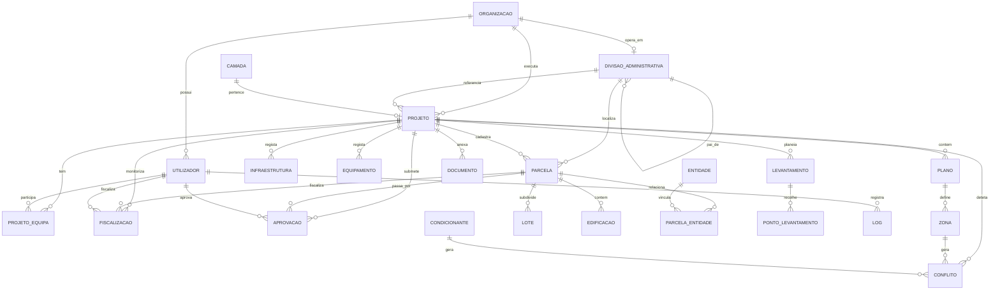
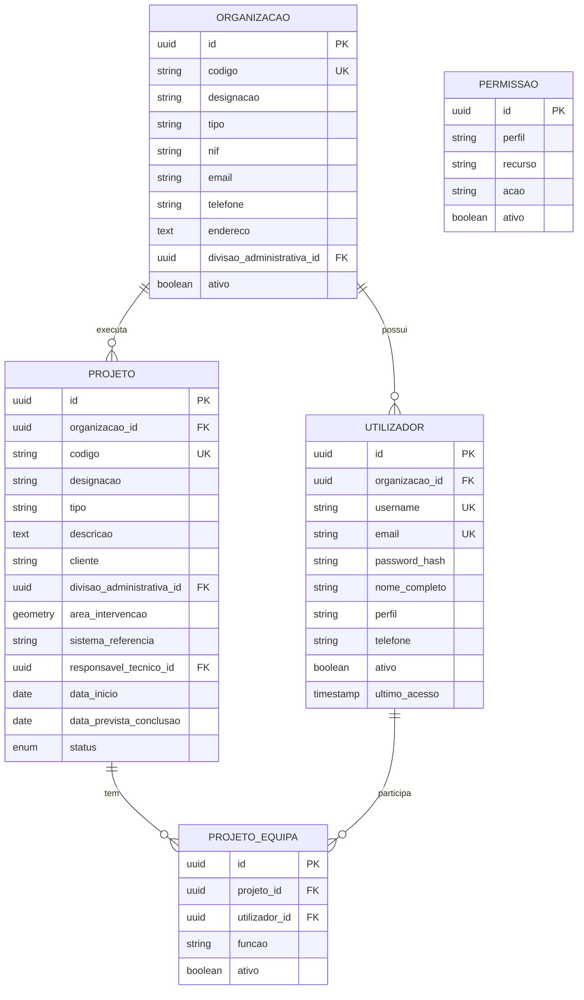
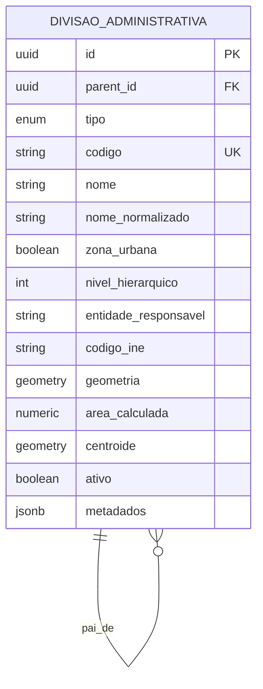
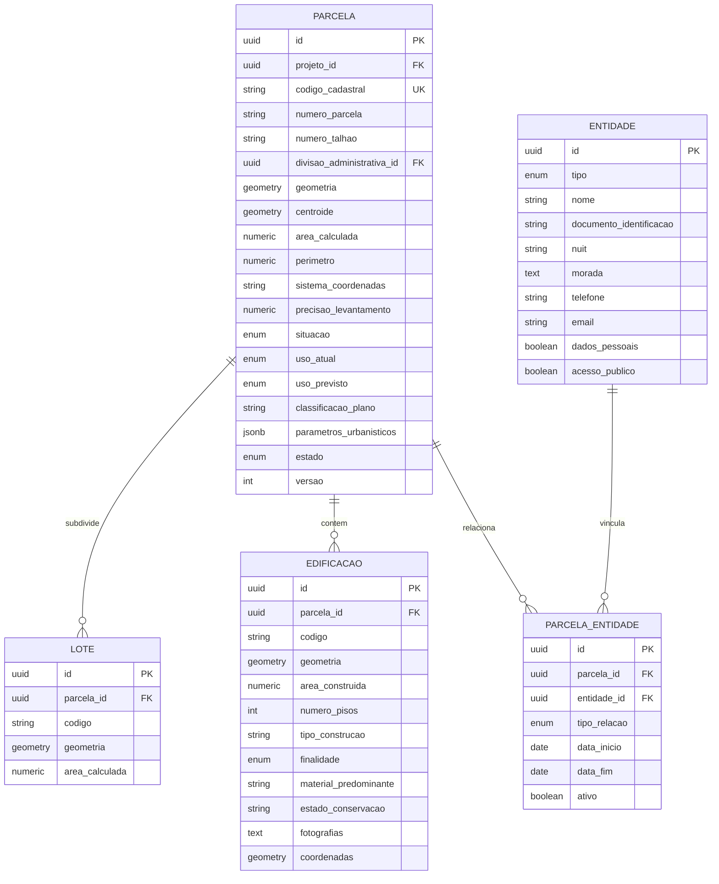
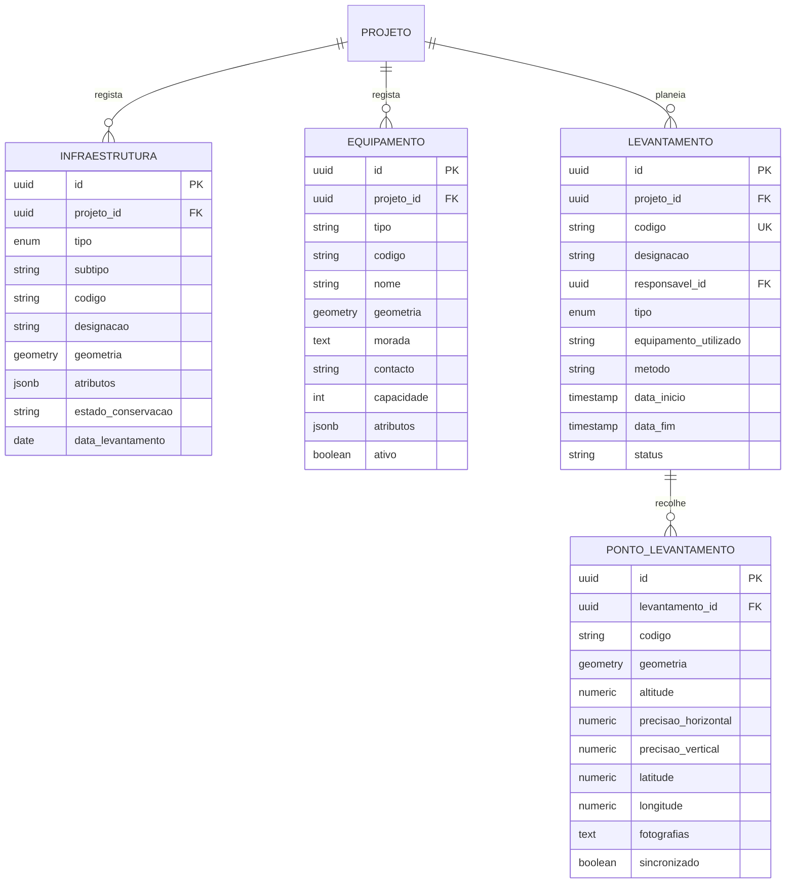
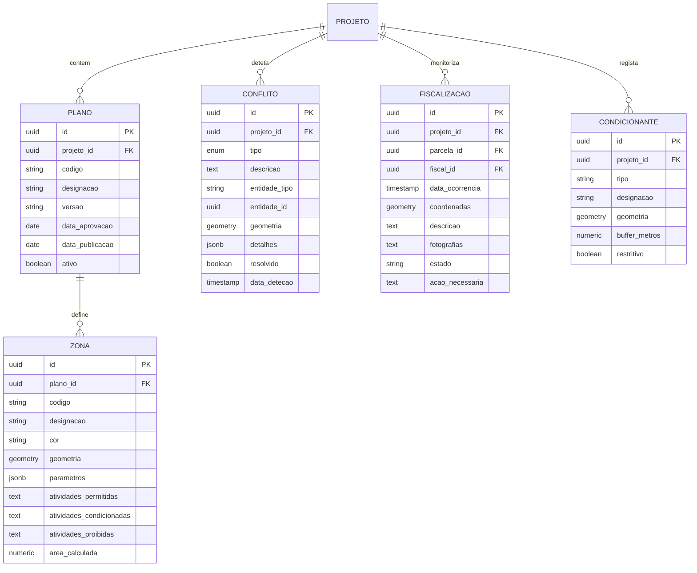
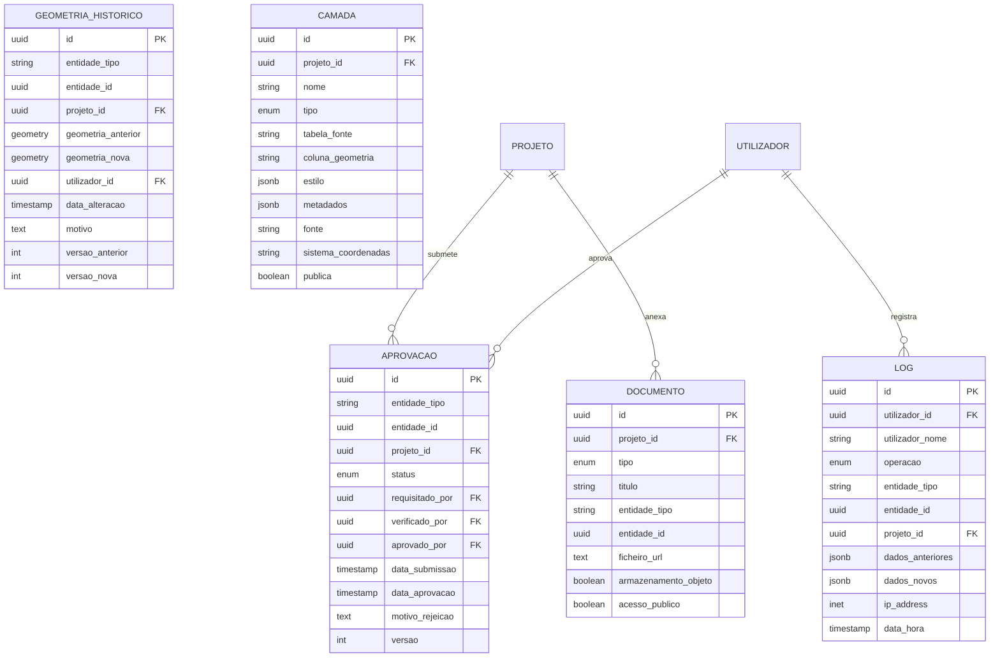

# Diagrama Entidade-Relacionamento

## Diagrama ER Simplificado (Mermaid)

---

## Diagrama ER Detalhado por Domínio

### 1. Territorial — Organizações, Utilizadores e Projetos

### 2. Territorial — Divisão Administrativa

### 3. Cadastro — Parcelas, Edificações e Entidades

### 4. Cadastro — Infraestruturas, Equipamentos e Levantamentos

### 5. Territorial — Plano, Zoneamento, Conflitos e Fiscalização

### 6. Workflow, Auditoria e GIS

---

## Observações

- Todas as tabelas com geometria possuem índice espacial GIST no PostGIS.
- As tabelas `PARCELA`, `ZONA`, `DIVISAO_ADMINISTRATIVA` e outras utilizam campos gerados automaticamente para área, perímetro e centroide.
- O campo `tipo` da `DIVISAO_ADMINISTRATIVA` é um ENUM que permite representar tanto a estrutura urbana quanto a rural de Moçambique.
- A auditoria é feita por triggers nas tabelas principais, populando `audit.log`.
- O versionamento de geometrias é guardado em `territorial.geometria_historico`.
