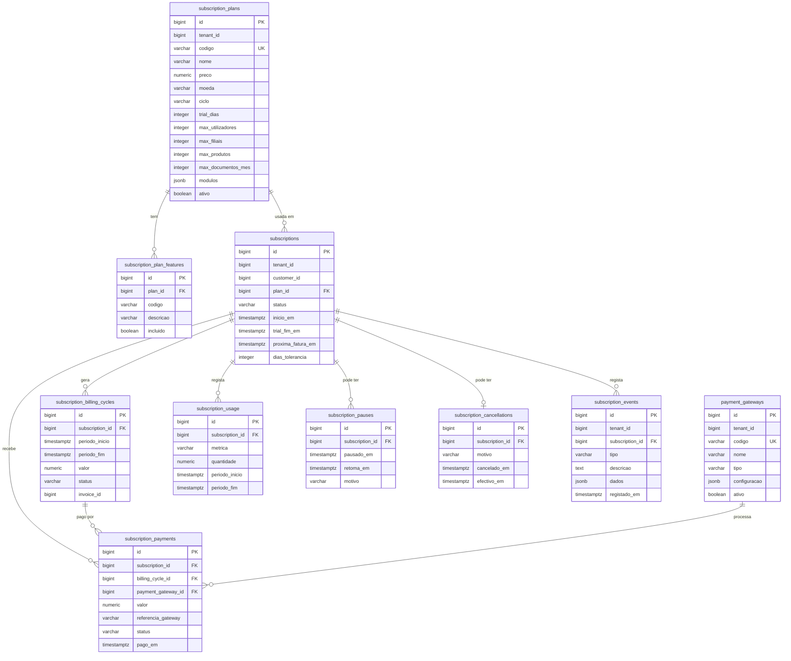
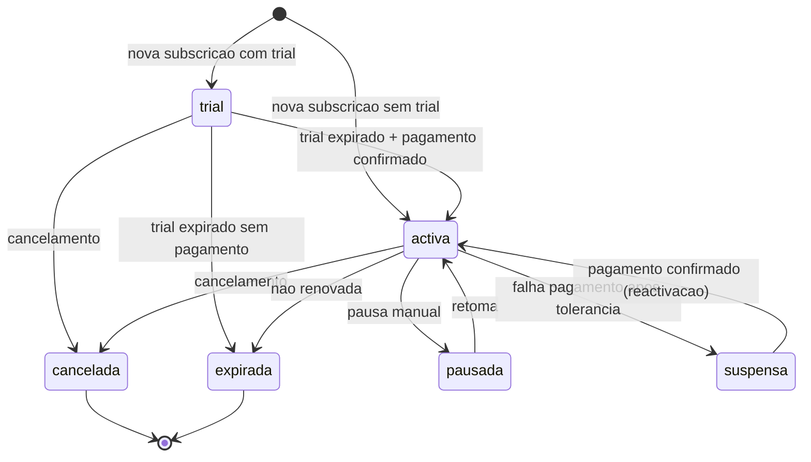
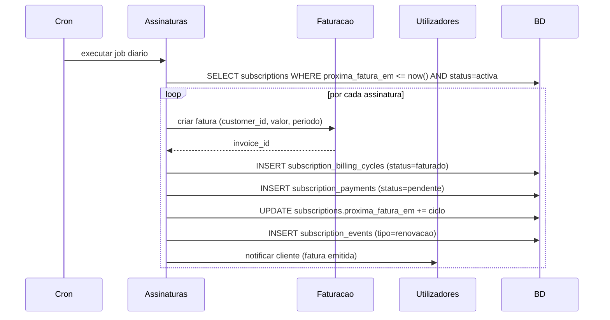
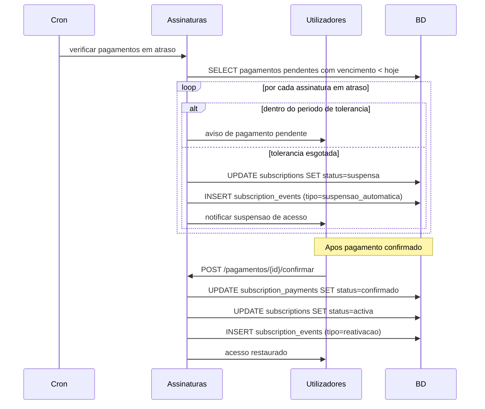
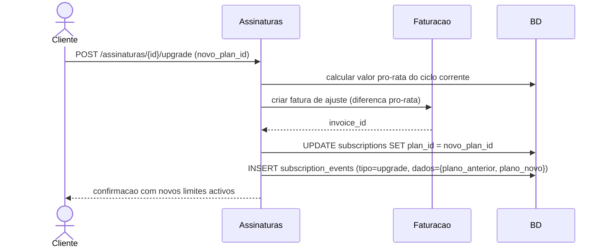

# UML — Modulo Assinaturas SaaS / Licencas

## Diagrama de Entidades (ERD)

## Ciclo de Vida da Assinatura

## Fluxo de Faturacao Automatica

## Fluxo de Inadimplencia

## Fluxo de Upgrade de Plano

