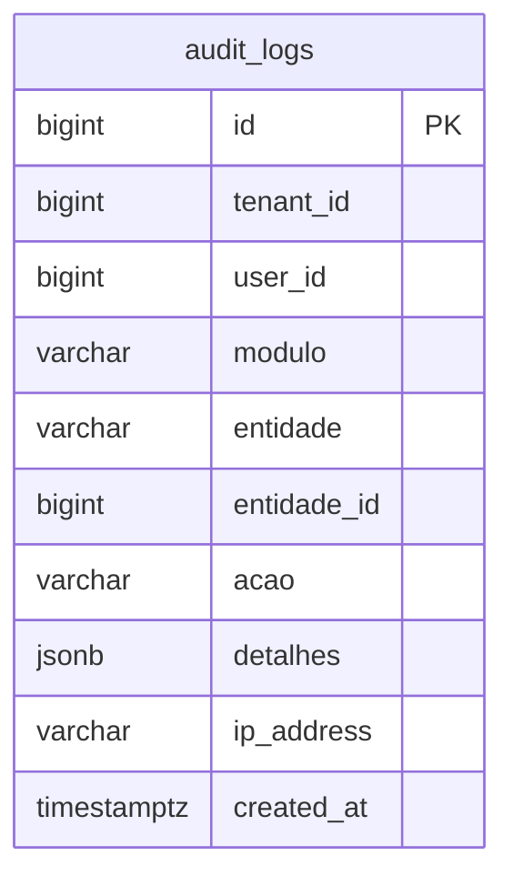
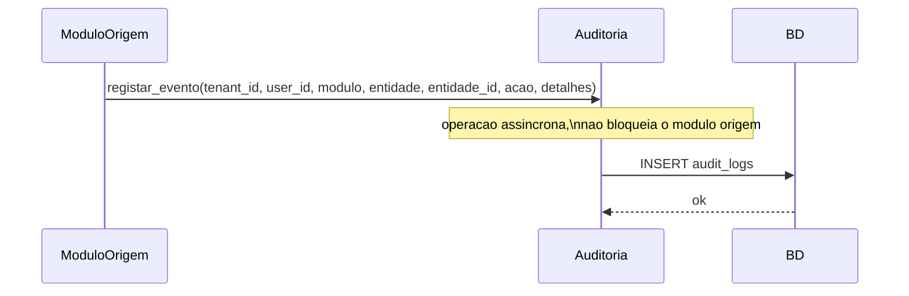
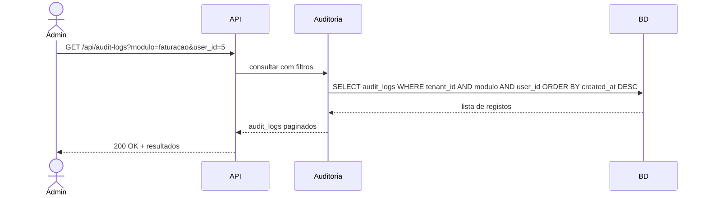
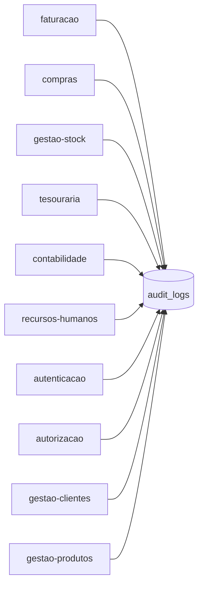

# UML — Modulo Auditoria

## Diagrama de Entidades (ERD)

```mermaid
erDiagram
    audit_logs {
        bigint id PK
        bigint tenant_id
        bigint user_id
        varchar modulo
        varchar entidade
        bigint entidade_id
        varchar acao
        jsonb detalhes
        varchar ip_address
        timestamptz created_at
    }
```

## Fluxo de Registo de Auditoria

```mermaid
sequenceDiagram
    participant ModuloOrigem
    participant Auditoria
    participant BD

    ModuloOrigem->>Auditoria: registar_evento(tenant_id, user_id, modulo, entidade, entidade_id, acao, detalhes)
    Note over Auditoria: operacao assincrona,\nnao bloqueia o modulo origem
    Auditoria->>BD: INSERT audit_logs
    BD-->>Auditoria: ok
```

## Fluxo de Consulta de Auditoria

```mermaid
sequenceDiagram
    actor Admin
    participant API
    participant Auditoria
    participant BD

    Admin->>API: GET /api/audit-logs?modulo=faturacao&user_id=5
    API->>Auditoria: consultar com filtros
    Auditoria->>BD: SELECT audit_logs WHERE tenant_id AND modulo AND user_id ORDER BY created_at DESC
    BD-->>Auditoria: lista de registos
    Auditoria-->>API: audit_logs paginados
    API-->>Admin: 200 OK + resultados
```

## Diagrama de Fontes de Auditoria

```mermaid
flowchart LR
    F[faturacao] --> A[(audit_logs)]
    C[compras] --> A
    S[gestao-stock] --> A
    T[tesouraria] --> A
    CT[contabilidade] --> A
    RH[recursos-humanos] --> A
    AU[autenticacao] --> A
    AZ[autorizacao] --> A
    CL[gestao-clientes] --> A
    P[gestao-produtos] --> A
```
