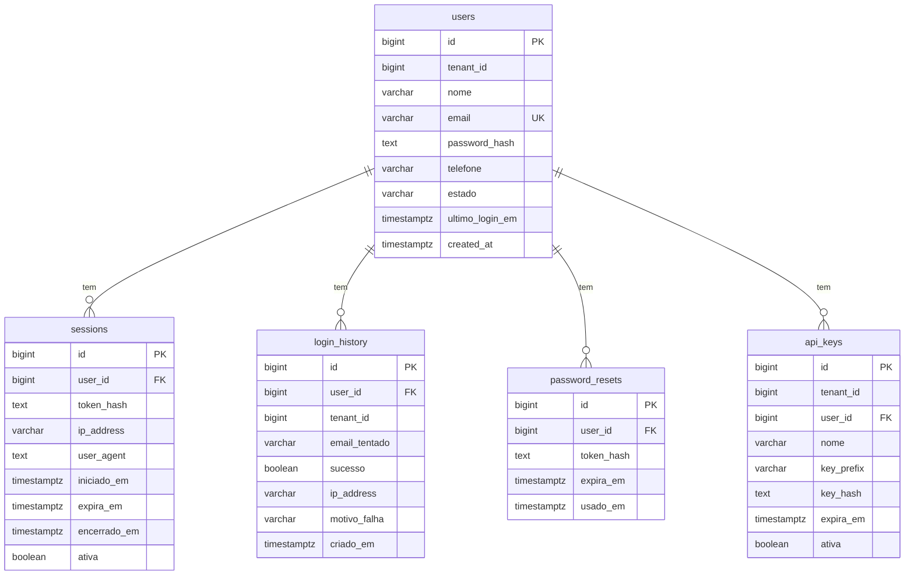
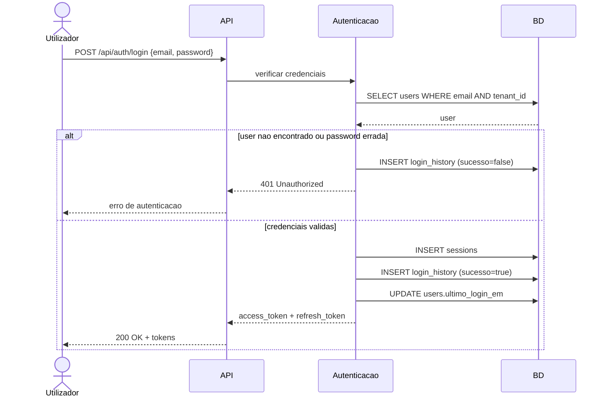
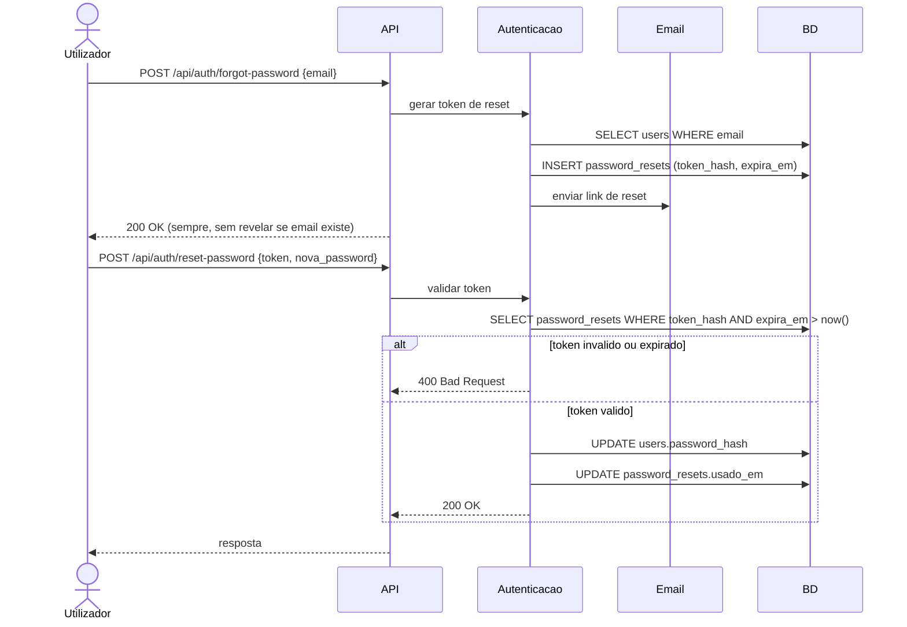

# UML — Modulo Autenticacao

## Diagrama de Entidades (ERD)

```mermaid
erDiagram
    users {
        bigint id PK
        bigint tenant_id
        varchar nome
        varchar email UK
        text password_hash
        varchar telefone
        varchar estado
        timestamptz ultimo_login_em
        timestamptz created_at
    }

    sessions {
        bigint id PK
        bigint user_id FK
        text token_hash
        varchar ip_address
        text user_agent
        timestamptz iniciado_em
        timestamptz expira_em
        timestamptz encerrado_em
        boolean ativa
    }

    login_history {
        bigint id PK
        bigint user_id FK
        bigint tenant_id
        varchar email_tentado
        boolean sucesso
        varchar ip_address
        varchar motivo_falha
        timestamptz criado_em
    }

    password_resets {
        bigint id PK
        bigint user_id FK
        text token_hash
        timestamptz expira_em
        timestamptz usado_em
    }

    api_keys {
        bigint id PK
        bigint tenant_id
        bigint user_id FK
        varchar nome
        varchar key_prefix
        text key_hash
        timestamptz expira_em
        boolean ativa
    }

    users ||--o{ sessions : "tem"
    users ||--o{ login_history : "tem"
    users ||--o{ password_resets : "tem"
    users ||--o{ api_keys : "tem"
```

## Fluxo de Login

```mermaid
sequenceDiagram
    actor Utilizador
    participant API
    participant Autenticacao
    participant BD

    Utilizador->>API: POST /api/auth/login {email, password}
    API->>Autenticacao: verificar credenciais
    Autenticacao->>BD: SELECT users WHERE email AND tenant_id
    BD-->>Autenticacao: user

    alt user nao encontrado ou password errada
        Autenticacao->>BD: INSERT login_history (sucesso=false)
        Autenticacao-->>API: 401 Unauthorized
        API-->>Utilizador: erro de autenticacao
    else credenciais validas
        Autenticacao->>BD: INSERT sessions
        Autenticacao->>BD: INSERT login_history (sucesso=true)
        Autenticacao->>BD: UPDATE users.ultimo_login_em
        Autenticacao-->>API: access_token + refresh_token
        API-->>Utilizador: 200 OK + tokens
    end
```

## Fluxo de Recuperacao de Password

```mermaid
sequenceDiagram
    actor Utilizador
    participant API
    participant Autenticacao
    participant Email
    participant BD

    Utilizador->>API: POST /api/auth/forgot-password {email}
    API->>Autenticacao: gerar token de reset
    Autenticacao->>BD: SELECT users WHERE email
    Autenticacao->>BD: INSERT password_resets (token_hash, expira_em)
    Autenticacao->>Email: enviar link de reset
    API-->>Utilizador: 200 OK (sempre, sem revelar se email existe)

    Utilizador->>API: POST /api/auth/reset-password {token, nova_password}
    API->>Autenticacao: validar token
    Autenticacao->>BD: SELECT password_resets WHERE token_hash AND expira_em > now()
    alt token invalido ou expirado
        Autenticacao-->>API: 400 Bad Request
    else token valido
        Autenticacao->>BD: UPDATE users.password_hash
        Autenticacao->>BD: UPDATE password_resets.usado_em
        Autenticacao-->>API: 200 OK
    end
    API-->>Utilizador: resposta
```
