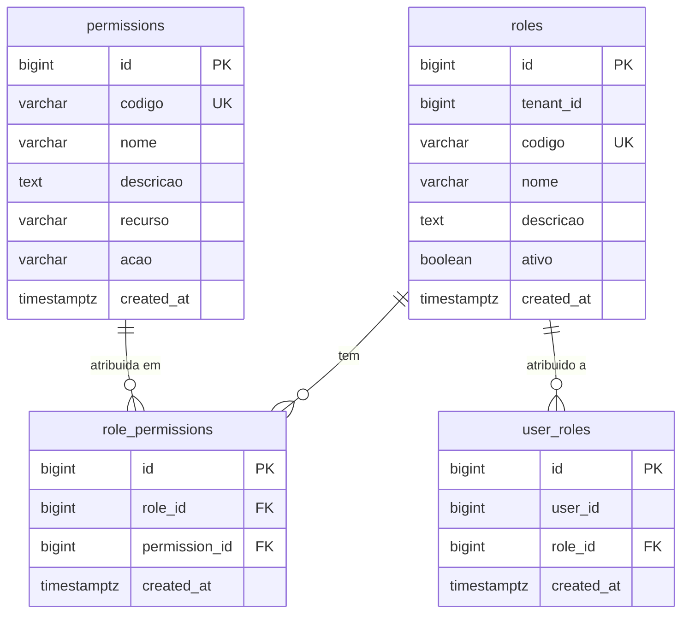
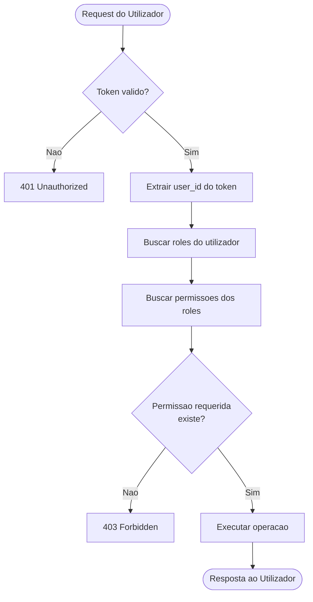
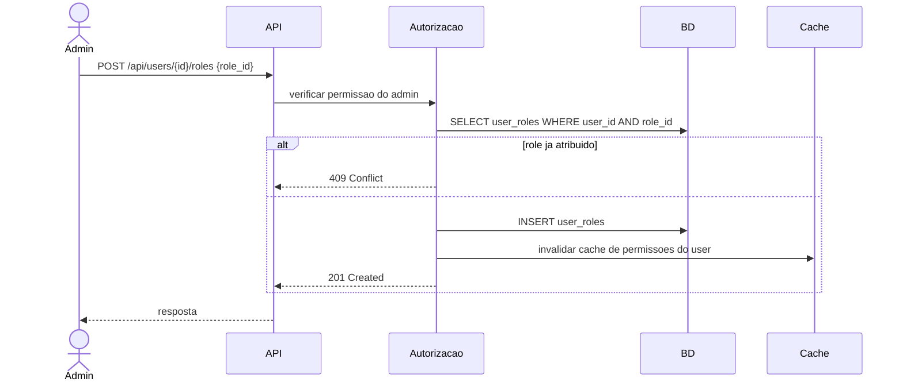

# UML — Modulo Autorizacao

## Diagrama de Entidades (ERD)

```mermaid
erDiagram
    roles {
        bigint id PK
        bigint tenant_id
        varchar codigo UK
        varchar nome
        text descricao
        boolean ativo
        timestamptz created_at
    }

    permissions {
        bigint id PK
        varchar codigo UK
        varchar nome
        text descricao
        varchar recurso
        varchar acao
        timestamptz created_at
    }

    role_permissions {
        bigint id PK
        bigint role_id FK
        bigint permission_id FK
        timestamptz created_at
    }

    user_roles {
        bigint id PK
        bigint user_id
        bigint role_id FK
        timestamptz created_at
    }

    roles ||--o{ role_permissions : "tem"
    permissions ||--o{ role_permissions : "atribuida em"
    roles ||--o{ user_roles : "atribuido a"
```

## Diagrama de Verificacao de Permissao

```mermaid
flowchart TD
    A([Request do Utilizador]) --> B{Token valido?}
    B -- Nao --> Z1[401 Unauthorized]
    B -- Sim --> C[Extrair user_id do token]
    C --> D[Buscar roles do utilizador]
    D --> E[Buscar permissoes dos roles]
    E --> F{Permissao requerida\nexiste?}
    F -- Nao --> Z2[403 Forbidden]
    F -- Sim --> G[Executar operacao]
    G --> H([Resposta ao Utilizador])
```

## Fluxo de Atribuicao de Role a Utilizador

```mermaid
sequenceDiagram
    actor Admin
    participant API
    participant Autorizacao
    participant BD

    Admin->>API: POST /api/users/{id}/roles {role_id}
    API->>Autorizacao: verificar permissao do admin
    Autorizacao->>BD: SELECT user_roles WHERE user_id AND role_id
    alt role ja atribuido
        Autorizacao-->>API: 409 Conflict
    else
        Autorizacao->>BD: INSERT user_roles
        Autorizacao->>Cache: invalidar cache de permissoes do user
        Autorizacao-->>API: 201 Created
    end
    API-->>Admin: resposta
```
