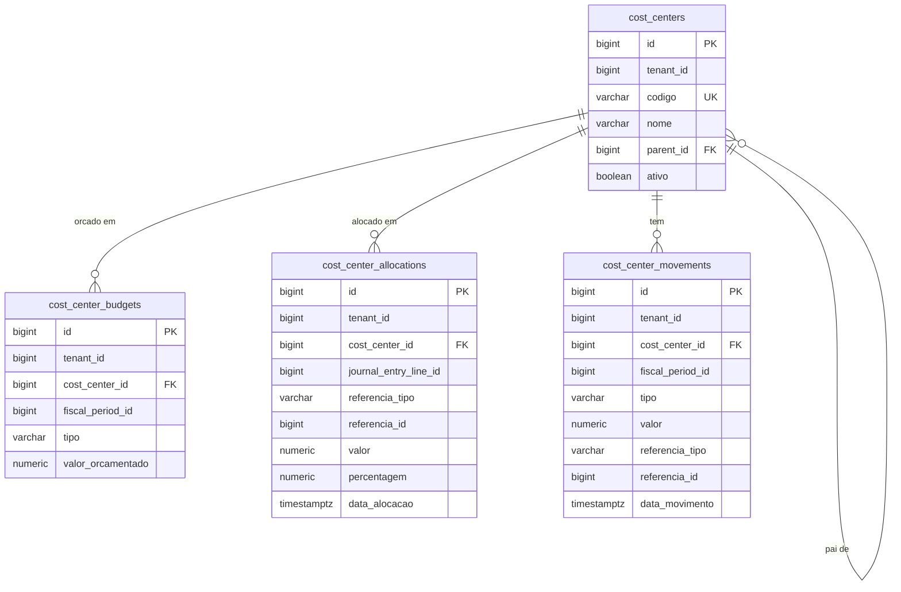
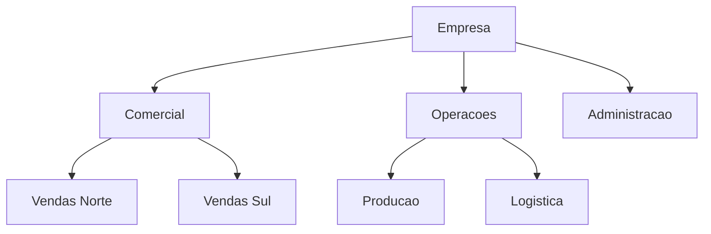
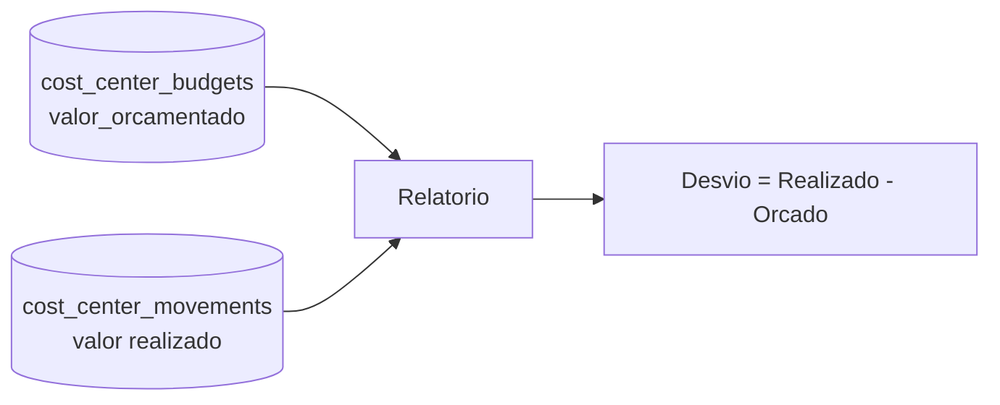

# UML — Modulo Centros de Custo

## Diagrama de Entidades (ERD)

```mermaid
erDiagram
    cost_centers {
        bigint id PK
        bigint tenant_id
        varchar codigo UK
        varchar nome
        bigint parent_id FK
        boolean ativo
    }

    cost_center_budgets {
        bigint id PK
        bigint tenant_id
        bigint cost_center_id FK
        bigint fiscal_period_id
        varchar tipo
        numeric valor_orcamentado
    }

    cost_center_allocations {
        bigint id PK
        bigint tenant_id
        bigint cost_center_id FK
        bigint journal_entry_line_id
        varchar referencia_tipo
        bigint referencia_id
        numeric valor
        numeric percentagem
        timestamptz data_alocacao
    }

    cost_center_movements {
        bigint id PK
        bigint tenant_id
        bigint cost_center_id FK
        bigint fiscal_period_id
        varchar tipo
        numeric valor
        varchar referencia_tipo
        bigint referencia_id
        timestamptz data_movimento
    }

    cost_centers ||--o{ cost_centers : "pai de"
    cost_centers ||--o{ cost_center_budgets : "orcado em"
    cost_centers ||--o{ cost_center_allocations : "alocado em"
    cost_centers ||--o{ cost_center_movements : "tem"
```

## Hierarquia de Centros de Custo

```mermaid
flowchart TD
    A[Empresa] --> B[Comercial]
    A --> C[Operacoes]
    A --> D[Administracao]
    B --> E[Vendas Norte]
    B --> F[Vendas Sul]
    C --> G[Producao]
    C --> H[Logistica]
```

## Relatorio Orcado vs Realizado

```mermaid
flowchart LR
    B[(cost_center_budgets\nvalor_orcamentado)] --> R[Relatorio]
    M[(cost_center_movements\nvalor realizado)] --> R
    R --> D[Desvio = Realizado - Orcado]
```
