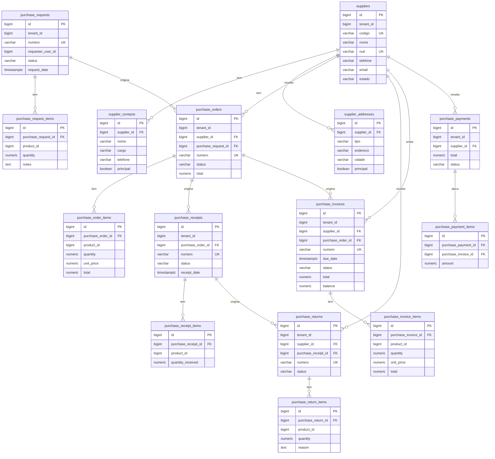
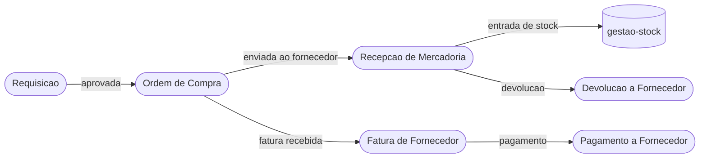

# UML — Modulo Compras

## Diagrama de Entidades (ERD)

```mermaid
erDiagram
    suppliers {
        bigint id PK
        bigint tenant_id
        varchar codigo UK
        varchar nome
        varchar nuit UK
        varchar telefone
        varchar email
        varchar estado
    }

    supplier_contacts {
        bigint id PK
        bigint supplier_id FK
        varchar nome
        varchar cargo
        varchar telefone
        boolean principal
    }

    supplier_addresses {
        bigint id PK
        bigint supplier_id FK
        varchar tipo
        varchar endereco
        varchar cidade
        boolean principal
    }

    purchase_requests {
        bigint id PK
        bigint tenant_id
        varchar numero UK
        bigint requester_user_id
        varchar status
        timestamptz request_date
    }

    purchase_request_items {
        bigint id PK
        bigint purchase_request_id FK
        bigint product_id
        numeric quantity
        text notes
    }

    purchase_orders {
        bigint id PK
        bigint tenant_id
        bigint supplier_id FK
        bigint purchase_request_id FK
        varchar numero UK
        varchar status
        numeric total
    }

    purchase_order_items {
        bigint id PK
        bigint purchase_order_id FK
        bigint product_id
        numeric quantity
        numeric unit_price
        numeric total
    }

    purchase_receipts {
        bigint id PK
        bigint tenant_id
        bigint purchase_order_id FK
        varchar numero UK
        varchar status
        timestamptz receipt_date
    }

    purchase_receipt_items {
        bigint id PK
        bigint purchase_receipt_id FK
        bigint product_id
        numeric quantity_received
    }

    purchase_returns {
        bigint id PK
        bigint tenant_id
        bigint supplier_id FK
        bigint purchase_receipt_id FK
        varchar numero UK
        varchar status
    }

    purchase_return_items {
        bigint id PK
        bigint purchase_return_id FK
        bigint product_id
        numeric quantity
        text reason
    }

    purchase_invoices {
        bigint id PK
        bigint tenant_id
        bigint supplier_id FK
        bigint purchase_order_id FK
        varchar numero UK
        timestamptz due_date
        varchar status
        numeric total
        numeric balance
    }

    purchase_invoice_items {
        bigint id PK
        bigint purchase_invoice_id FK
        bigint product_id
        numeric quantity
        numeric unit_price
        numeric total
    }

    purchase_payments {
        bigint id PK
        bigint tenant_id
        bigint supplier_id FK
        numeric total
        varchar status
    }

    purchase_payment_items {
        bigint id PK
        bigint purchase_payment_id FK
        bigint purchase_invoice_id FK
        numeric amount
    }

    suppliers ||--o{ supplier_contacts : "tem"
    suppliers ||--o{ supplier_addresses : "tem"
    suppliers ||--o{ purchase_orders : "recebe"
    suppliers ||--o{ purchase_returns : "recebe"
    suppliers ||--o{ purchase_invoices : "emite"
    suppliers ||--o{ purchase_payments : "recebe"
    purchase_requests ||--o{ purchase_request_items : "tem"
    purchase_requests ||--o{ purchase_orders : "origina"
    purchase_orders ||--o{ purchase_order_items : "tem"
    purchase_orders ||--o{ purchase_receipts : "origina"
    purchase_orders ||--o{ purchase_invoices : "origina"
    purchase_receipts ||--o{ purchase_receipt_items : "tem"
    purchase_receipts ||--o{ purchase_returns : "origina"
    purchase_returns ||--o{ purchase_return_items : "tem"
    purchase_invoices ||--o{ purchase_invoice_items : "tem"
    purchase_payments ||--o{ purchase_payment_items : "aloca"
```

## Fluxo do Ciclo de Compra

```mermaid
flowchart LR
    A([Requisicao]) -->|aprovada| B([Ordem de Compra])
    B -->|enviada ao fornecedor| C([Recepcao de Mercadoria])
    C -->|entrada de stock| D[(gestao-stock)]
    B -->|fatura recebida| E([Fatura de Fornecedor])
    E -->|pagamento| F([Pagamento a Fornecedor])
    C -->|devolucao| G([Devolucao a Fornecedor])
```
