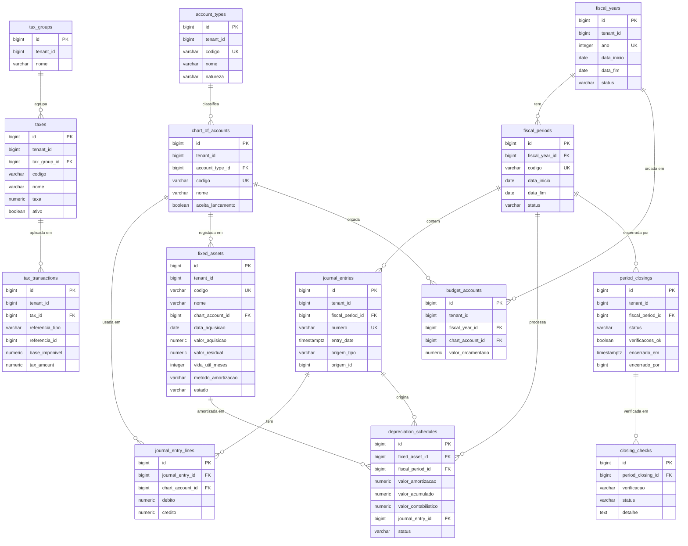
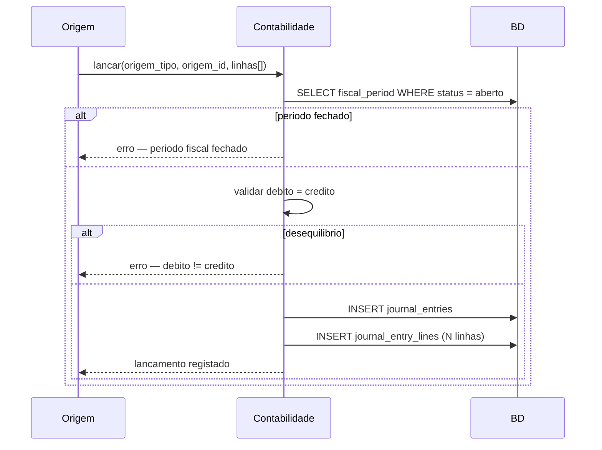
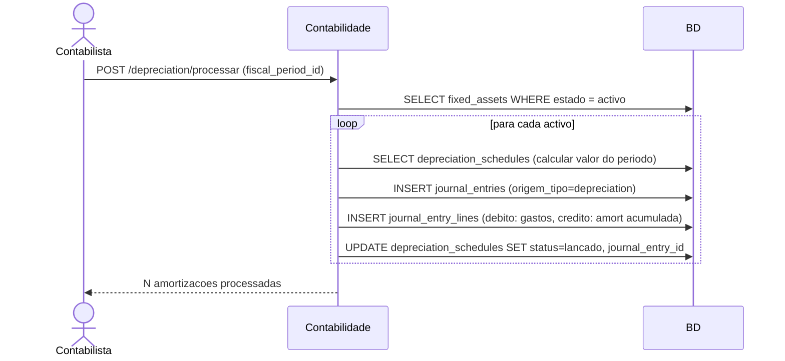
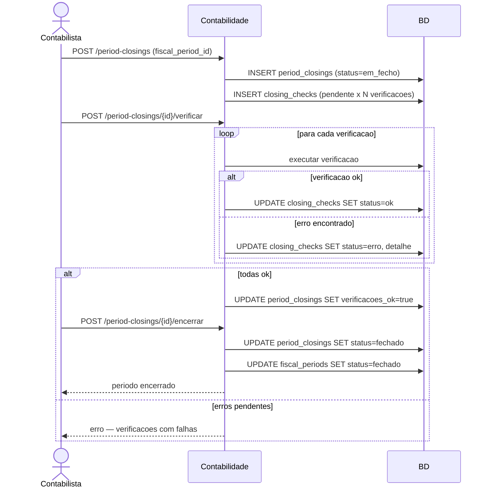
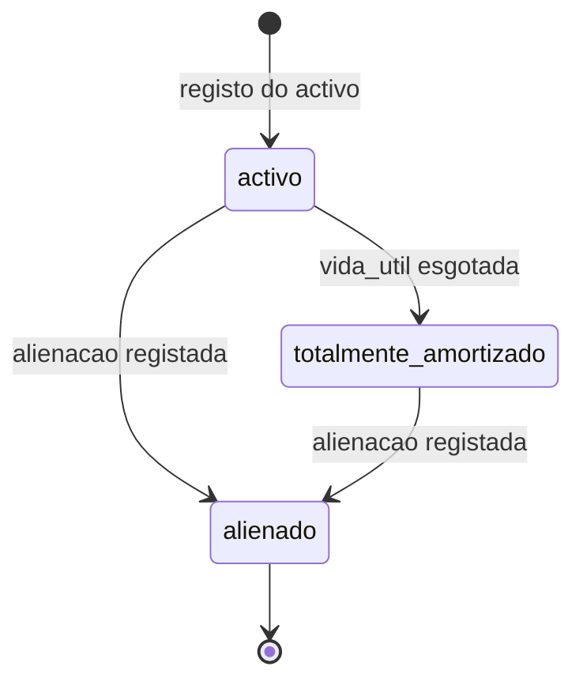
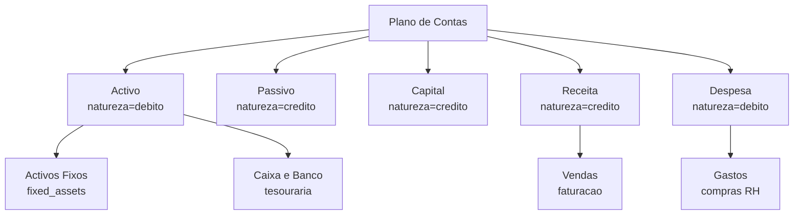

# UML — Modulo Contabilidade

## Diagrama de Entidades (ERD)

## Fluxo de Lancamento Contabilistico

## Fluxo de Processamento de Amortizacoes

## Fluxo de Encerramento de Periodo

## Estado do Activo Fixo

## Estrutura do Plano de Contas

