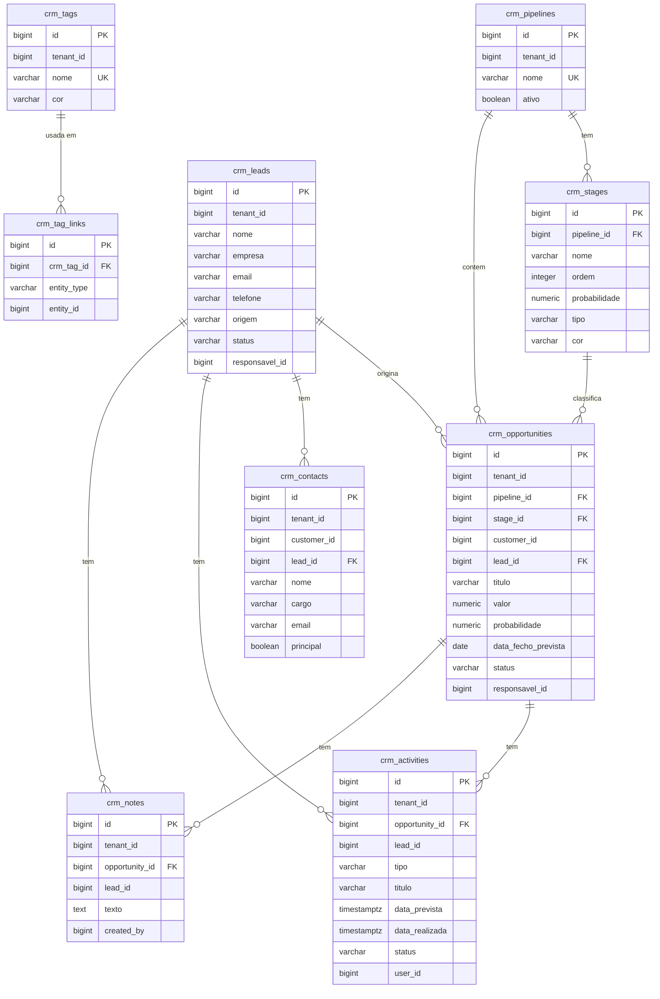
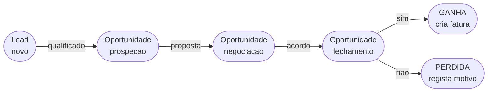
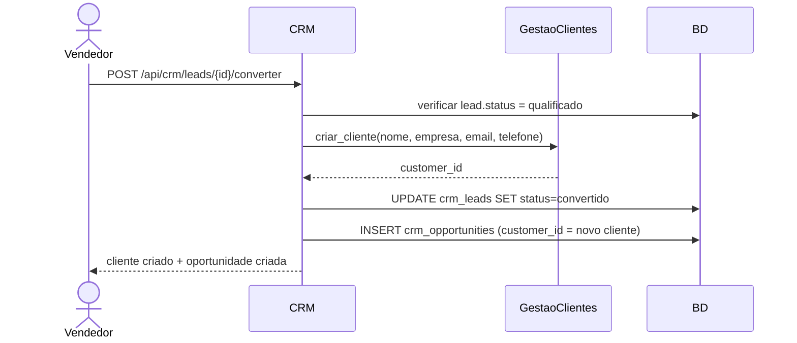

# UML — Modulo CRM

## Diagrama de Entidades (ERD)

```mermaid
erDiagram
    crm_pipelines {
        bigint id PK
        bigint tenant_id
        varchar nome UK
        boolean ativo
    }

    crm_stages {
        bigint id PK
        bigint pipeline_id FK
        varchar nome
        integer ordem
        numeric probabilidade
        varchar tipo
        varchar cor
    }

    crm_leads {
        bigint id PK
        bigint tenant_id
        varchar nome
        varchar empresa
        varchar email
        varchar telefone
        varchar origem
        varchar status
        bigint responsavel_id
    }

    crm_opportunities {
        bigint id PK
        bigint tenant_id
        bigint pipeline_id FK
        bigint stage_id FK
        bigint customer_id
        bigint lead_id FK
        varchar titulo
        numeric valor
        numeric probabilidade
        date data_fecho_prevista
        varchar status
        bigint responsavel_id
    }

    crm_contacts {
        bigint id PK
        bigint tenant_id
        bigint customer_id
        bigint lead_id FK
        varchar nome
        varchar cargo
        varchar email
        boolean principal
    }

    crm_activities {
        bigint id PK
        bigint tenant_id
        bigint opportunity_id FK
        bigint lead_id
        varchar tipo
        varchar titulo
        timestamptz data_prevista
        timestamptz data_realizada
        varchar status
        bigint user_id
    }

    crm_notes {
        bigint id PK
        bigint tenant_id
        bigint opportunity_id FK
        bigint lead_id
        text texto
        bigint created_by
    }

    crm_tags {
        bigint id PK
        bigint tenant_id
        varchar nome UK
        varchar cor
    }

    crm_tag_links {
        bigint id PK
        bigint crm_tag_id FK
        varchar entity_type
        bigint entity_id
    }

    crm_pipelines ||--o{ crm_stages : "tem"
    crm_pipelines ||--o{ crm_opportunities : "contem"
    crm_stages ||--o{ crm_opportunities : "classifica"
    crm_leads ||--o{ crm_opportunities : "origina"
    crm_leads ||--o{ crm_contacts : "tem"
    crm_leads ||--o{ crm_activities : "tem"
    crm_leads ||--o{ crm_notes : "tem"
    crm_opportunities ||--o{ crm_activities : "tem"
    crm_opportunities ||--o{ crm_notes : "tem"
    crm_tags ||--o{ crm_tag_links : "usada em"
```

## Funil de Vendas (Pipeline)

```mermaid
flowchart LR
    A([Lead\nnovo]) -->|qualificado| B([Oportunidade\nprospecao])
    B -->|proposta| C([Oportunidade\nnegociacao])
    C -->|acordo| D([Oportunidade\nfechamento])
    D -->|sim| E([GANHA\ncria fatura])
    D -->|nao| F([PERDIDA\nregista motivo])
```

## Fluxo de Conversao de Lead

```mermaid
sequenceDiagram
    actor Vendedor
    participant CRM
    participant GestaoClientes
    participant BD

    Vendedor->>CRM: POST /api/crm/leads/{id}/converter
    CRM->>BD: verificar lead.status = qualificado
    CRM->>GestaoClientes: criar_cliente(nome, empresa, email, telefone)
    GestaoClientes-->>CRM: customer_id
    CRM->>BD: UPDATE crm_leads SET status=convertido
    CRM->>BD: INSERT crm_opportunities (customer_id = novo cliente)
    CRM-->>Vendedor: cliente criado + oportunidade criada
```
