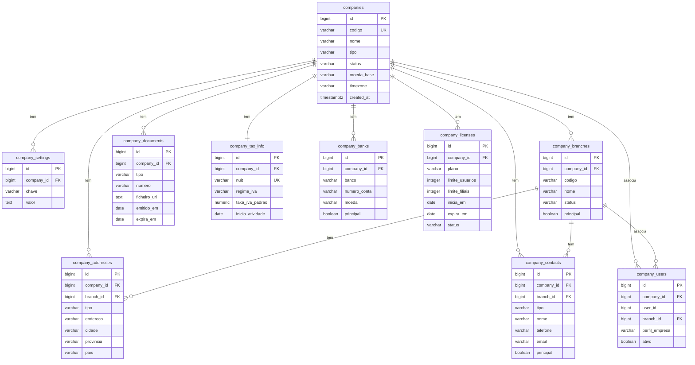
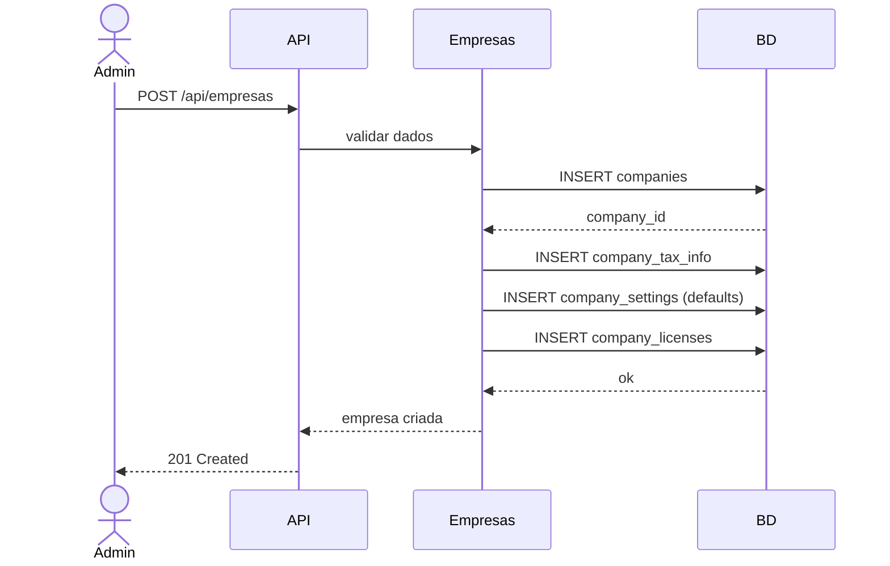

# UML — Modulo Empresas

## Diagrama de Entidades (ERD)

```mermaid
erDiagram
    companies {
        bigint id PK
        varchar codigo UK
        varchar nome
        varchar tipo
        varchar status
        varchar moeda_base
        varchar timezone
        timestamptz created_at
    }

    company_settings {
        bigint id PK
        bigint company_id FK
        varchar chave
        text valor
    }

    company_branches {
        bigint id PK
        bigint company_id FK
        varchar codigo
        varchar nome
        varchar status
        boolean principal
    }

    company_addresses {
        bigint id PK
        bigint company_id FK
        bigint branch_id FK
        varchar tipo
        varchar endereco
        varchar cidade
        varchar provincia
        varchar pais
    }

    company_contacts {
        bigint id PK
        bigint company_id FK
        bigint branch_id FK
        varchar tipo
        varchar nome
        varchar telefone
        varchar email
        boolean principal
    }

    company_documents {
        bigint id PK
        bigint company_id FK
        varchar tipo
        varchar numero
        text ficheiro_url
        date emitido_em
        date expira_em
    }

    company_tax_info {
        bigint id PK
        bigint company_id FK
        varchar nuit UK
        varchar regime_iva
        numeric taxa_iva_padrao
        date inicio_atividade
    }

    company_banks {
        bigint id PK
        bigint company_id FK
        varchar banco
        varchar numero_conta
        varchar moeda
        boolean principal
    }

    company_licenses {
        bigint id PK
        bigint company_id FK
        varchar plano
        integer limite_usuarios
        integer limite_filiais
        date inicia_em
        date expira_em
        varchar status
    }

    company_users {
        bigint id PK
        bigint company_id FK
        bigint user_id
        bigint branch_id FK
        varchar perfil_empresa
        boolean ativo
    }

    companies ||--o{ company_settings : "tem"
    companies ||--o{ company_branches : "tem"
    companies ||--o{ company_addresses : "tem"
    companies ||--o{ company_contacts : "tem"
    companies ||--o{ company_documents : "tem"
    companies ||--|| company_tax_info : "tem"
    companies ||--o{ company_banks : "tem"
    companies ||--o{ company_licenses : "tem"
    companies ||--o{ company_users : "associa"
    company_branches ||--o{ company_addresses : "tem"
    company_branches ||--o{ company_contacts : "tem"
    company_branches ||--o{ company_users : "associa"
```

## Fluxo de Criacao de Empresa

```mermaid
sequenceDiagram
    actor Admin
    participant API
    participant Empresas
    participant BD

    Admin->>API: POST /api/empresas
    API->>Empresas: validar dados
    Empresas->>BD: INSERT companies
    BD-->>Empresas: company_id
    Empresas->>BD: INSERT company_tax_info
    Empresas->>BD: INSERT company_settings (defaults)
    Empresas->>BD: INSERT company_licenses
    BD-->>Empresas: ok
    Empresas-->>API: empresa criada
    API-->>Admin: 201 Created
```
