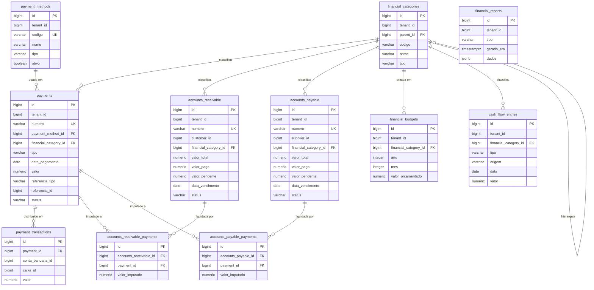
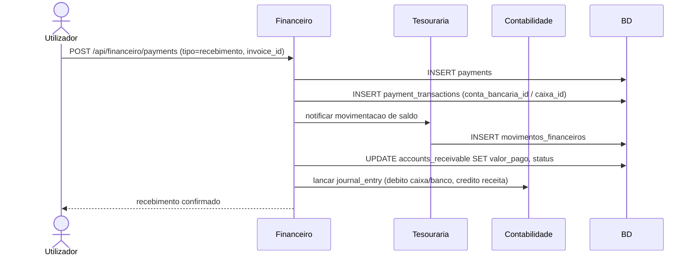
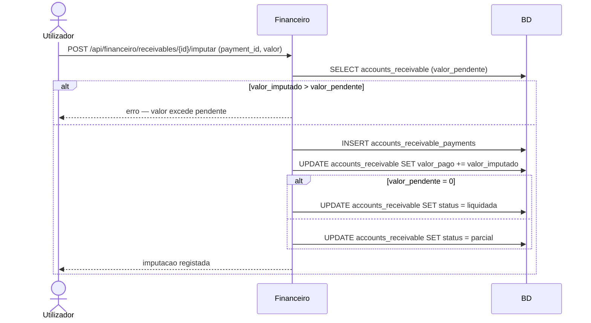
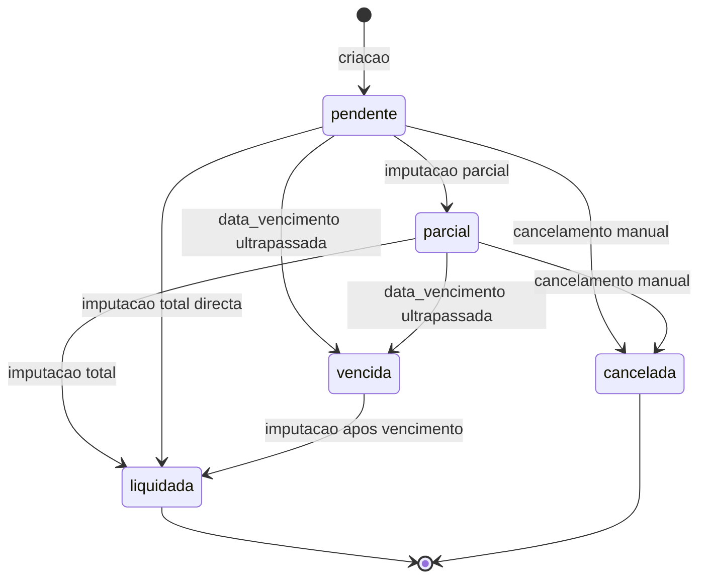
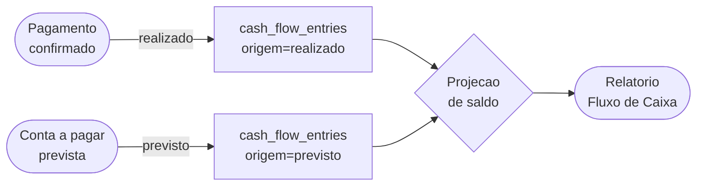

# UML — Modulo Financeiro

## Diagrama de Entidades (ERD)

## Fluxo de Registo de Recebimento (Fatura)

## Fluxo de Imputacao de Pagamento a Conta a Receber

## Estados de Conta a Receber / Conta a Pagar

## Fluxo de Caixa — Realizados vs. Previstos

