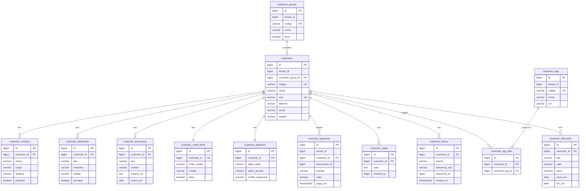
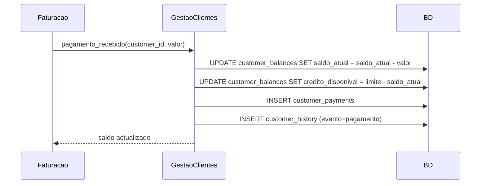

# UML — Modulo Gestao de Clientes

## Diagrama de Entidades (ERD)

```mermaid
erDiagram
    customer_groups {
        bigint id PK
        bigint tenant_id
        varchar codigo UK
        varchar nome
        boolean ativo
    }

    customers {
        bigint id PK
        bigint tenant_id
        bigint customer_group_id FK
        varchar codigo UK
        varchar nome
        varchar nuit UK
        varchar telefone
        varchar email
        varchar estado
    }

    customer_contacts {
        bigint id PK
        bigint customer_id FK
        varchar nome
        varchar cargo
        varchar telefone
        boolean principal
    }

    customer_addresses {
        bigint id PK
        bigint customer_id FK
        varchar tipo
        varchar endereco
        varchar cidade
        boolean principal
    }

    customer_documents {
        bigint id PK
        bigint customer_id FK
        varchar tipo
        varchar numero
        text ficheiro_url
        date expira_em
    }

    customer_credit_limits {
        bigint id PK
        bigint customer_id FK
        numeric limite_credito
        varchar moeda
        boolean ativo
    }

    customer_balances {
        bigint id PK
        bigint customer_id FK
        numeric saldo_atual
        numeric saldo_vencido
        numeric credito_disponivel
    }

    customer_payments {
        bigint id PK
        bigint tenant_id
        bigint customer_id FK
        bigint documento_id
        varchar metodo
        numeric valor
        timestamptz pago_em
    }

    customer_notes {
        bigint id PK
        bigint customer_id FK
        text nota
        bigint created_by
    }

    customer_history {
        bigint id PK
        bigint customer_id FK
        varchar evento
        varchar referencia_tipo
        bigint referencia_id
        timestamptz created_at
    }

    customer_tags {
        bigint id PK
        bigint tenant_id
        varchar codigo UK
        varchar nome
        varchar cor
    }

    customer_tag_links {
        bigint id PK
        bigint customer_id FK
        bigint customer_tag_id FK
    }

    customer_discounts {
        bigint id PK
        bigint customer_id FK
        varchar tipo
        numeric valor
        boolean ativo
        date inicio_em
        date fim_em
    }

    customer_groups ||--o{ customers : "classifica"
    customers ||--o{ customer_contacts : "tem"
    customers ||--o{ customer_addresses : "tem"
    customers ||--o{ customer_documents : "tem"
    customers ||--|| customer_credit_limits : "tem"
    customers ||--|| customer_balances : "tem"
    customers ||--o{ customer_payments : "regista"
    customers ||--o{ customer_notes : "tem"
    customers ||--o{ customer_history : "tem"
    customers ||--o{ customer_tag_links : "tagged"
    customer_tags ||--o{ customer_tag_links : "usada em"
    customers ||--o{ customer_discounts : "tem"
```

## Fluxo de Actualizacao de Saldo

```mermaid
sequenceDiagram
    participant Faturacao
    participant GestaoClientes
    participant BD

    Faturacao->>GestaoClientes: pagamento_recebido(customer_id, valor)
    GestaoClientes->>BD: UPDATE customer_balances SET saldo_atual = saldo_atual - valor
    GestaoClientes->>BD: UPDATE customer_balances SET credito_disponivel = limite - saldo_atual
    GestaoClientes->>BD: INSERT customer_payments
    GestaoClientes->>BD: INSERT customer_history (evento=pagamento)
    GestaoClientes-->>Faturacao: saldo actualizado
```
