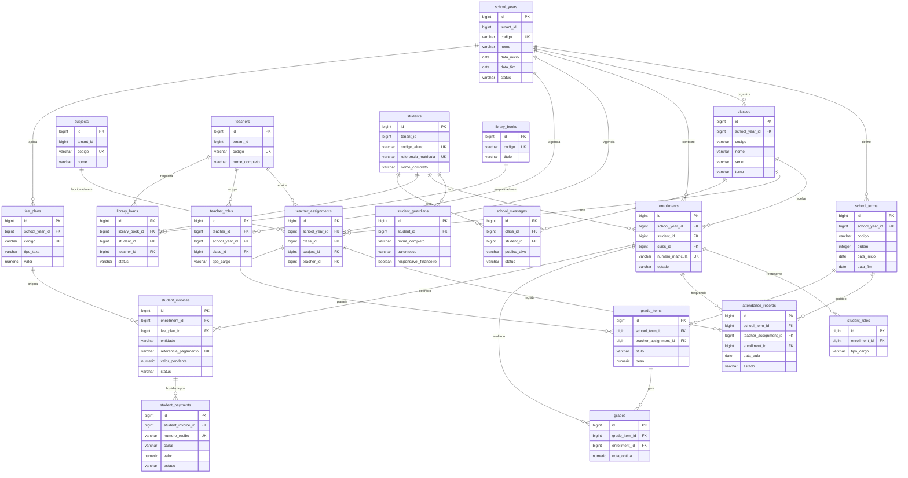
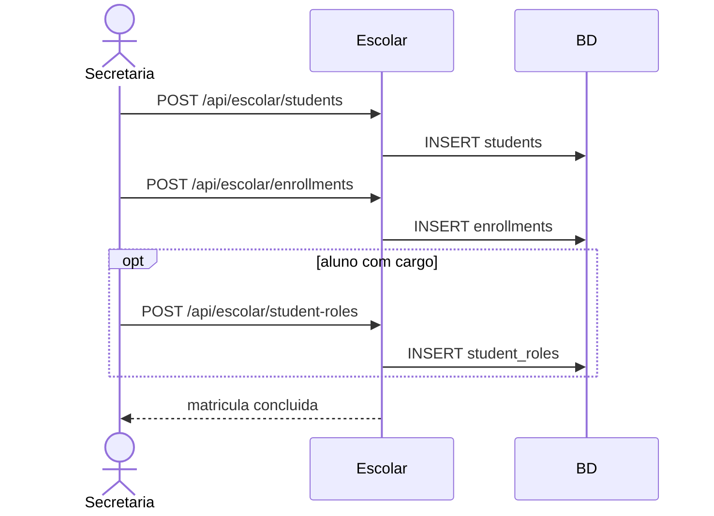
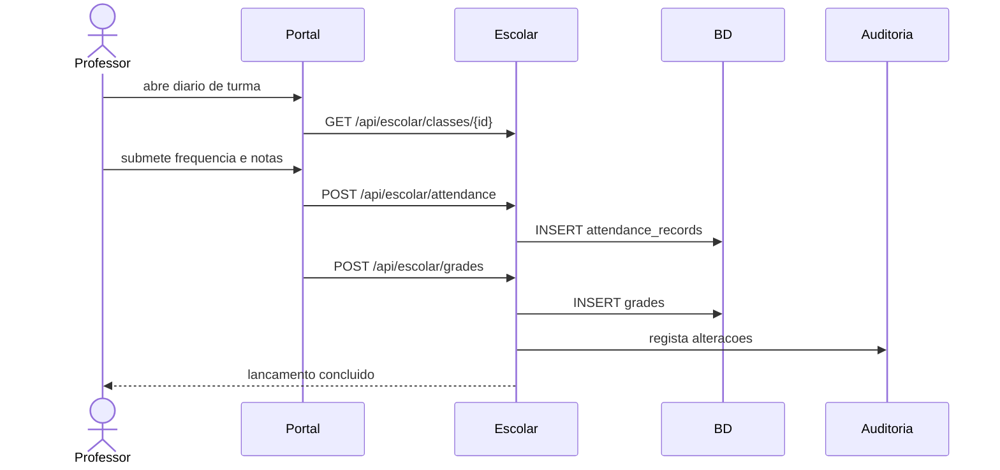
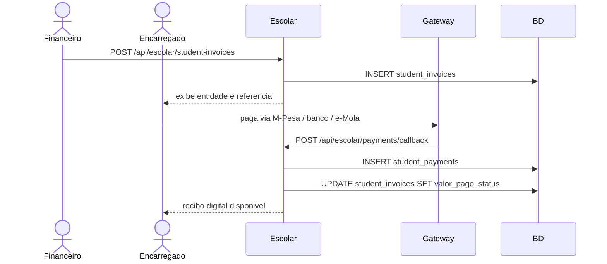
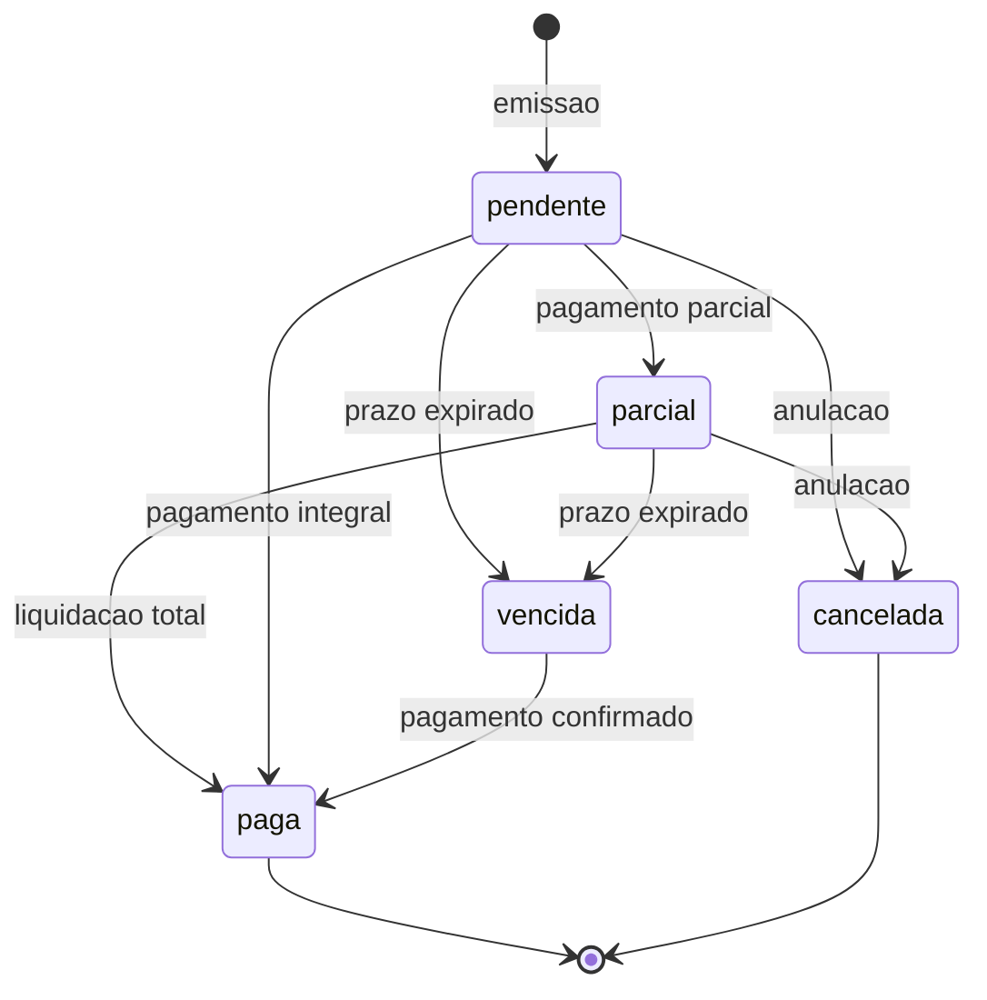

# UML — Modulo Gestao Escolar

## Diagrama de Entidades (ERD)

## Fluxo de Matricula e Cargo

## Fluxo de Notas e Frequencia

## Fluxo de Pagamento com Entidade e Referencia

## Estados da Cobranca

