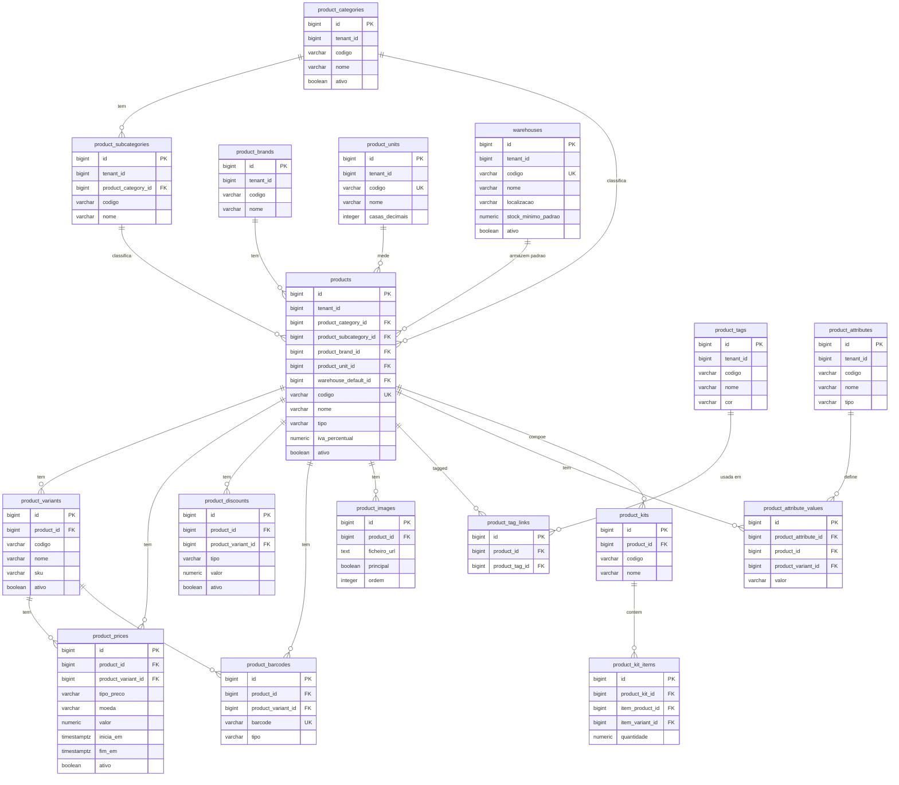

# UML — Modulo Gestao de Produtos

## Diagrama de Entidades (ERD)

```mermaid
erDiagram
    product_categories {
        bigint id PK
        bigint tenant_id
        varchar codigo
        varchar nome
        boolean ativo
    }

    product_subcategories {
        bigint id PK
        bigint tenant_id
        bigint product_category_id FK
        varchar codigo
        varchar nome
    }

    product_brands {
        bigint id PK
        bigint tenant_id
        varchar codigo
        varchar nome
    }

    product_units {
        bigint id PK
        bigint tenant_id
        varchar codigo UK
        varchar nome
        integer casas_decimais
    }

    warehouses {
        bigint id PK
        bigint tenant_id
        varchar codigo UK
        varchar nome
        varchar localizacao
        numeric stock_minimo_padrao
        boolean ativo
    }

    products {
        bigint id PK
        bigint tenant_id
        bigint product_category_id FK
        bigint product_subcategory_id FK
        bigint product_brand_id FK
        bigint product_unit_id FK
        bigint warehouse_default_id FK
        varchar codigo UK
        varchar nome
        varchar tipo
        numeric iva_percentual
        boolean ativo
    }

    product_variants {
        bigint id PK
        bigint product_id FK
        varchar codigo
        varchar nome
        varchar sku
        boolean ativo
    }

    product_prices {
        bigint id PK
        bigint product_id FK
        bigint product_variant_id FK
        varchar tipo_preco
        varchar moeda
        numeric valor
        timestamptz inicia_em
        timestamptz fim_em
        boolean ativo
    }

    product_discounts {
        bigint id PK
        bigint product_id FK
        bigint product_variant_id FK
        varchar tipo
        numeric valor
        boolean ativo
    }

    product_barcodes {
        bigint id PK
        bigint product_id FK
        bigint product_variant_id FK
        varchar barcode UK
        varchar tipo
    }

    product_images {
        bigint id PK
        bigint product_id FK
        text ficheiro_url
        boolean principal
        integer ordem
    }

    product_tags {
        bigint id PK
        bigint tenant_id
        varchar codigo
        varchar nome
        varchar cor
    }

    product_tag_links {
        bigint id PK
        bigint product_id FK
        bigint product_tag_id FK
    }

    product_attributes {
        bigint id PK
        bigint tenant_id
        varchar codigo
        varchar nome
        varchar tipo
    }

    product_attribute_values {
        bigint id PK
        bigint product_attribute_id FK
        bigint product_id FK
        bigint product_variant_id FK
        varchar valor
    }

    product_kits {
        bigint id PK
        bigint product_id FK
        varchar codigo
        varchar nome
    }

    product_kit_items {
        bigint id PK
        bigint product_kit_id FK
        bigint item_product_id FK
        bigint item_variant_id FK
        numeric quantidade
    }

    product_categories ||--o{ product_subcategories : "tem"
    product_categories ||--o{ products : "classifica"
    product_subcategories ||--o{ products : "classifica"
    product_brands ||--o{ products : "tem"
    product_units ||--o{ products : "mede"
    warehouses ||--o{ products : "armazem padrao"
    products ||--o{ product_variants : "tem"
    products ||--o{ product_prices : "tem"
    products ||--o{ product_discounts : "tem"
    products ||--o{ product_barcodes : "tem"
    products ||--o{ product_images : "tem"
    products ||--o{ product_tag_links : "tagged"
    product_tags ||--o{ product_tag_links : "usada em"
    products ||--o{ product_attribute_values : "tem"
    product_attributes ||--o{ product_attribute_values : "define"
    products ||--o{ product_kits : "compoe"
    product_kits ||--o{ product_kit_items : "contem"
    product_variants ||--o{ product_prices : "tem"
    product_variants ||--o{ product_barcodes : "tem"
```
