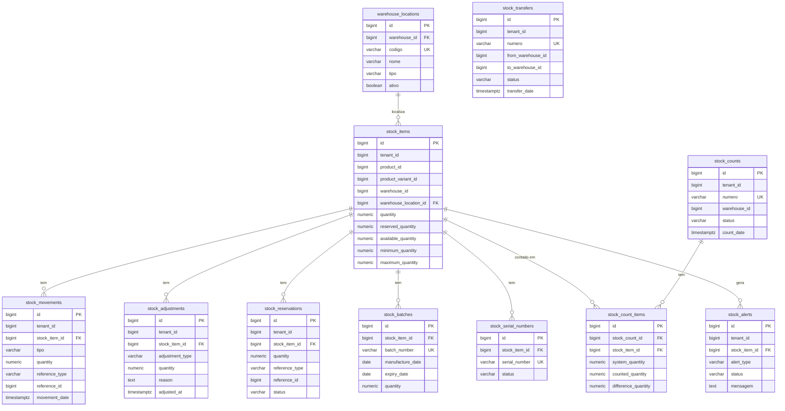
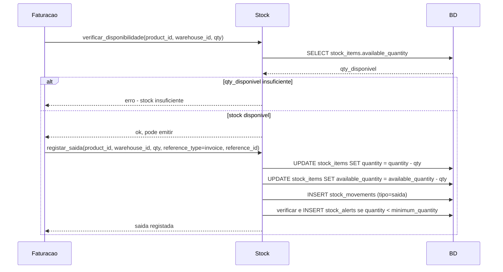

# UML — Modulo Gestao de Stock

## Diagrama de Entidades (ERD)

```mermaid
erDiagram
    warehouse_locations {
        bigint id PK
        bigint warehouse_id FK
        varchar codigo UK
        varchar nome
        varchar tipo
        boolean ativo
    }

    stock_items {
        bigint id PK
        bigint tenant_id
        bigint product_id
        bigint product_variant_id
        bigint warehouse_id
        bigint warehouse_location_id FK
        numeric quantity
        numeric reserved_quantity
        numeric available_quantity
        numeric minimum_quantity
        numeric maximum_quantity
    }

    stock_movements {
        bigint id PK
        bigint tenant_id
        bigint stock_item_id FK
        varchar tipo
        numeric quantity
        varchar reference_type
        bigint reference_id
        timestamptz movement_date
    }

    stock_adjustments {
        bigint id PK
        bigint tenant_id
        bigint stock_item_id FK
        varchar adjustment_type
        numeric quantity
        text reason
        timestamptz adjusted_at
    }

    stock_transfers {
        bigint id PK
        bigint tenant_id
        varchar numero UK
        bigint from_warehouse_id
        bigint to_warehouse_id
        varchar status
        timestamptz transfer_date
    }

    stock_reservations {
        bigint id PK
        bigint tenant_id
        bigint stock_item_id FK
        numeric quantity
        varchar reference_type
        bigint reference_id
        varchar status
    }

    stock_batches {
        bigint id PK
        bigint stock_item_id FK
        varchar batch_number UK
        date manufacture_date
        date expiry_date
        numeric quantity
    }

    stock_serial_numbers {
        bigint id PK
        bigint stock_item_id FK
        varchar serial_number UK
        varchar status
    }

    stock_counts {
        bigint id PK
        bigint tenant_id
        varchar numero UK
        bigint warehouse_id
        varchar status
        timestamptz count_date
    }

    stock_count_items {
        bigint id PK
        bigint stock_count_id FK
        bigint stock_item_id FK
        numeric system_quantity
        numeric counted_quantity
        numeric difference_quantity
    }

    stock_alerts {
        bigint id PK
        bigint tenant_id
        bigint stock_item_id FK
        varchar alert_type
        varchar status
        text mensagem
    }

    warehouse_locations ||--o{ stock_items : "localiza"
    stock_items ||--o{ stock_movements : "tem"
    stock_items ||--o{ stock_adjustments : "tem"
    stock_items ||--o{ stock_reservations : "tem"
    stock_items ||--o{ stock_batches : "tem"
    stock_items ||--o{ stock_serial_numbers : "tem"
    stock_items ||--o{ stock_count_items : "contado em"
    stock_items ||--o{ stock_alerts : "gera"
    stock_counts ||--o{ stock_count_items : "tem"
```

## Fluxo de Saida de Stock (Emissao de Fatura)

```mermaid
sequenceDiagram
    participant Faturacao
    participant Stock
    participant BD

    Faturacao->>Stock: verificar_disponibilidade(product_id, warehouse_id, qty)
    Stock->>BD: SELECT stock_items.available_quantity
    BD-->>Stock: qty_disponivel

    alt qty_disponivel insuficiente
        Stock-->>Faturacao: erro - stock insuficiente
    else stock disponivel
        Stock-->>Faturacao: ok, pode emitir

        Faturacao->>Stock: registar_saida(product_id, warehouse_id, qty, reference_type=invoice, reference_id)
        Stock->>BD: UPDATE stock_items SET quantity = quantity - qty
        Stock->>BD: UPDATE stock_items SET available_quantity = available_quantity - qty
        Stock->>BD: INSERT stock_movements (tipo=saida)
        Stock->>BD: verificar e INSERT stock_alerts se quantity < minimum_quantity
        Stock-->>Faturacao: saida registada
    end
```
