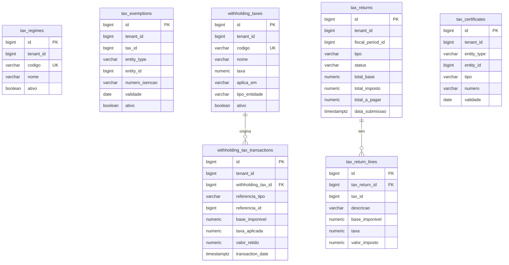
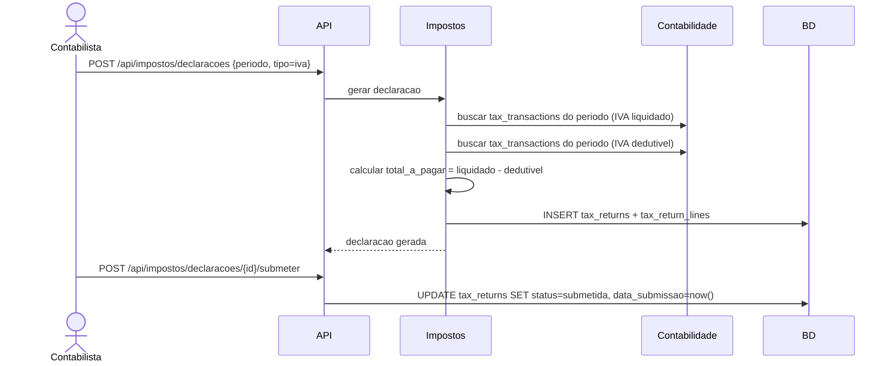

# UML — Modulo Impostos Avancados

## Diagrama de Entidades (ERD)

```mermaid
erDiagram
    tax_regimes {
        bigint id PK
        bigint tenant_id
        varchar codigo UK
        varchar nome
        boolean ativo
    }

    tax_exemptions {
        bigint id PK
        bigint tenant_id
        bigint tax_id
        varchar entity_type
        bigint entity_id
        varchar numero_isencao
        date validade
        boolean ativo
    }

    withholding_taxes {
        bigint id PK
        bigint tenant_id
        varchar codigo UK
        varchar nome
        numeric taxa
        varchar aplica_em
        varchar tipo_entidade
        boolean ativo
    }

    withholding_tax_transactions {
        bigint id PK
        bigint tenant_id
        bigint withholding_tax_id FK
        varchar referencia_tipo
        bigint referencia_id
        numeric base_imponivel
        numeric taxa_aplicada
        numeric valor_retido
        timestamptz transaction_date
    }

    tax_returns {
        bigint id PK
        bigint tenant_id
        bigint fiscal_period_id
        varchar tipo
        varchar status
        numeric total_base
        numeric total_imposto
        numeric total_a_pagar
        timestamptz data_submissao
    }

    tax_return_lines {
        bigint id PK
        bigint tax_return_id FK
        bigint tax_id
        varchar descricao
        numeric base_imponivel
        numeric taxa
        numeric valor_imposto
    }

    tax_certificates {
        bigint id PK
        bigint tenant_id
        varchar entity_type
        bigint entity_id
        varchar tipo
        varchar numero
        date validade
    }

    withholding_taxes ||--o{ withholding_tax_transactions : "origina"
    tax_returns ||--o{ tax_return_lines : "tem"
```

## Fluxo de Declaracao de IVA

```mermaid
sequenceDiagram
    actor Contabilista
    participant API
    participant Impostos
    participant Contabilidade
    participant BD

    Contabilista->>API: POST /api/impostos/declaracoes {periodo, tipo=iva}
    API->>Impostos: gerar declaracao
    Impostos->>Contabilidade: buscar tax_transactions do periodo (IVA liquidado)
    Impostos->>Contabilidade: buscar tax_transactions do periodo (IVA dedutivel)
    Impostos->>Impostos: calcular total_a_pagar = liquidado - dedutivel
    Impostos->>BD: INSERT tax_returns + tax_return_lines
    Impostos-->>API: declaracao gerada

    Contabilista->>API: POST /api/impostos/declaracoes/{id}/submeter
    API->>BD: UPDATE tax_returns SET status=submetida, data_submissao=now()
```
