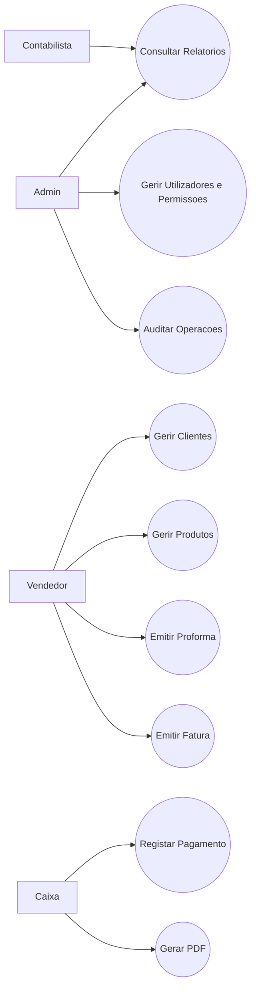
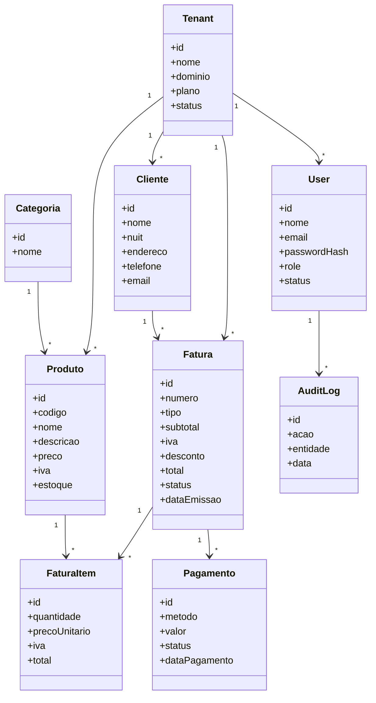
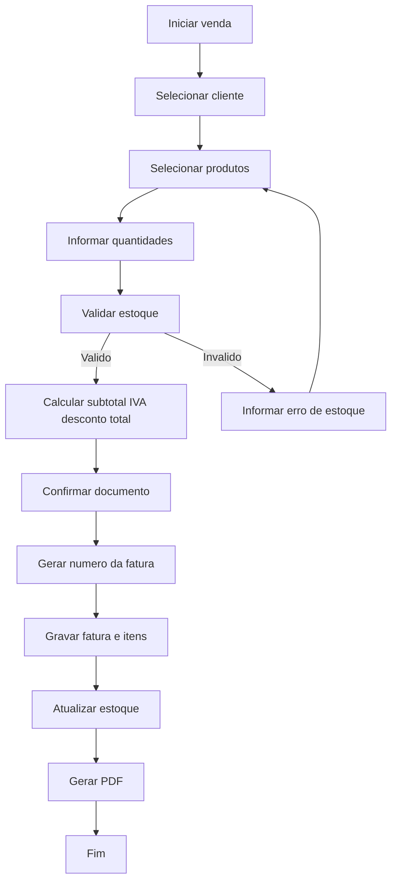
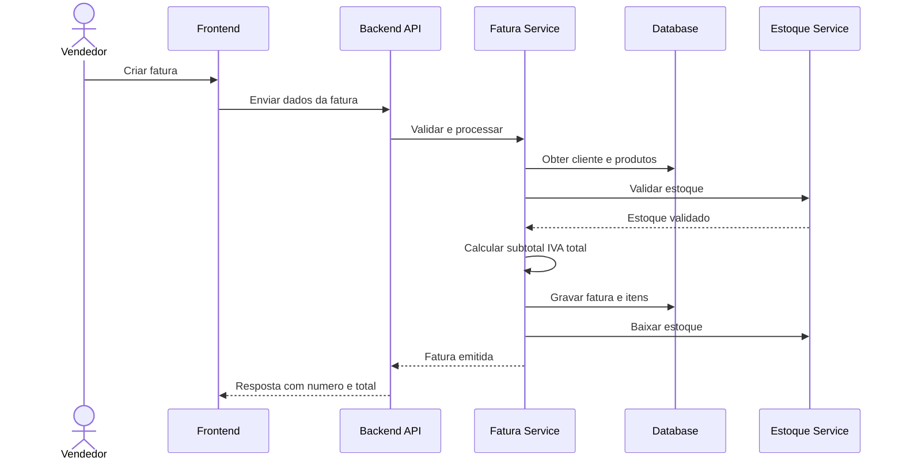

# Especificacao Completa do Sistema de Faturacao

## 1. Descricao geral

O sistema de faturacao e uma aplicacao usada para gerir clientes, produtos, faturas, faturas proforma, pagamentos, estoque e relatorios. O objetivo principal e permitir que uma empresa registe vendas de forma organizada, gere documentos comerciais e fiscais, acompanhe os valores cobrados e mantenha o controlo operacional do negocio.

Este sistema pode funcionar como:

- modulo de faturacao de um ERP
- sistema POS
- sistema web de gestao comercial
- plataforma SaaS multi-tenant

O sistema deve garantir:

- cadastro correto de clientes
- cadastro correto de produtos e servicos
- emissao de fatura e proforma
- calculo de subtotal, IVA, desconto e total
- controlo de estoque
- registo de pagamentos
- emissao de relatorios
- seguranca e auditoria das operacoes

## 2. Objetivos do sistema

- Centralizar a informacao comercial da empresa
- Automatizar o processo de venda e faturacao
- Reduzir erros manuais nos calculos
- Melhorar o controlo financeiro e de estoque
- Permitir rastreabilidade de todas as operacoes
- Preparar o sistema para crescimento e multiempresa

## 3. Escopo funcional

O sistema cobre os seguintes modulos:

- autenticacao e autorizacao
- gestao de clientes
- gestao de produtos
- gestao de categorias
- gestao de estoque
- emissao de faturas
- emissao de faturas proforma
- gestao de itens da fatura
- registo de pagamentos
- geracao de PDF
- relatorios
- logs e auditoria
- configuracoes da empresa

## 4. Perfis de utilizador

### 4.1 Admin

Responsavel pela configuracao geral do sistema, criacao de utilizadores, atribuicao de permissoes e monitoria global.

### 4.2 Contabilista

Responsavel por acompanhar documentos fiscais, impostos, pagamentos e relatorios financeiros.

### 4.3 Vendedor

Responsavel por cadastrar clientes, selecionar produtos e emitir faturas ou proformas.

### 4.4 Caixa

Responsavel por registar recebimentos, confirmar pagamentos e emitir comprovativos.

## 5. Requisitos funcionais

### RF01. Autenticacao de utilizadores

O sistema deve permitir que o utilizador faca login com credenciais validas.

### RF02. Gestao de perfis e permissoes

O sistema deve permitir controlar acessos por perfil, como admin, contabilista, vendedor e caixa.

### RF03. Cadastro de clientes

O sistema deve permitir criar, editar, consultar e desativar clientes.

Campos minimos:

- codigo ou id
- nome ou razao social
- NUIT
- endereco
- telefone
- email

### RF04. Cadastro de produtos

O sistema deve permitir criar, editar, consultar e desativar produtos ou servicos.

Campos minimos:

- codigo do produto
- nome
- descricao
- preco
- IVA
- estoque
- categoria

### RF05. Gestao de categorias

O sistema deve permitir classificar produtos por categoria.

### RF06. Consulta de estoque

O sistema deve mostrar a quantidade disponivel de cada produto.

### RF07. Atualizacao automatica de estoque

O sistema deve reduzir o estoque quando uma fatura for confirmada.

### RF08. Criacao de fatura proforma

O sistema deve permitir gerar proformas antes da confirmacao da venda.

### RF09. Criacao de fatura

O sistema deve permitir gerar faturas com numero unico e sequencial.

### RF10. Gestao de itens da fatura

O sistema deve permitir adicionar, editar e remover itens antes da finalizacao da fatura.

### RF11. Calculo automatico

O sistema deve calcular automaticamente:

- subtotal
- desconto
- IVA
- total final

### RF12. Validacao de dados da fatura

O sistema deve validar se a fatura possui cliente, ao menos um item e valores consistentes antes da emissao.

### RF13. Registo de pagamentos

O sistema deve permitir registar pagamentos por diferentes metodos.

Exemplos:

- dinheiro
- transferencia
- M-Pesa
- E-Mola
- cartao

### RF14. Controle de estado da fatura

O sistema deve permitir estados como:

- pendente
- paga
- parcialmente paga
- cancelada

### RF15. Emissao de PDF

O sistema deve permitir gerar e exportar a fatura em PDF.

### RF16. Impressao de documentos

O sistema deve permitir imprimir fatura, proforma e recibo.

### RF17. Pesquisa e filtragem

O sistema deve permitir pesquisar clientes, produtos, faturas e pagamentos.

### RF18. Relatorios

O sistema deve emitir relatorios de:

- vendas por periodo
- vendas por cliente
- produtos mais vendidos
- faturacao mensal
- IVA liquidado
- pagamentos recebidos

### RF19. Auditoria

O sistema deve guardar historico das operacoes importantes.

### RF20. Multiempresa ou multi-tenant

O sistema deve permitir separar os dados por empresa ou tenant.

### RF21. Configuracao fiscal

O sistema deve permitir configurar dados fiscais da empresa, incluindo NUIT, endereco, serie documental e regras de IVA.

### RF22. Numeracao documental

O sistema deve gerar numeracao sequencial por tipo de documento.

Exemplo:

```text
FT 2026/000123
PP 2026/000045
```

### RF23. Conversao de proforma para fatura

O sistema deve permitir transformar uma proforma em fatura quando a venda for confirmada.

### RF24. Cancelamento controlado

O sistema deve permitir cancelar documentos segundo permissao e registar o motivo.

## 6. Requisitos nao funcionais

### RNF01. Seguranca

O sistema deve proteger autenticacao, autorizacao, sessao e dados sensiveis.

### RNF02. Desempenho

Operacoes comuns, como listar clientes, listar produtos e emitir fatura, devem responder rapidamente em condicoes normais de uso.

### RNF03. Disponibilidade

O sistema deve ter alta disponibilidade em ambiente de producao.

### RNF04. Escalabilidade

O sistema deve suportar crescimento do numero de utilizadores, tenants, produtos e faturas sem perda severa de desempenho.

### RNF05. Usabilidade

As telas devem ser simples, claras e adequadas para operadores administrativos e comerciais.

### RNF06. Integridade de dados

O sistema deve garantir consistencia entre cliente, fatura, itens, pagamento e estoque.

### RNF07. Auditabilidade

Todas as operacoes criticas devem ser rastreaveis com utilizador, acao, data e entidade afetada.

### RNF08. Portabilidade

O sistema deve poder ser executado em ambiente web e, se necessario, adaptado para mobile.

### RNF09. Manutenibilidade

O codigo deve ser modular, documentado e de facil evolucao.

### RNF10. Backup e recuperacao

O sistema deve permitir backups regulares e recuperacao de dados em caso de falha.

### RNF11. Conformidade legal

O sistema deve permitir configuracao conforme a legislacao fiscal aplicavel, incluindo IVA, numeracao e identificacao fiscal.

### RNF12. Multi-tenant seguro

O sistema deve isolar os dados de cada tenant para impedir acesso cruzado entre empresas.

## 7. Regras de negocio

### RN01. Cliente obrigatorio

Nao e permitido emitir fatura sem cliente associado, salvo regra especifica de consumidor final.

### RN02. Fatura deve ter itens

Nenhuma fatura pode ser emitida sem pelo menos um item.

### RN03. Estoque suficiente

Nao e permitido confirmar venda de produto com estoque insuficiente, exceto se a empresa permitir venda sem estoque.

### RN04. Calculo do IVA

O IVA deve ser calculado com base na taxa configurada por produto ou regra fiscal.

### RN05. Numero unico

Cada documento deve possuir numero unico dentro da sua serie.

### RN06. Conversao documental

Uma proforma pode ser convertida em fatura, preservando os dados principais do documento.

### RN07. Pagamento parcial

Uma fatura pode permanecer em estado parcialmente pago ate a liquidacao total.

### RN08. Auditoria obrigatoria

Criacao, edicao, cancelamento e pagamento de documentos devem gerar log de auditoria.

## 8. Casos de uso principais

### UC01. Cadastrar cliente

Ator principal: Vendedor

Fluxo:

1. O utilizador abre o modulo de clientes
2. Informa os dados obrigatorios
3. O sistema valida os campos
4. O sistema grava o cliente
5. O sistema confirma o cadastro

### UC02. Cadastrar produto

Ator principal: Admin ou Vendedor autorizado

Fluxo:

1. O utilizador abre o modulo de produtos
2. Informa os dados do produto
3. O sistema valida preco, categoria e estoque inicial
4. O sistema grava o produto

### UC03. Emitir proforma

Ator principal: Vendedor

Fluxo:

1. Selecionar cliente
2. Adicionar produtos
3. Informar quantidades
4. O sistema calcula subtotal, IVA e total
5. O utilizador confirma
6. O sistema gera a proforma

### UC04. Emitir fatura

Ator principal: Vendedor

Fluxo:

1. Selecionar cliente
2. Adicionar produtos
3. Validar estoque
4. Calcular valores
5. Confirmar emissao
6. Gerar numero sequencial
7. Atualizar estoque
8. Gravar auditoria

### UC05. Registar pagamento

Ator principal: Caixa

Fluxo:

1. Localizar a fatura
2. Escolher metodo de pagamento
3. Informar valor recebido
4. O sistema atualiza o estado da fatura
5. O sistema grava o pagamento

### UC06. Gerar relatorio

Ator principal: Admin ou Contabilista

Fluxo:

1. Selecionar tipo de relatorio
2. Definir periodo e filtros
3. O sistema processa os dados
4. O sistema apresenta o resultado
5. O utilizador pode exportar

## 9. UML de casos de uso



## 10. UML de classes



## 11. UML de atividade do processo de faturacao



## 12. UML de sequencia da emissao de fatura



## 13. Estrutura recomendada de modulos

- modulo de autenticacao
- modulo de clientes
- modulo de produtos
- modulo de categorias
- modulo de estoque
- modulo de faturacao
- modulo de pagamentos
- modulo de relatorios
- modulo de configuracoes
- modulo de auditoria

## 14. Estrutura recomendada de tabelas

- tenants
- users
- roles
- permissions
- user_roles
- clientes
- categorias
- produtos
- movimentos_estoque
- faturas
- fatura_itens
- pagamentos
- impostos
- configuracoes_empresa
- audit_logs

## 15. Conclusao

Esta especificacao define a base funcional e tecnica de um sistema de faturacao profissional. Ela pode ser usada como referencia para:

- levantamento de requisitos
- desenho da base de dados
- modelacao UML
- desenvolvimento backend
- desenvolvimento frontend
- preparacao de documentacao tecnica e funcional
