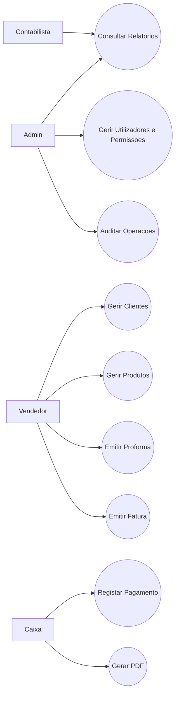
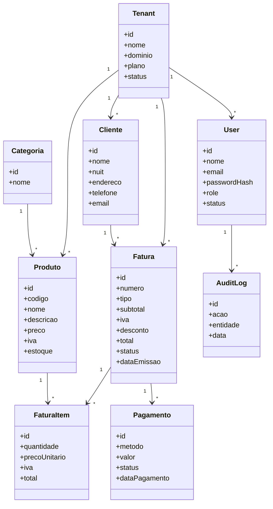
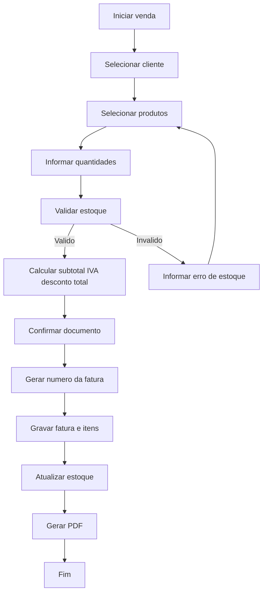
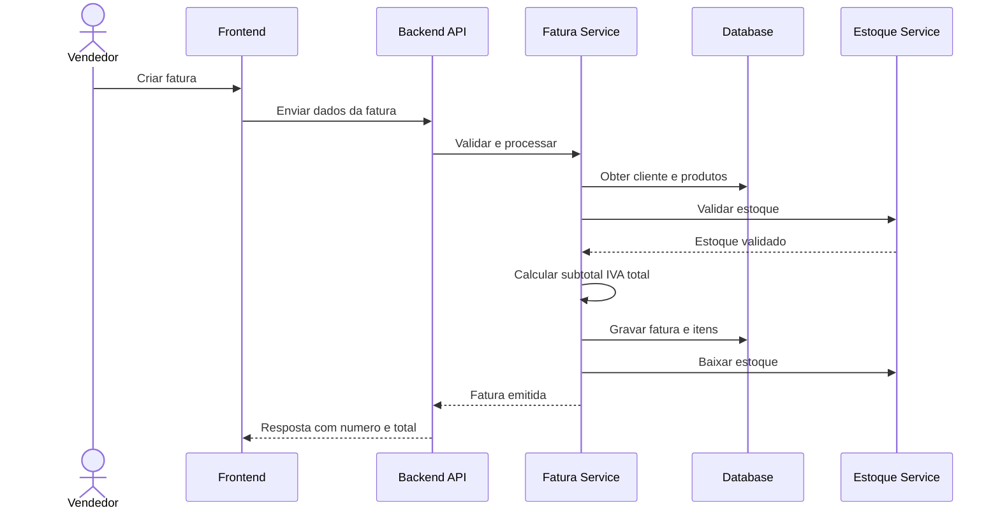

# UML do Sistema de Faturacao

## 1. UML de casos de uso

```mermaid
flowchart LR
    Admin[Admin]
    Vendedor[Vendedor]
    Caixa[Caixa]
    Contabilista[Contabilista]

    UC1((Gerir Clientes))
    UC2((Gerir Produtos))
    UC3((Emitir Proforma))
    UC4((Emitir Fatura))
    UC5((Registar Pagamento))
    UC6((Gerar PDF))
    UC7((Consultar Relatorios))
    UC8((Gerir Utilizadores e Permissoes))
    UC9((Auditar Operacoes))

    Vendedor --> UC1
    Vendedor --> UC2
    Vendedor --> UC3
    Vendedor --> UC4
    Caixa --> UC5
    Caixa --> UC6
    Contabilista --> UC7
    Admin --> UC7
    Admin --> UC8
    Admin --> UC9
```

## 2. UML de classes

```mermaid
classDiagram
    class Tenant {
        +id
        +nome
        +dominio
        +plano
        +status
    }

    class User {
        +id
        +nome
        +email
        +passwordHash
        +role
        +status
    }

    class Cliente {
        +id
        +nome
        +nuit
        +endereco
        +telefone
        +email
    }

    class Categoria {
        +id
        +nome
    }

    class Produto {
        +id
        +codigo
        +nome
        +descricao
        +preco
        +iva
        +estoque
    }

    class Fatura {
        +id
        +numero
        +tipo
        +subtotal
        +iva
        +desconto
        +total
        +status
        +dataEmissao
    }

    class FaturaItem {
        +id
        +quantidade
        +precoUnitario
        +iva
        +total
    }

    class Pagamento {
        +id
        +metodo
        +valor
        +status
        +dataPagamento
    }

    class AuditLog {
        +id
        +acao
        +entidade
        +data
    }

    Tenant "1" --> "*" User
    Tenant "1" --> "*" Cliente
    Tenant "1" --> "*" Produto
    Tenant "1" --> "*" Fatura
    Categoria "1" --> "*" Produto
    Cliente "1" --> "*" Fatura
    Fatura "1" --> "*" FaturaItem
    Produto "1" --> "*" FaturaItem
    Fatura "1" --> "*" Pagamento
    User "1" --> "*" AuditLog
```

## 3. UML de atividade do processo de faturacao

```mermaid
flowchart TD
    A[Iniciar venda] --> B[Selecionar cliente]
    B --> C[Selecionar produtos]
    C --> D[Informar quantidades]
    D --> E[Validar estoque]
    E -->|Valido| F[Calcular subtotal IVA desconto total]
    E -->|Invalido| X[Informar erro de estoque]
    X --> C
    F --> G[Confirmar documento]
    G --> H[Gerar numero da fatura]
    H --> I[Gravar fatura e itens]
    I --> J[Atualizar estoque]
    J --> K[Gerar PDF]
    K --> L[Fim]
```

## 4. UML de sequencia da emissao de fatura

```mermaid
sequenceDiagram
    actor V as Vendedor
    participant UI as Frontend
    participant API as Backend API
    participant S as Fatura Service
    participant DB as Database
    participant EST as Estoque Service

    V->>UI: Criar fatura
    UI->>API: Enviar dados da fatura
    API->>S: Validar e processar
    S->>DB: Obter cliente e produtos
    S->>EST: Validar estoque
    EST-->>S: Estoque validado
    S->>S: Calcular subtotal IVA total
    S->>DB: Gravar fatura e itens
    S->>EST: Baixar estoque
    S-->>API: Fatura emitida
    API-->>UI: Resposta com numero e total
```
