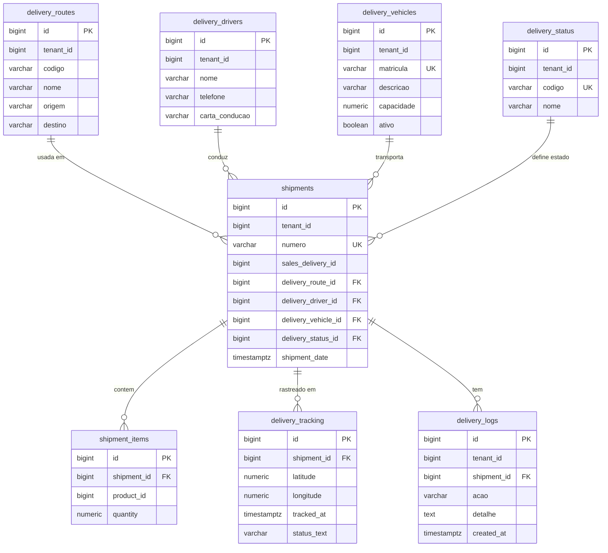
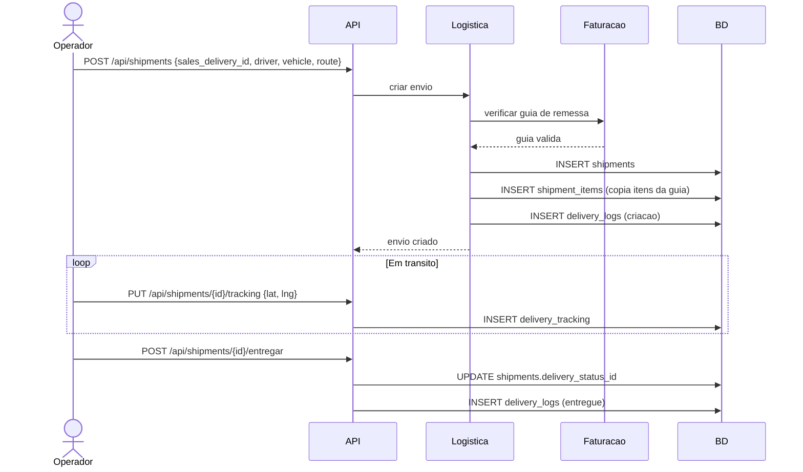

# UML — Modulo Logistica

## Diagrama de Entidades (ERD)

```mermaid
erDiagram
    delivery_drivers {
        bigint id PK
        bigint tenant_id
        varchar nome
        varchar telefone
        varchar carta_conducao
    }

    delivery_vehicles {
        bigint id PK
        bigint tenant_id
        varchar matricula UK
        varchar descricao
        numeric capacidade
        boolean ativo
    }

    delivery_routes {
        bigint id PK
        bigint tenant_id
        varchar codigo
        varchar nome
        varchar origem
        varchar destino
    }

    delivery_status {
        bigint id PK
        bigint tenant_id
        varchar codigo UK
        varchar nome
    }

    shipments {
        bigint id PK
        bigint tenant_id
        varchar numero UK
        bigint sales_delivery_id
        bigint delivery_route_id FK
        bigint delivery_driver_id FK
        bigint delivery_vehicle_id FK
        bigint delivery_status_id FK
        timestamptz shipment_date
    }

    shipment_items {
        bigint id PK
        bigint shipment_id FK
        bigint product_id
        numeric quantity
    }

    delivery_tracking {
        bigint id PK
        bigint shipment_id FK
        numeric latitude
        numeric longitude
        timestamptz tracked_at
        varchar status_text
    }

    delivery_logs {
        bigint id PK
        bigint tenant_id
        bigint shipment_id FK
        varchar acao
        text detalhe
        timestamptz created_at
    }

    shipments ||--o{ shipment_items : "contem"
    shipments ||--o{ delivery_tracking : "rastreado em"
    shipments ||--o{ delivery_logs : "tem"
    delivery_routes ||--o{ shipments : "usada em"
    delivery_drivers ||--o{ shipments : "conduz"
    delivery_vehicles ||--o{ shipments : "transporta"
    delivery_status ||--o{ shipments : "define estado"
```

## Fluxo de Envio

```mermaid
sequenceDiagram
    actor Operador
    participant API
    participant Logistica
    participant Faturacao
    participant BD

    Operador->>API: POST /api/shipments {sales_delivery_id, driver, vehicle, route}
    API->>Logistica: criar envio
    Logistica->>Faturacao: verificar guia de remessa
    Faturacao-->>Logistica: guia valida

    Logistica->>BD: INSERT shipments
    Logistica->>BD: INSERT shipment_items (copia itens da guia)
    Logistica->>BD: INSERT delivery_logs (criacao)
    Logistica-->>API: envio criado

    loop Em transito
        Operador->>API: PUT /api/shipments/{id}/tracking {lat, lng}
        API->>BD: INSERT delivery_tracking
    end

    Operador->>API: POST /api/shipments/{id}/entregar
    API->>BD: UPDATE shipments.delivery_status_id
    API->>BD: INSERT delivery_logs (entregue)
```
