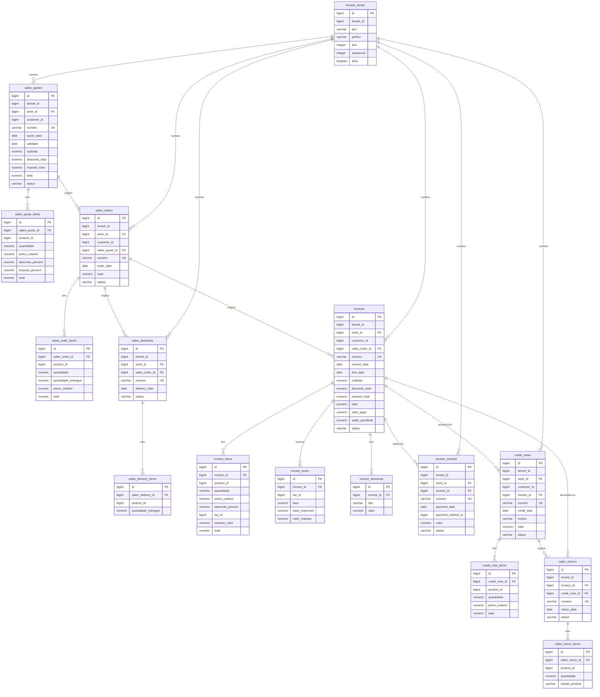
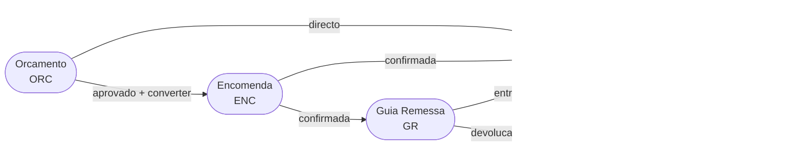
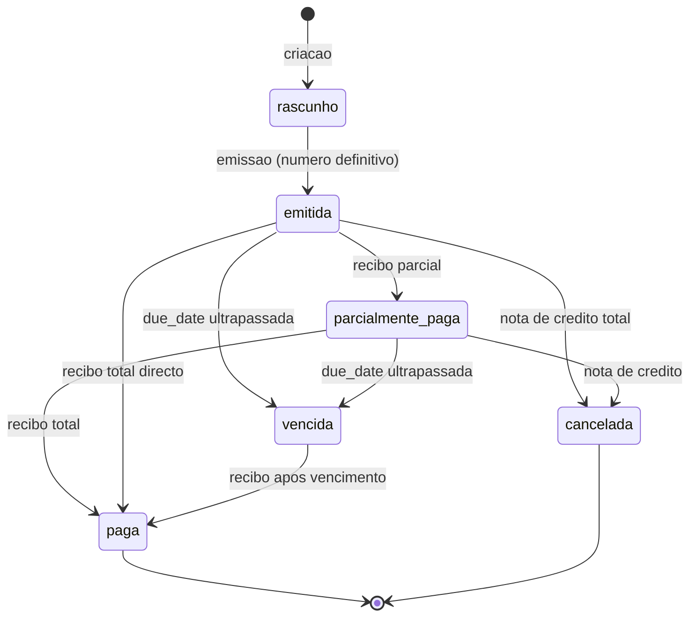
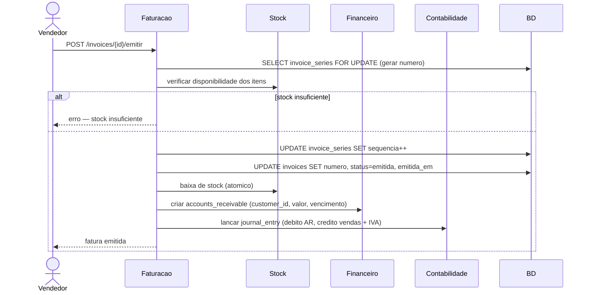
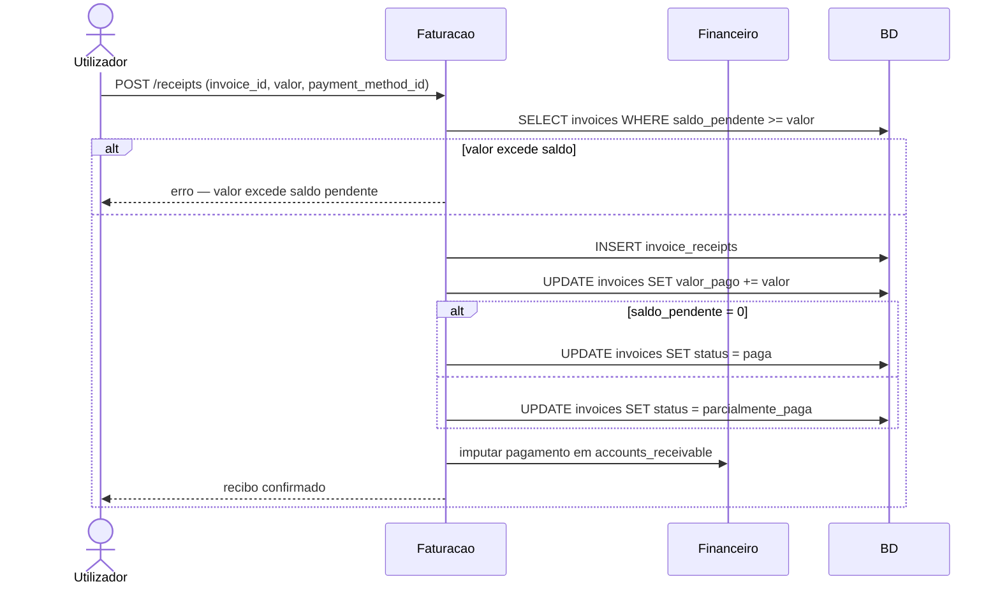

# UML — Modulo Faturacao

## Diagrama de Entidades (ERD)

```mermaid
erDiagram
    invoice_series {
        bigint id PK
        bigint tenant_id
        varchar tipo
        varchar prefixo
        integer ano
        integer sequencia
        boolean ativo
    }

    sales_quotes {
        bigint id PK
        bigint tenant_id
        bigint serie_id FK
        bigint customer_id
        varchar numero UK
        date quote_date
        date validade
        numeric subtotal
        numeric desconto_total
        numeric imposto_total
        numeric total
        varchar status
    }

    sales_quote_items {
        bigint id PK
        bigint sales_quote_id FK
        bigint product_id
        numeric quantidade
        numeric preco_unitario
        numeric desconto_percent
        numeric imposto_percent
        numeric total
    }

    sales_orders {
        bigint id PK
        bigint tenant_id
        bigint serie_id FK
        bigint customer_id
        bigint sales_quote_id FK
        varchar numero UK
        date order_date
        numeric total
        varchar status
    }

    sales_order_items {
        bigint id PK
        bigint sales_order_id FK
        bigint product_id
        numeric quantidade
        numeric quantidade_entregue
        numeric preco_unitario
        numeric total
    }

    sales_deliveries {
        bigint id PK
        bigint tenant_id
        bigint serie_id FK
        bigint sales_order_id FK
        varchar numero UK
        date delivery_date
        varchar status
    }

    sales_delivery_items {
        bigint id PK
        bigint sales_delivery_id FK
        bigint product_id
        numeric quantidade_entregue
    }

    invoices {
        bigint id PK
        bigint tenant_id
        bigint serie_id FK
        bigint customer_id
        bigint sales_order_id FK
        varchar numero UK
        date invoice_date
        date due_date
        numeric subtotal
        numeric desconto_total
        numeric imposto_total
        numeric total
        numeric valor_pago
        numeric saldo_pendente
        varchar status
    }

    invoice_items {
        bigint id PK
        bigint invoice_id FK
        bigint product_id
        numeric quantidade
        numeric preco_unitario
        numeric desconto_percent
        bigint tax_id
        numeric imposto_valor
        numeric total
    }

    invoice_taxes {
        bigint id PK
        bigint invoice_id FK
        bigint tax_id
        numeric taxa
        numeric base_imponivel
        numeric valor_imposto
    }

    invoice_discounts {
        bigint id PK
        bigint invoice_id FK
        varchar tipo
        numeric valor
    }

    invoice_receipts {
        bigint id PK
        bigint tenant_id
        bigint serie_id FK
        bigint invoice_id FK
        varchar numero UK
        date payment_date
        bigint payment_method_id
        numeric valor
        varchar status
    }

    credit_notes {
        bigint id PK
        bigint tenant_id
        bigint serie_id FK
        bigint customer_id
        bigint invoice_id FK
        varchar numero UK
        date credit_date
        varchar motivo
        numeric total
        varchar status
    }

    credit_note_items {
        bigint id PK
        bigint credit_note_id FK
        bigint product_id
        numeric quantidade
        numeric preco_unitario
        numeric total
    }

    sales_returns {
        bigint id PK
        bigint tenant_id
        bigint invoice_id FK
        bigint credit_note_id FK
        varchar numero UK
        date return_date
        varchar status
    }

    sales_return_items {
        bigint id PK
        bigint sales_return_id FK
        bigint product_id
        numeric quantidade
        varchar estado_produto
    }

    invoice_series ||--o{ sales_quotes : "numera"
    invoice_series ||--o{ sales_orders : "numera"
    invoice_series ||--o{ sales_deliveries : "numera"
    invoice_series ||--o{ invoices : "numera"
    invoice_series ||--o{ invoice_receipts : "numera"
    invoice_series ||--o{ credit_notes : "numera"
    sales_quotes ||--o{ sales_quote_items : "tem"
    sales_quotes ||--o{ sales_orders : "origina"
    sales_orders ||--o{ sales_order_items : "tem"
    sales_orders ||--o{ sales_deliveries : "origina"
    sales_orders ||--o{ invoices : "origina"
    sales_deliveries ||--o{ sales_delivery_items : "tem"
    invoices ||--o{ invoice_items : "tem"
    invoices ||--o{ invoice_taxes : "resume"
    invoices ||--o{ invoice_discounts : "tem"
    invoices ||--o{ invoice_receipts : "paga por"
    invoices ||--o{ credit_notes : "anulada por"
    invoices ||--o{ sales_returns : "devolvida em"
    credit_notes ||--o{ credit_note_items : "tem"
    credit_notes ||--o{ sales_returns : "origina"
    sales_returns ||--o{ sales_return_items : "tem"
```

## Ciclo de Vida do Documento de Venda

```mermaid
flowchart LR
    A([Orcamento\nORC]) -->|aprovado + converter| B([Encomenda\nENC])
    A -->|directo| D
    B -->|confirmada| C([Guia Remessa\nGR])
    B -->|confirmada| D([Fatura\nFT])
    C -->|entregue| D
    D -->|pagamento| E([Recibo\nRB])
    D -->|anulacao| F([Nota Credito\nNC])
    C -->|devolucao fisica| G([Devolucao])
    G -->|processar| F
```

## Estados da Fatura

```mermaid
stateDiagram-v2
    [*] --> rascunho : criacao
    rascunho --> emitida : emissao (numero definitivo)
    emitida --> parcialmente_paga : recibo parcial
    parcialmente_paga --> paga : recibo total
    emitida --> paga : recibo total directo
    emitida --> vencida : due_date ultrapassada
    parcialmente_paga --> vencida : due_date ultrapassada
    emitida --> cancelada : nota de credito total
    parcialmente_paga --> cancelada : nota de credito
    vencida --> paga : recibo apos vencimento
    paga --> [*]
    cancelada --> [*]
```

## Fluxo de Emissao de Fatura

```mermaid
sequenceDiagram
    actor Vendedor
    participant Faturacao
    participant Stock
    participant Financeiro
    participant Contabilidade
    participant BD

    Vendedor->>Faturacao: POST /invoices/{id}/emitir
    Faturacao->>BD: SELECT invoice_series FOR UPDATE (gerar numero)
    Faturacao->>Stock: verificar disponibilidade dos itens
    alt stock insuficiente
        Faturacao-->>Vendedor: erro — stock insuficiente
    else
        Faturacao->>BD: UPDATE invoice_series SET sequencia++
        Faturacao->>BD: UPDATE invoices SET numero, status=emitida, emitida_em
        Faturacao->>Stock: baixa de stock (atomico)
        Faturacao->>Financeiro: criar accounts_receivable (customer_id, valor, vencimento)
        Faturacao->>Contabilidade: lancar journal_entry (debito AR, credito vendas + IVA)
        Faturacao-->>Vendedor: fatura emitida
    end
```

## Fluxo de Registo de Recibo

```mermaid
sequenceDiagram
    actor Utilizador
    participant Faturacao
    participant Financeiro
    participant BD

    Utilizador->>Faturacao: POST /receipts (invoice_id, valor, payment_method_id)
    Faturacao->>BD: SELECT invoices WHERE saldo_pendente >= valor
    alt valor excede saldo
        Faturacao-->>Utilizador: erro — valor excede saldo pendente
    else
        Faturacao->>BD: INSERT invoice_receipts
        Faturacao->>BD: UPDATE invoices SET valor_pago += valor
        alt saldo_pendente = 0
            Faturacao->>BD: UPDATE invoices SET status = paga
        else
            Faturacao->>BD: UPDATE invoices SET status = parcialmente_paga
        end
        Faturacao->>Financeiro: imputar pagamento em accounts_receivable
        Faturacao-->>Utilizador: recibo confirmado
    end
```
