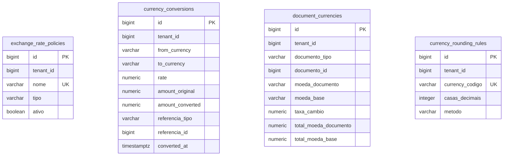
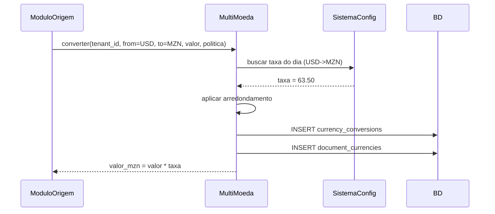
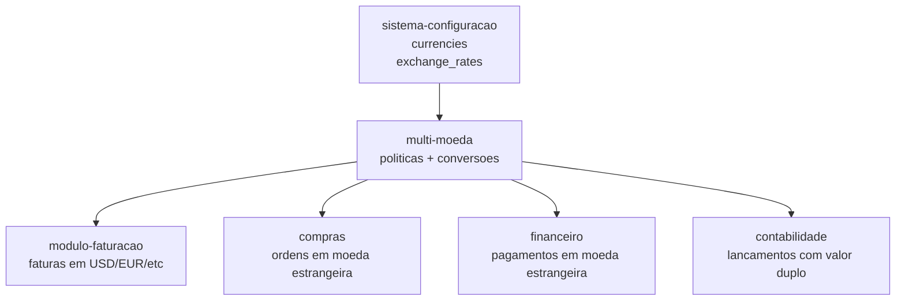

# UML — Modulo Multi-Moeda

## Diagrama de Entidades (ERD)

```mermaid
erDiagram
    exchange_rate_policies {
        bigint id PK
        bigint tenant_id
        varchar nome UK
        varchar tipo
        boolean ativo
    }

    currency_conversions {
        bigint id PK
        bigint tenant_id
        varchar from_currency
        varchar to_currency
        numeric rate
        numeric amount_original
        numeric amount_converted
        varchar referencia_tipo
        bigint referencia_id
        timestamptz converted_at
    }

    document_currencies {
        bigint id PK
        bigint tenant_id
        varchar documento_tipo
        bigint documento_id
        varchar moeda_documento
        varchar moeda_base
        numeric taxa_cambio
        numeric total_moeda_documento
        numeric total_moeda_base
    }

    currency_rounding_rules {
        bigint id PK
        bigint tenant_id
        varchar currency_codigo UK
        integer casas_decimais
        varchar metodo
    }
```

## Fluxo de Conversao em Documento

```mermaid
sequenceDiagram
    participant ModuloOrigem
    participant MultiMoeda
    participant SistemaConfig
    participant BD

    ModuloOrigem->>MultiMoeda: converter(tenant_id, from=USD, to=MZN, valor, politica)
    MultiMoeda->>SistemaConfig: buscar taxa do dia (USD->MZN)
    SistemaConfig-->>MultiMoeda: taxa = 63.50
    MultiMoeda->>MultiMoeda: aplicar arredondamento
    MultiMoeda->>BD: INSERT currency_conversions
    MultiMoeda->>BD: INSERT document_currencies
    MultiMoeda-->>ModuloOrigem: valor_mzn = valor * taxa
```

## Arquitectura Multi-Moeda

```mermaid
flowchart TD
    SC[sistema-configuracao\ncurrencies\nexchange_rates] --> MM[multi-moeda\npoliticas + conversoes]
    MM --> F[modulo-faturacao\nfaturas em USD/EUR/etc]
    MM --> C[compras\nordens em moeda estrangeira]
    MM --> FI[financeiro\npagamentos em moeda estrangeira]
    MM --> CT[contabilidade\nlancamentos com valor duplo]
```
