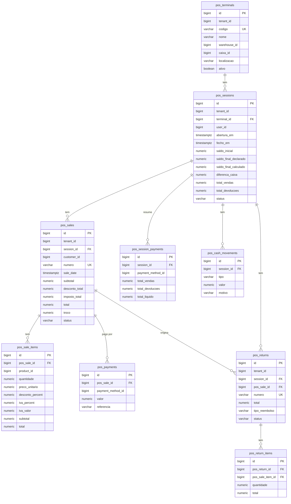
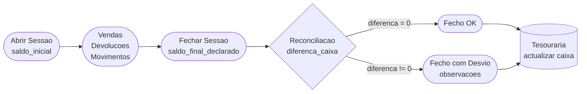
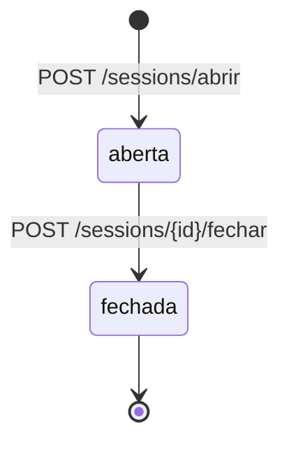
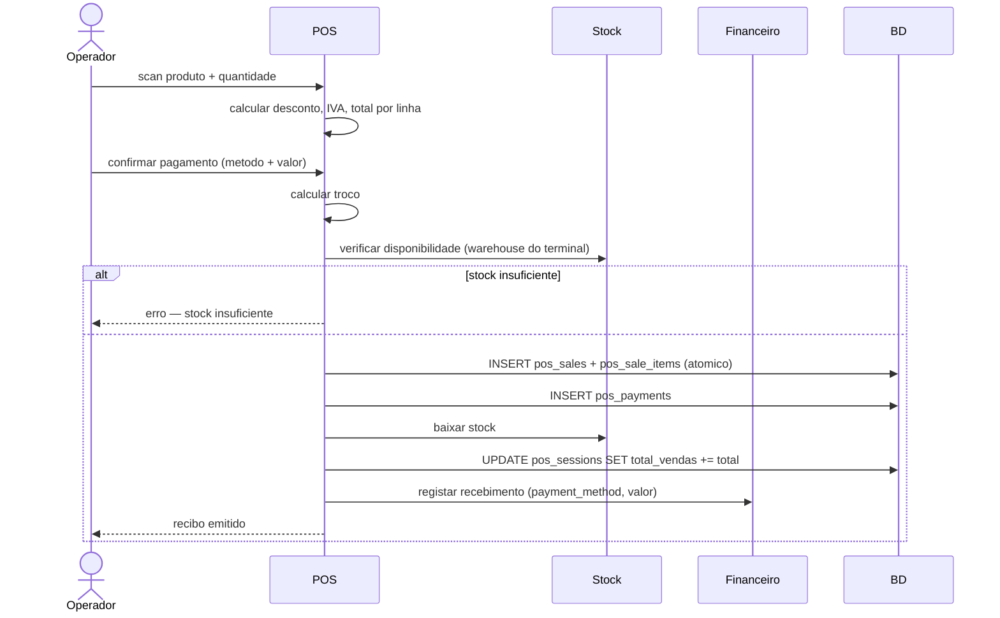
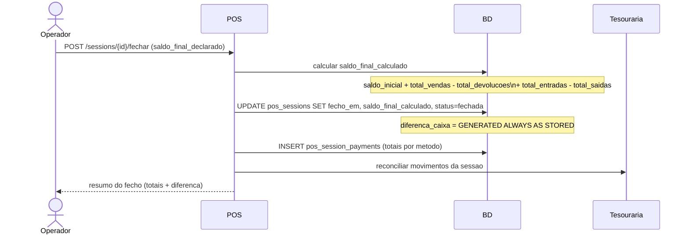

# UML — Modulo POS

## Diagrama de Entidades (ERD)

```mermaid
erDiagram
    pos_terminals {
        bigint id PK
        bigint tenant_id
        varchar codigo UK
        varchar nome
        bigint warehouse_id
        bigint caixa_id
        varchar localizacao
        boolean ativo
    }

    pos_sessions {
        bigint id PK
        bigint tenant_id
        bigint terminal_id FK
        bigint user_id
        timestamptz abertura_em
        timestamptz fecho_em
        numeric saldo_inicial
        numeric saldo_final_declarado
        numeric saldo_final_calculado
        numeric diferenca_caixa
        numeric total_vendas
        numeric total_devolucoes
        varchar status
    }

    pos_session_payments {
        bigint id PK
        bigint session_id FK
        bigint payment_method_id
        numeric total_vendas
        numeric total_devolucoes
        numeric total_liquido
    }

    pos_sales {
        bigint id PK
        bigint tenant_id
        bigint session_id FK
        bigint customer_id
        varchar numero UK
        timestamptz sale_date
        numeric subtotal
        numeric desconto_total
        numeric imposto_total
        numeric total
        numeric troco
        varchar status
    }

    pos_sale_items {
        bigint id PK
        bigint pos_sale_id FK
        bigint product_id
        numeric quantidade
        numeric preco_unitario
        numeric desconto_percent
        numeric iva_percent
        numeric iva_valor
        numeric subtotal
        numeric total
    }

    pos_payments {
        bigint id PK
        bigint pos_sale_id FK
        bigint payment_method_id
        numeric valor
        varchar referencia
    }

    pos_returns {
        bigint id PK
        bigint tenant_id
        bigint session_id FK
        bigint pos_sale_id FK
        varchar numero UK
        numeric total
        varchar tipo_reembolso
        varchar status
    }

    pos_return_items {
        bigint id PK
        bigint pos_return_id FK
        bigint pos_sale_item_id FK
        numeric quantidade
        numeric total
    }

    pos_cash_movements {
        bigint id PK
        bigint session_id FK
        varchar tipo
        numeric valor
        varchar motivo
    }

    pos_terminals ||--o{ pos_sessions : "tem"
    pos_sessions ||--o{ pos_sales : "tem"
    pos_sessions ||--o{ pos_session_payments : "resume"
    pos_sessions ||--o{ pos_cash_movements : "tem"
    pos_sessions ||--o{ pos_returns : "tem"
    pos_sales ||--o{ pos_sale_items : "tem"
    pos_sales ||--o{ pos_payments : "pago por"
    pos_sales ||--o{ pos_returns : "origina"
    pos_returns ||--o{ pos_return_items : "tem"
```

## Ciclo de Sessao de Caixa

```mermaid
flowchart LR
    A([Abrir Sessao\nsaldo_inicial]) --> B([Vendas\nDevolucoes\nMovimentos])
    B --> C([Fechar Sessao\nsaldo_final_declarado])
    C --> D{Reconciliacao\ndiferenca_caixa}
    D -->|diferenca = 0| E([Fecho OK])
    D -->|diferenca != 0| F([Fecho com Desvio\nobservacoes])
    E --> G[(Tesouraria\nactualizar caixa)]
    F --> G
```

## Estado da Sessao

```mermaid
stateDiagram-v2
    [*] --> aberta : POST /sessions/abrir
    aberta --> fechada : POST /sessions/{id}/fechar
    fechada --> [*]
```

## Fluxo de Venda POS

```mermaid
sequenceDiagram
    actor Operador
    participant POS
    participant Stock
    participant Financeiro
    participant BD

    Operador->>POS: scan produto + quantidade
    POS->>POS: calcular desconto, IVA, total por linha
    Operador->>POS: confirmar pagamento (metodo + valor)
    POS->>POS: calcular troco
    POS->>Stock: verificar disponibilidade (warehouse do terminal)
    alt stock insuficiente
        POS-->>Operador: erro — stock insuficiente
    else
        POS->>BD: INSERT pos_sales + pos_sale_items (atomico)
        POS->>BD: INSERT pos_payments
        POS->>Stock: baixar stock
        POS->>BD: UPDATE pos_sessions SET total_vendas += total
        POS->>Financeiro: registar recebimento (payment_method, valor)
        POS-->>Operador: recibo emitido
    end
```

## Fluxo de Fecho de Sessao

```mermaid
sequenceDiagram
    actor Operador
    participant POS
    participant BD
    participant Tesouraria

    Operador->>POS: POST /sessions/{id}/fechar (saldo_final_declarado)
    POS->>BD: calcular saldo_final_calculado
    note over BD: saldo_inicial + total_vendas - total_devolucoes\n+ total_entradas - total_saidas
    POS->>BD: UPDATE pos_sessions SET fecho_em, saldo_final_calculado, status=fechada
    note over BD: diferenca_caixa = GENERATED ALWAYS AS STORED
    POS->>BD: INSERT pos_session_payments (totais por metodo)
    POS->>Tesouraria: reconciliar movimentos da sessao
    POS-->>Operador: resumo do fecho (totais + diferenca)
```
