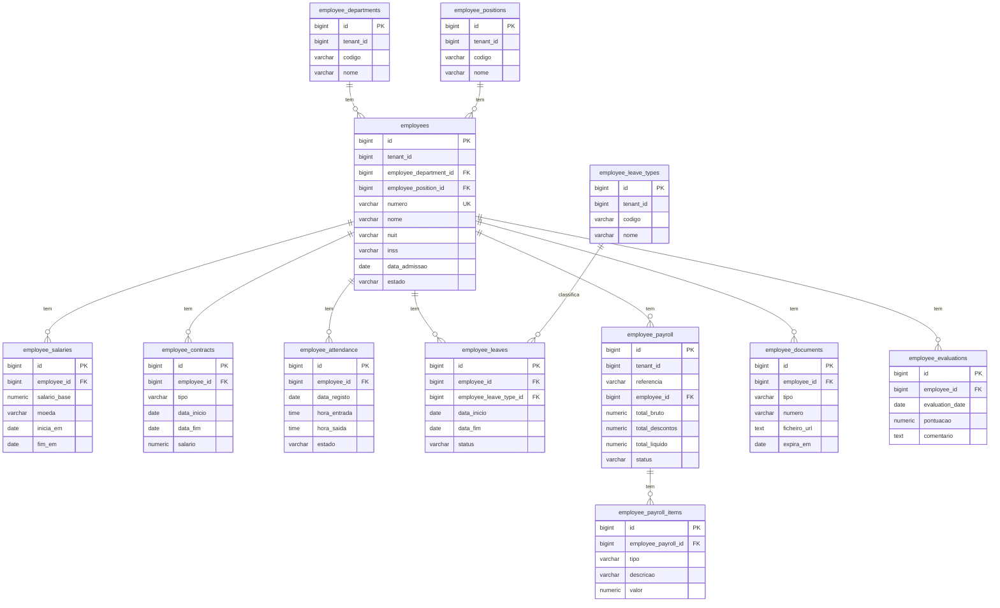
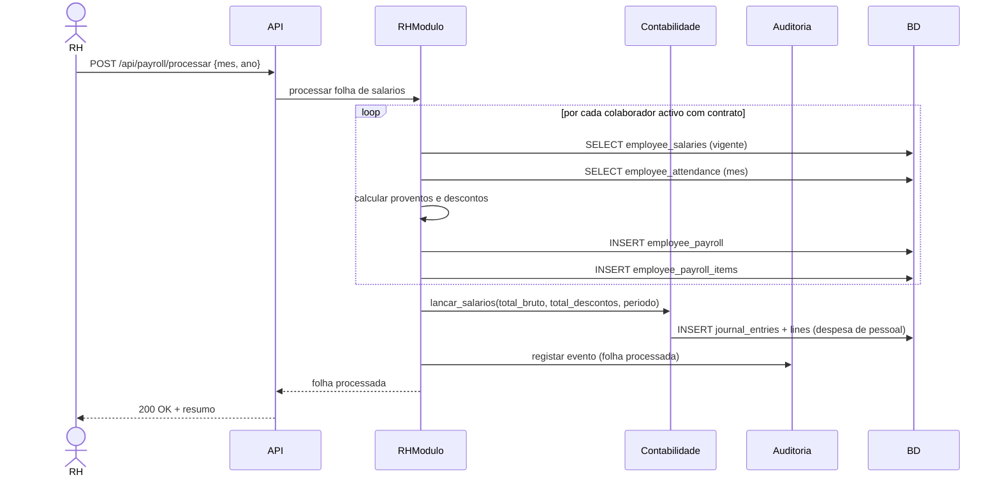

# UML — Modulo Recursos Humanos

## Diagrama de Entidades (ERD)

```mermaid
erDiagram
    employee_departments {
        bigint id PK
        bigint tenant_id
        varchar codigo
        varchar nome
    }

    employee_positions {
        bigint id PK
        bigint tenant_id
        varchar codigo
        varchar nome
    }

    employees {
        bigint id PK
        bigint tenant_id
        bigint employee_department_id FK
        bigint employee_position_id FK
        varchar numero UK
        varchar nome
        varchar nuit
        varchar inss
        date data_admissao
        varchar estado
    }

    employee_salaries {
        bigint id PK
        bigint employee_id FK
        numeric salario_base
        varchar moeda
        date inicia_em
        date fim_em
    }

    employee_contracts {
        bigint id PK
        bigint employee_id FK
        varchar tipo
        date data_inicio
        date data_fim
        numeric salario
    }

    employee_attendance {
        bigint id PK
        bigint employee_id FK
        date data_registo
        time hora_entrada
        time hora_saida
        varchar estado
    }

    employee_leave_types {
        bigint id PK
        bigint tenant_id
        varchar codigo
        varchar nome
    }

    employee_leaves {
        bigint id PK
        bigint employee_id FK
        bigint employee_leave_type_id FK
        date data_inicio
        date data_fim
        varchar status
    }

    employee_payroll {
        bigint id PK
        bigint tenant_id
        varchar referencia
        bigint employee_id FK
        numeric total_bruto
        numeric total_descontos
        numeric total_liquido
        varchar status
    }

    employee_payroll_items {
        bigint id PK
        bigint employee_payroll_id FK
        varchar tipo
        varchar descricao
        numeric valor
    }

    employee_documents {
        bigint id PK
        bigint employee_id FK
        varchar tipo
        varchar numero
        text ficheiro_url
        date expira_em
    }

    employee_evaluations {
        bigint id PK
        bigint employee_id FK
        date evaluation_date
        numeric pontuacao
        text comentario
    }

    employee_departments ||--o{ employees : "tem"
    employee_positions ||--o{ employees : "tem"
    employees ||--o{ employee_salaries : "tem"
    employees ||--o{ employee_contracts : "tem"
    employees ||--o{ employee_attendance : "tem"
    employees ||--o{ employee_leaves : "tem"
    employees ||--o{ employee_payroll : "tem"
    employees ||--o{ employee_documents : "tem"
    employees ||--o{ employee_evaluations : "tem"
    employee_leave_types ||--o{ employee_leaves : "classifica"
    employee_payroll ||--o{ employee_payroll_items : "tem"
```

## Fluxo de Processamento de Salario

```mermaid
sequenceDiagram
    actor RH
    participant API
    participant RHModulo
    participant Contabilidade
    participant Auditoria
    participant BD

    RH->>API: POST /api/payroll/processar {mes, ano}
    API->>RHModulo: processar folha de salarios

    loop por cada colaborador activo com contrato
        RHModulo->>BD: SELECT employee_salaries (vigente)
        RHModulo->>BD: SELECT employee_attendance (mes)
        RHModulo->>RHModulo: calcular proventos e descontos
        RHModulo->>BD: INSERT employee_payroll
        RHModulo->>BD: INSERT employee_payroll_items
    end

    RHModulo->>Contabilidade: lancar_salarios(total_bruto, total_descontos, periodo)
    Contabilidade->>BD: INSERT journal_entries + lines (despesa de pessoal)
    RHModulo->>Auditoria: registar evento (folha processada)
    RHModulo-->>API: folha processada
    API-->>RH: 200 OK + resumo
```
