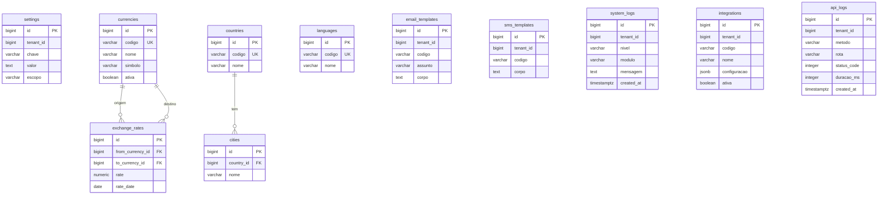
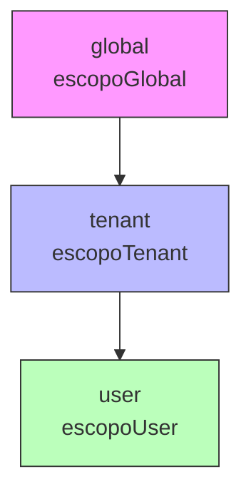

# UML — Modulo Sistema e Configuracao

## Diagrama de Entidades (ERD)

```mermaid
erDiagram
    settings {
        bigint id PK
        bigint tenant_id
        varchar chave
        text valor
        varchar escopo
    }

    currencies {
        bigint id PK
        varchar codigo UK
        varchar nome
        varchar simbolo
        boolean ativa
    }

    exchange_rates {
        bigint id PK
        bigint from_currency_id FK
        bigint to_currency_id FK
        numeric rate
        date rate_date
    }

    countries {
        bigint id PK
        varchar codigo UK
        varchar nome
    }

    cities {
        bigint id PK
        bigint country_id FK
        varchar nome
    }

    languages {
        bigint id PK
        varchar codigo UK
        varchar nome
    }

    email_templates {
        bigint id PK
        bigint tenant_id
        varchar codigo
        varchar assunto
        text corpo
    }

    sms_templates {
        bigint id PK
        bigint tenant_id
        varchar codigo
        text corpo
    }

    system_logs {
        bigint id PK
        bigint tenant_id
        varchar nivel
        varchar modulo
        text mensagem
        timestamptz created_at
    }

    integrations {
        bigint id PK
        bigint tenant_id
        varchar codigo
        varchar nome
        jsonb configuracao
        boolean ativa
    }

    api_logs {
        bigint id PK
        bigint tenant_id
        varchar metodo
        varchar rota
        integer status_code
        integer duracao_ms
        timestamptz created_at
    }

    currencies ||--o{ exchange_rates : "origem"
    currencies ||--o{ exchange_rates : "destino"
    countries ||--o{ cities : "tem"
```

## Diagrama de Escopos de Configuracao

```mermaid
flowchart TD
    G[global\nescopoGlobal] --> T[tenant\nescopoTenant]
    T --> U[user\nescopoUser]

    style G fill:#f9f,stroke:#333
    style T fill:#bbf,stroke:#333
    style U fill:#bfb,stroke:#333
```
