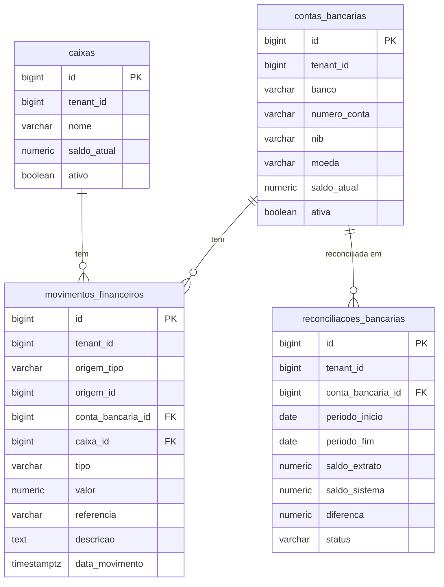
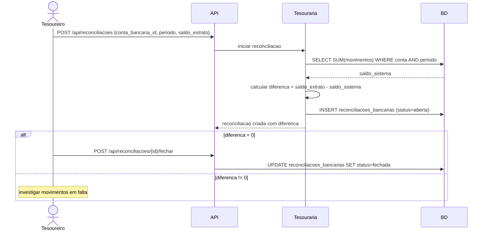

# UML — Modulo Tesouraria

## Diagrama de Entidades (ERD)

```mermaid
erDiagram
    contas_bancarias {
        bigint id PK
        bigint tenant_id
        varchar banco
        varchar numero_conta
        varchar nib
        varchar moeda
        numeric saldo_atual
        boolean ativa
    }

    caixas {
        bigint id PK
        bigint tenant_id
        varchar nome
        numeric saldo_atual
        boolean ativo
    }

    movimentos_financeiros {
        bigint id PK
        bigint tenant_id
        varchar origem_tipo
        bigint origem_id
        bigint conta_bancaria_id FK
        bigint caixa_id FK
        varchar tipo
        numeric valor
        varchar referencia
        text descricao
        timestamptz data_movimento
    }

    reconciliacoes_bancarias {
        bigint id PK
        bigint tenant_id
        bigint conta_bancaria_id FK
        date periodo_inicio
        date periodo_fim
        numeric saldo_extrato
        numeric saldo_sistema
        numeric diferenca
        varchar status
    }

    contas_bancarias ||--o{ movimentos_financeiros : "tem"
    caixas ||--o{ movimentos_financeiros : "tem"
    contas_bancarias ||--o{ reconciliacoes_bancarias : "reconciliada em"
```

## Fluxo de Reconciliacao Bancaria

```mermaid
sequenceDiagram
    actor Tesoureiro
    participant API
    participant Tesouraria
    participant BD

    Tesoureiro->>API: POST /api/reconciliacoes {conta_bancaria_id, periodo, saldo_extrato}
    API->>Tesouraria: iniciar reconciliacao
    Tesouraria->>BD: SELECT SUM(movimentos) WHERE conta AND periodo
    BD-->>Tesouraria: saldo_sistema
    Tesouraria->>Tesouraria: calcular diferenca = saldo_extrato - saldo_sistema
    Tesouraria->>BD: INSERT reconciliacoes_bancarias (status=aberta)
    Tesouraria-->>API: reconciliacao criada com diferenca

    alt diferenca = 0
        Tesoureiro->>API: POST /api/reconciliacoes/{id}/fechar
        API->>BD: UPDATE reconciliacoes_bancarias SET status=fechada
    else diferenca != 0
        Note over Tesoureiro: investigar movimentos em falta
    end
```
