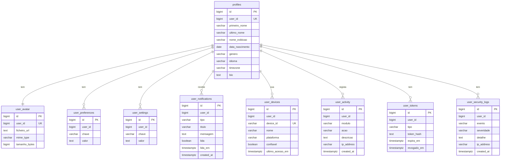
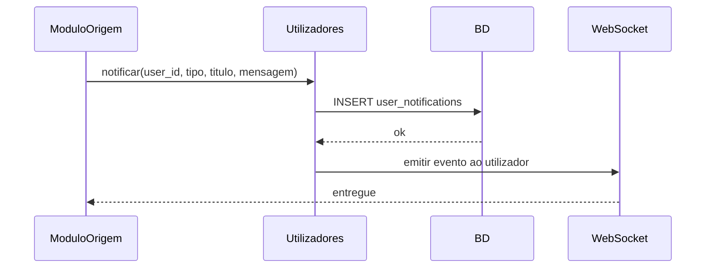

# UML — Modulo Utilizadores

## Diagrama de Entidades (ERD)

```mermaid
erDiagram
    profiles {
        bigint id PK
        bigint user_id UK
        varchar primeiro_nome
        varchar ultimo_nome
        varchar nome_exibicao
        date data_nascimento
        varchar genero
        varchar idioma
        varchar timezone
        text bio
    }

    user_preferences {
        bigint id PK
        bigint user_id
        varchar chave
        text valor
    }

    user_settings {
        bigint id PK
        bigint user_id
        varchar chave
        text valor
    }

    user_notifications {
        bigint id PK
        bigint user_id
        varchar tipo
        varchar titulo
        text mensagem
        boolean lida
        timestamptz lida_em
        timestamptz created_at
    }

    user_devices {
        bigint id PK
        bigint user_id
        varchar device_id UK
        varchar nome
        varchar plataforma
        boolean confiavel
        timestamptz ultimo_acesso_em
    }

    user_activity {
        bigint id PK
        bigint user_id
        varchar modulo
        varchar acao
        text descricao
        varchar ip_address
        timestamptz created_at
    }

    user_tokens {
        bigint id PK
        bigint user_id
        varchar tipo
        text token_hash
        timestamptz expira_em
        timestamptz revogado_em
    }

    user_security_logs {
        bigint id PK
        bigint user_id
        varchar evento
        varchar severidade
        text detalhe
        varchar ip_address
        timestamptz created_at
    }

    user_avatar {
        bigint id PK
        bigint user_id UK
        text ficheiro_url
        varchar mime_type
        bigint tamanho_bytes
    }

    profiles ||--|| user_avatar : "tem"
    profiles ||--o{ user_preferences : "tem"
    profiles ||--o{ user_settings : "tem"
    profiles ||--o{ user_notifications : "recebe"
    profiles ||--o{ user_devices : "usa"
    profiles ||--o{ user_activity : "regista"
    profiles ||--o{ user_tokens : "tem"
    profiles ||--o{ user_security_logs : "tem"
```

## Fluxo de Notificacao

```mermaid
sequenceDiagram
    participant ModuloOrigem
    participant Utilizadores
    participant BD
    participant WS as WebSocket

    ModuloOrigem->>Utilizadores: notificar(user_id, tipo, titulo, mensagem)
    Utilizadores->>BD: INSERT user_notifications
    BD-->>Utilizadores: ok
    Utilizadores->>WS: emitir evento ao utilizador
    WS-->>ModuloOrigem: entregue
```
